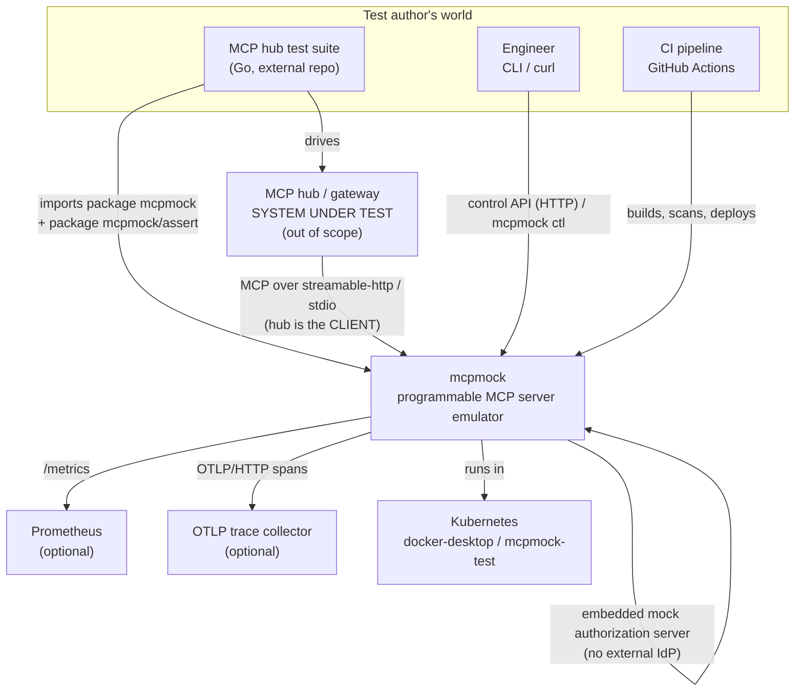
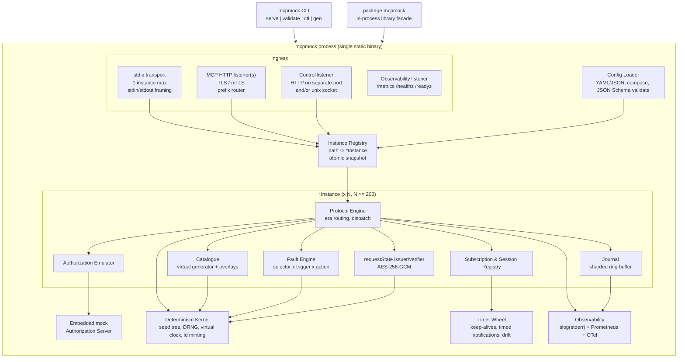
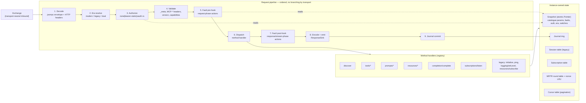
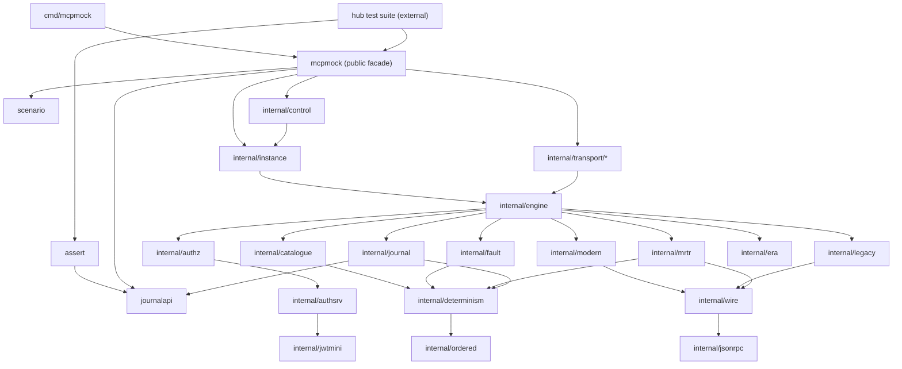

# mcpmock — Target Architecture

## 0. Reading order

1. `requirements-spec.md` — every `MOCK-nnn` with measurable acceptance criteria.
2. This document — structure, boundaries, concurrency.
3. `adr/` — the decisions and what they foreclose.
4. `contracts/` — public Go API, assertion API, control API, scenario JSON Schema, wire annex.
5. `data-model.md`, `security.md`, `observability.md`, `test-strategy.md`, `deployment.md`.
6. `gap-analysis.md` — **read before starting Phase 1**; items marked `DECISION-REQUIRED` block work.
7. `implementation-plan.md`, `traceability.md`.

## 1. Mode and provenance

Greenfield. **VERIFIED:** repository contains one commit (`992d5a8`), `README.md`, `.gitignore`,
`.golangci.yml`, `.github/workflows/ci.yml`, `specification/requirements.md`. There is no
`go.mod`, no Go source, no `Makefile`, no `Dockerfile`, no `helm/` directory. Nothing in this
document is a description of existing code; everything is a proposal.

Two pre-existing conventions constrain the design and are **not** up for renegotiation:

| Artifact | Evidence | Constraint imposed |
|---|---|---|
| `.golangci.yml` | `.golangci.yml:1` `version: "2"`, `:8` `default: none`, `:5` `tests: false` | Explicit enable list incl. `funlen` (200 lines / 60 statements, `:125`), `gocyclo` 15 (`:133`), `gocognit` 20 (`:135`), `lll` 120 (`:128`), `gosec`, `contextcheck`, `prealloc`, `testpackage`, `revive` with `package-comments` and `exported` (`:148`,`:153`). Every package needs a doc comment; every exported symbol needs a comment. Test files are **not** linted. |
| `.github/workflows/ci.yml` | 735 lines; jobs `lint`, `govulncheck`, `unit-tests`, `functional-tests`, `integration-tests`, `e2e-tests`, `sonarcloud`, `build`, `docker-build-pr`, `helm-validate`, `build-release`, `docker-build-push`, `trivy-scan`, `helm-deploy` | Build tags are already fixed: `-tags=functional ./test/functional/...` (`:126`), `-tags=integration ./test/integration/...` (`:222`), `-tags=e2e ./test/e2e/...` (`:281`). `make build` must exist (`:385`). Chart path and namespace are env vars (`:22`–`:24`). Extend, do not replace. |

`ci.yml` is templated from a different project (`HELM_CHART_PATH: helm/restapi-example`, `:22`;
`./cmd/server`, `:255`; Vault + Keycloak services, `:156`–`:202`). The required edits are listed in
`deployment.md §7`.

## 2. Quality-attribute ranking

The architecture follows from this ranking. It is explicit so that it can be argued with.

| Rank | Attribute | Why it dominates | Requirement anchor |
|---|---|---|---|
| 1 | **Determinism** | A test harness that is not reproducible produces flaky tests in the *system under test*, which is worse than no harness. | §0.1, `MOCK-704` |
| 2 | **Observability of the client's behaviour** | The journal, not the responses, is the product. | §0.3, `MOCK-601`…`606` |
| 3 | **Programmability at runtime** | One binary must cover hundreds of cases without restart. | §0.2, `MOCK-702` |
| 4 | **Embeddability** | In-process library use forbids global state and init-time work. | `MOCK-107` |
| 5 | **Throughput / stream density** | 20 000 rps, 20 000 SSE streams, 200 instances. | `MOCK-901`…`904` |
| 6 | **Deliberate non-conformance** | The mock must be able to emit bytes no conformant server would. | §0.4, §5 |
| 7 | Operability (metrics, image, chart) | Needed, but a means not an end. | `MOCK-101`, `MOCK-105` |

Ranks 1 and 4 together are the sharpest constraint in the whole design: **no package-level
mutable state, no `init()` that does work, and no process-wide singletons.** Everything hangs off
an explicitly constructed `*Instance`. This is stated once here and assumed everywhere below.

Ranks 1 and 5 are in tension (determinism wants serialisation; throughput wants none). ADR-002
resolves it by making every random decision a pure function of request content rather than of
execution order.

## 3. C1 — System context



Note the direction that surprises people: **the hub is the MCP client**, mcpmock is the server.
Every `MOCK-6nn` journal assertion is an assertion about what the hub sent.

## 4. C2 — Containers (deployable / runnable units)



Deployable units: **one** — the `mcpmock` binary / container image. Everything above is in-process.
That is deliberate: `MOCK-107` (usable as a library) makes any out-of-process split a defect.

## 5. C3 — Component view of a single `*Instance`



Every stage reads the **same immutable `Snapshot`** captured once at stage 1. A control-API
mutation that lands mid-request therefore cannot produce a half-old/half-new response. This is
the correctness argument for ADR-014.

## 6. Module and package structure

Single Go module. The module path is **`github.com/vyrodovalexey/mcp-mock-server`** `[stated]` —
verified from `git remote -v` (`git@github.com:vyrodovalexey/mcp-mock-server.git`). GAP-001 is
**resolved**; see `amendments-2026-09-04.md` AMEND-1.

**Module path and package name are deliberately different, and the difference is load-bearing.**
The module path is the repository name; the root Go package is `mcpmock`. Throughout this
specification, a bare `mcpmock/<x>` is a **package label**, never an import path. The mapping is:

| Package label used in this spec | Go package name | Actual import path |
|---|---|---|
| `mcpmock` | `mcpmock` | `github.com/vyrodovalexey/mcp-mock-server` |
| `mcpmock/scenario` | `scenario` | `github.com/vyrodovalexey/mcp-mock-server/scenario` |
| `mcpmock/journalapi` | `journalapi` | `github.com/vyrodovalexey/mcp-mock-server/journalapi` |
| `mcpmock/assert` | `assert` | `github.com/vyrodovalexey/mcp-mock-server/assert` |
| `cmd/mcpmock` | `main` | `github.com/vyrodovalexey/mcp-mock-server/cmd/mcpmock` |
| `internal/<x>` | `<x>` | `github.com/vyrodovalexey/mcp-mock-server/internal/<x>` |

The produced binary is named `mcpmock`, not `mcp-mock-server`, because `cmd/mcpmock` is the
package directory. This is intentional and must not be "corrected" during implementation.

```
github.com/vyrodovalexey/mcp-mock-server
├── go.mod                       # module github.com/vyrodovalexey/mcp-mock-server; go 1.27.0
├── Makefile                     # build, lint, test-unit, test-functional, ..., required by ci.yml:385
├── Dockerfile                   # multi-stage -> distroless static nonroot
├── mcpmock.go                   # package mcpmock — public facade (MOCK-107)
├── options.go                   # package mcpmock — functional options
├── control.go                   # package mcpmock — Control interface (shared with HTTP + CLI)
├── assert/                      # package assert — journal assertions (MOCK-603)
├── scenario/                    # package scenario — public config types + loader (MOCK-701/703)
├── journalapi/                  # package journalapi — public Record/View/Selector types
├── cmd/mcpmock/                 # main: serve | validate | ctl | gen
├── internal/
│   ├── determinism/             # seed tree, DRNG, virtual clock, id minting   [no deps]
│   ├── ordered/                 # deterministic map/set/iteration helpers      [no deps]
│   ├── jsonrpc/                 # envelope, raw ids, error codes, canonical encoder
│   ├── wire/                    # 2026-07-28 + legacy wire types (see contracts/wire-annex)
│   ├── engine/                  # pipeline, handler registry, Exchange, ResponseSink
│   ├── era/                     # era detection and dual-era arbitration (MOCK-303/304)
│   ├── modern/                  # 2026-07-28 handlers, _meta, header mirroring, resultType
│   ├── legacy/                  # 2025-* handshake, sessions, GET SSE, Last-Event-ID replay
│   ├── mrtr/                    # InputRequiredResult, rounds, requestState AEAD
│   ├── catalogue/               # virtual generation, overlays, drift, auth-scoped views
│   ├── paging/                  # opaque cursors, page faults, per-page ttl/cacheScope
│   ├── journal/                 # sharded ring, query, ndjson, golden/redaction
│   ├── fault/                   # selector algebra, triggers, actions
│   ├── authz/                   # modes, PRM document, challenges, audience checks
│   ├── authsrv/                 # embedded mock AS (MOCK-405)
│   ├── jwtmini/                 # minimal JWS sign/verify + deliberate malformation
│   ├── transport/
│   │   ├── stdio/               # framing, stdout hijack, multiplexing (MOCK-256)
│   │   └── httpx/               # streamable-http, SSE sink, prefix router, TLS/mTLS
│   ├── control/                 # HTTP + UDS front-ends over the Control interface
│   ├── instance/                # *Instance, Snapshot, Registry, lifecycle
│   ├── sched/                   # hierarchical timer wheel
│   ├── obs/                     # slog handler, Prometheus registry, OTel wiring
│   ├── config/                  # load, compose/overlay, embedded JSON Schema, --validate
│   ├── certs/                   # runtime ephemeral CA + leaf generation (MOCK-106)
│   └── corpus/                  # encoded prompt-injection corpus, gated (MOCK-507)
├── helm/mcpmock/
├── deploy/manifests/
├── scenarios/                   # scenario library (MOCK-705)
└── test/
    ├── mcpclient/               # INDEPENDENT minimal MCP client — shares no code with internal/
    ├── functional/              # -tags=functional   (ci.yml:126)
    ├── integration/             # -tags=integration  (ci.yml:222)
    ├── e2e/                     # -tags=e2e          (ci.yml:281)
    └── perf/                    # k6 scripts + Go benchmarks
```

### 6.1 Dependency direction



Rules, enforceable by a `go list`-based CI check (`make deps-check`):

1. Nothing under `internal/` may import the root `mcpmock` package. (Prevents cycles and keeps
   the facade thin.)
2. `internal/determinism` and `internal/ordered` import **nothing** from the module. They are the
   base of the graph.
3. `internal/transport/*` may import `internal/engine` but not `internal/modern|legacy|mrtr`.
   Transports must stay era-blind (ADR-006).
4. `journalapi` and `scenario` are **public** and import nothing internal. They are the
   serialisation boundary that external test suites depend on.
5. `assert` imports only `journalapi` + stdlib + `testing`. It must be usable against a journal
   read from a file, not only against a live server.

### 6.2 Why the public surface is split into four packages

`mcpmock` (lifecycle), `scenario` (config types), `journalapi` (record types), `assert`
(assertions). A hub test that only reads a recorded journal file imports `journalapi` + `assert`
and pulls in **no** server code, no Prometheus, no OTel. That matters: `MOCK-107` puts mcpmock
into someone else's `go.mod`, and a fat transitive tree there is a real cost.

## 7. Concurrency model

### 7.1 Goroutine budget

| Unit | Goroutines | Notes |
|---|---|---|
| Process | 6 + `GOMAXPROCS` | signal handler, control HTTP server, obs server, timer wheel, stdout-hijack drainer, OTel batch exporter |
| Per instance | **0 at rest** | Instances own no background goroutine. Anything periodic is a timer-wheel entry. This is what makes `MOCK-904` (≥200 instances) cheap. |
| Per non-streaming HTTP request | 0 extra | Handled entirely on `net/http`'s connection goroutine. No `go func()` on the hot path. |
| Per SSE stream | 1 (the handler goroutine) | `net/http` already owns the connection read goroutine; we add none. Frames arrive on a buffered channel; the handler `select`s on `frames` / `ctx.Done()`. |
| Per stdio process | 2 | one reader (demux stdin), one writer (serialise stdout frames). Requests are handled on a bounded worker pool, not a goroutine per request, so `MOCK-256` interleaving stays bounded. |
| Timer wheel | 1 | Hierarchical wheel, 10 ms tick. Enqueues frames; never writes to a socket itself. |

At `MOCK-903` (20 000 SSE streams) this is 20 000 handler goroutines + ~20 000 net/http read
goroutines ≈ 40 000. See ADR-012 for the memory envelope and why a per-stream `time.Ticker`
(which would add 20 000 timer heap entries and 20 000 more goroutines) is forbidden.

### 7.2 Synchronisation strategy

| State | Mechanism | Rationale |
|---|---|---|
| Instance configuration (catalogue params, fault rules, auth config, era, per-method switches) | `atomic.Pointer[Snapshot]`, copy-on-write; writers serialise on a per-instance `sync.Mutex` | Read path is lock-free — mandatory at 20 000 rps. Mutation is rare (control API). ADR-014. |
| Journal | Sharded ring; per-shard `atomic.Uint64` write cursor; global `atomic.Uint64` sequence | No global lock. ADR-005. |
| Fault rule counters | `atomic.Uint64` per rule | Note: this makes count-based triggers order-dependent under concurrency — GAP-007. |
| Sessions (legacy), subscriptions, cursors, MRTR rounds | Sharded `map` behind `sync.RWMutex`, 64 shards keyed by FNV-1a of the id | Not on the 20 000 rps path (modern mode is sessionless per `MOCK-207`). |
| Catalogue | Immutable generator params in `Snapshot` + immutable overlay slice | Items are computed, not stored. ADR-004. |
| Registry (path → instance) | `atomic.Pointer[routeTable]` | Control API can add/remove instances without restarting the listener. |
| Metrics | Prometheus client internals | Pre-resolved `prometheus.Counter` handles cached per instance at construction — never `WithLabelValues` on the hot path. |

**Explicitly forbidden on the request path:** `sync.Mutex` on any shared object, `map` iteration
that affects output, `time.Now()` for any value that appears in a response body, `go func()`,
`fmt.Sprintf` for hot-path strings, `WithLabelValues`, allocation of a new `slog.Logger`.

### 7.3 Cancellation

`context.Context` is created by the transport and threaded through every pipeline stage and
handler (`contextcheck` in `.golangci.yml:50` enforces propagation).

- HTTP: `r.Context()`; client disconnect cancels it. `MOCK-212` is implemented by observing
  `ctx.Err() == context.Canceled` in stage 8/9 and writing a journal record with elapsed time.
- stdio: a per-request `context.Context` held in the request table, cancelled on
  `notifications/cancelled` or on stdin EOF.
- Faults that hold a request (latency injection) `select` on `ctx.Done()` and record the
  cancellation rather than sleeping through it.

### 7.4 Determinism under concurrency

Stated fully in ADR-002. The one-line version: **the random stream for a request is derived from
the request's content, not from a shared generator.**

```
instanceKey  = HMAC-SHA256(rootSeed, "instance\x00" || instanceName)
requestKey   = HMAC-SHA256(instanceKey, "request\x00" || method || "\x00" || canonicalID || "\x00" || sha256(body))
decisionRNG  = ChaCha8(requestKey[0:32])                       // math/rand/v2
```

Two goroutines handling the same bytes get the same stream. Execution order is irrelevant.
`decisionRNG` is then consumed in a **fixed order** defined by the pipeline stage numbering in
§5, so adding a new random decision requires appending, never inserting (ADR-002 consequence).

## 8. Cross-cutting concerns

| Concern | Design |
|---|---|
| **Configuration** | One scenario document (`scenario` package types), composed from `extends` overlays, validated against an embedded JSON Schema 2020-12. CLI flags override a small, enumerated subset (`--seed`, `--listen`, `--control-listen`, `--log-level`). No environment-variable configuration of behaviour, because it defeats reproducibility; env is allowed only for secrets (`MCPMOCK_CONTROL_TOKEN`). ADR-008. |
| **Error handling** | Sentinel errors + `errors.Is/As` (`errorlint` is enabled, `.golangci.yml:20`). Every pipeline stage returns a `*engine.Fault` carrying a JSON-RPC code, an HTTP status and a journalable `reason` string. The wire error is produced in exactly one place (`internal/engine/emit.go`) so `MOCK-505` fault codes and genuine errors share a single encoder. |
| **Logging** | `log/slog` JSON handler, **stderr only, always** (ADR-011). One logger per instance with pre-bound `instance` attribute. Request-level logs at `DEBUG`; at `INFO` only lifecycle, config changes, fault arming, and auth denials. |
| **Tracing** | OTel, no-op provider by default (startup budget). Inbound `traceparent` is *extracted and recorded* (needed for `MOCK-603 AssertTraceContextPropagated`) even when tracing export is off. |
| **Auth propagation** | The mock never forwards credentials anywhere. It records a keyed hash (`security.md §5`). |
| **Idempotency** | The control API uses `PUT`/`PATCH` on named resources; `POST …:action` verbs accept an optional `X-Mcpmock-Idempotency-Key`. |
| **Tenancy** | The instance *is* the tenant boundary. No cross-instance references except deliberate name collisions (`MOCK-223`), which are expressed as configuration, not as shared state. |
| **Time** | Two clocks. `obs.WallClock` for journal/metrics/logs (real). `determinism.VirtualClock` for anything serialised into a response body (derived from seed + request key). A response body containing `time.Now()` is a lint-reviewable defect. |

## 9. Startup budget (`MOCK-107`, < 200 ms)

Budget is spent, not assumed:

| Phase | Target | How it is kept |
|---|---|---|
| Process init | < 5 ms | No `init()` performs work. No package-level `regexp.MustCompile` of large patterns; use `sync.OnceValue`. |
| Config read + YAML→JSON | < 15 ms | `sigs.k8s.io/yaml`; overlays merged as decoded JSON trees. |
| JSON Schema compile + validate | < 40 ms | Schema is embedded; compiled once via `sync.OnceValue`. Skippable with `--no-validate` (validation still runs in `--validate` mode). |
| Instance construction × 200 | < 60 ms | Instances allocate a `Snapshot` and a journal ring only. **No catalogue materialisation** (ADR-004) — a 5000-tool catalogue costs O(1). Journal rings are lazily allocated on first write when `journal.preallocate: false`. |
| Listener bind + TLS | < 30 ms | Certificates parsed in parallel; ephemeral CA generation is P-256 ECDSA (µs), never RSA-4096. |
| Observability | < 10 ms | Prometheus registry only. OTel exporter constructed lazily on first span when enabled. |
| Corpus, scenario library | 0 ms | `go:embed`ed but decoded lazily on first use. |

CI gate: `test/functional` contains `TestStartupBudget` asserting p95 < 200 ms for a 200-instance
5000-tool scenario on the CI runner, and a `-benchtime` startup benchmark whose result is
recorded as an artifact.

## 10. What is deliberately *not* in this architecture

- No database, no external cache, no message broker. `MOCK-101` (no runtime dependencies).
- No plugin system / scripting engine. Behaviour is data (scenario file) + a fixed action
  vocabulary. A scripting engine would destroy determinism and the startup budget.
- No hub-side conformance suite. The `HUB-nnn` document is not in this repository
  (`gap-analysis.md` GAP-004); we deliver the extension points (`MOCK-603`, `MOCK-705`) only.
- No real LLM behind `sampling/createMessage` (§8 non-goal).
- No clustering. `MOCK-904` is *in one process*; horizontal scale is a Kubernetes concern.
