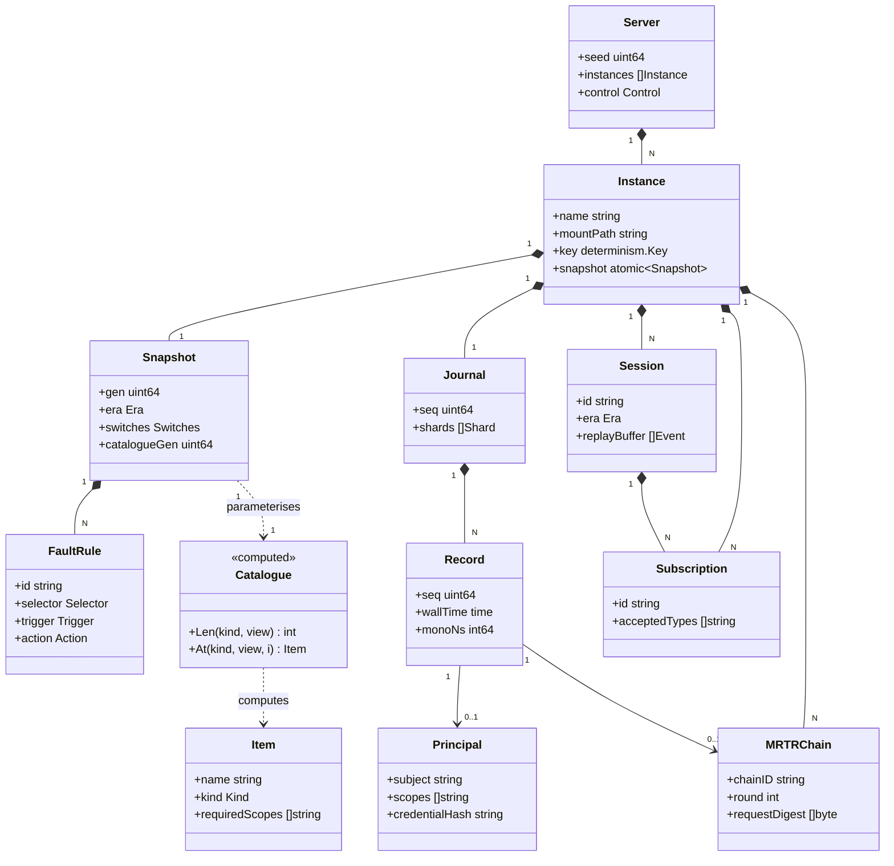
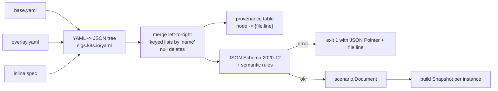
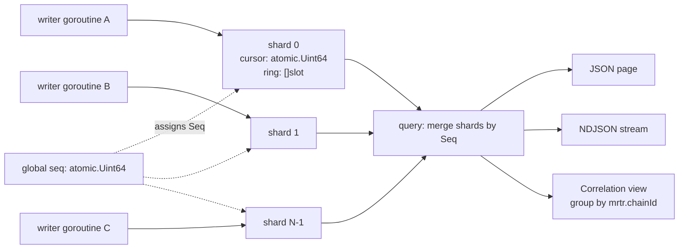
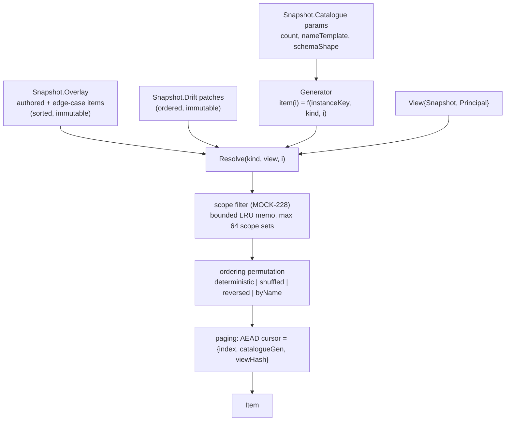
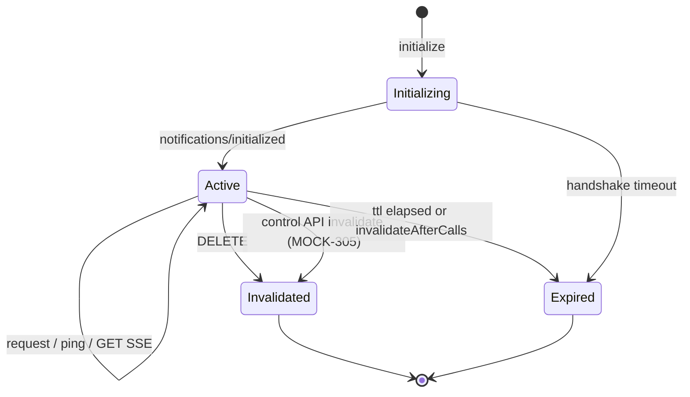
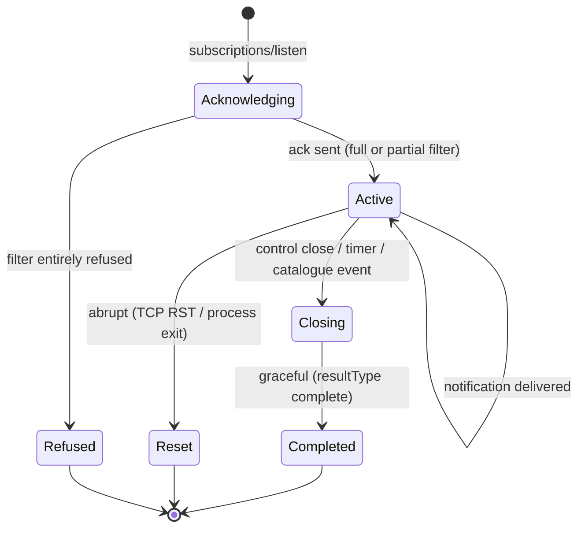
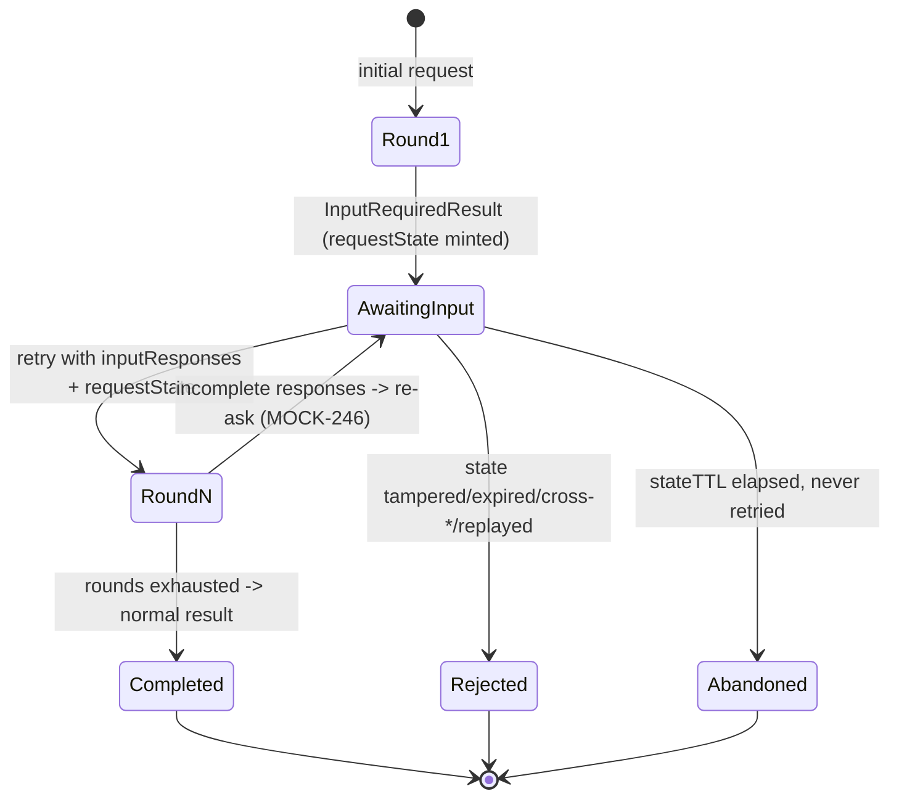

# Data Model

Four data domains, with different owners and lifetimes:

| Domain | Owner | Lifetime | Persistence | Public? |
|---|---|---|---|---|
| **Scenario configuration** | user's file → `Snapshot` on `*Instance` | immutable per generation (ADR-014) | source file only | `mcpmock/scenario` — **yes** |
| **Journal** | `*Instance` | process, bounded ring (ADR-005) | in-memory; exportable as NDJSON | `mcpmock/journalapi` — **yes** |
| **Catalogue** | computed (ADR-004) | derived from `Snapshot` | none | internal |
| **Session / subscription / MRTR state** | `*Instance` | connection or TTL | none | internal, surfaced via control API |

Nothing is durable. mcpmock is a test harness; a restart is a reset, deliberately (`MOCK-508` uses
that fact as a feature).

---

## 1. Domain model



---

## 2. Scenario configuration (`ENT-SCEN`)

**Owner:** the user's file, composed by `internal/config`, published as `scenario.Document`.
**Contract:** `contracts/scenario.schema.json`. **Merge semantics:** ADR-008.

### 2.1 Composition pipeline



### 2.2 Ownership and lifecycle

| Stage | Owner | Mutable? |
|---|---|---|
| Source file | user | yes, but not read after load |
| `scenario.Document` | `*Server`, retained for `AddInstance` and for `--validate` output | no after load |
| `Snapshot` | `*Instance` | **no** — replaced wholesale on mutation (ADR-014) |
| Derived caches (`Precomputed`, compiled selectors, scope index memo) | `Snapshot` | built once by the writer |

**Invariant:** a request reads exactly one `Snapshot` for its whole lifetime. `Snapshot.Gen` is
recorded on the journal record, which is what makes `MOCK-227`/`MOCK-233` observable.

### 2.3 Fleet-wide budgets

`journal.maxBytesTotal` (default 256 MiB) is divided across instances at construction:
`perInstance = max(maxBytesTotal / len(instances), minimumFloor)` where `minimumFloor` is 1 MiB.
A per-instance `journal.maxBytes` overrides. This exists because ADR-007's per-instance journals
would otherwise multiply the default budget by 200 (`MOCK-904`).

---

## 3. Journal record (`ENT-REC`) — the most important type here

**Public contract** (`mcpmock/journalapi`). Golden files encode it (`MOCK-604`), so its JSON form
carries `schemaVersion` from day one and is versioned independently of the control API.

```go
type Record struct {
    SchemaVersion int    `json:"schemaVersion"`
    Seq           uint64 `json:"seq"`            // global total order (ADR-005)
    Instance      string `json:"instance"`
    Generation    uint64 `json:"generation"`     // Snapshot.Gen at request start (ADR-014)

    // --- timing (MOCK-601) ---
    WallTime   time.Time `json:"wallTime"`       // RFC 3339 nanos, real clock
    MonoNs     int64     `json:"monoNs"`         // since instance start
    DurationNs int64     `json:"durationNs"`

    // --- transport (MOCK-601) ---
    Transport string    `json:"transport"`       // "http" | "stdio"
    Direction Direction `json:"direction"`       // inboundRequest | inboundResponse | outboundRequest | outboundNotification
    Era       string    `json:"era"`             // resolved era (MOCK-303.5)
    Peer      string    `json:"peer"`

    HTTP *HTTPPart `json:"http,omitempty"`
    TLS  *TLSPart  `json:"tls,omitempty"`

    // --- protocol ---
    JSONRPC  JSONRPCPart              `json:"jsonrpc"`
    Meta     map[string]json.RawMessage `json:"meta,omitempty"`   // decoded _meta, all keys preserved
    Response *ResponsePart            `json:"response,omitempty"`

    // --- evidence ---
    Credential *CredentialPart `json:"credential,omitempty"` // MOCK-407: hashed only
    Validation *ValidationPart `json:"validation,omitempty"` // MOCK-606
    MRTR       *MRTRPart       `json:"mrtr,omitempty"`       // MOCK-605
    Session    *SessionPart    `json:"session,omitempty"`
    Subscription *SubPart      `json:"subscription,omitempty"`
    Correlation CorrelationPart `json:"correlation"`         // trace/span, MOCK-603
    Faults     []FaultFired    `json:"faults,omitempty"`
    CorpusIDs  []string        `json:"corpusIds,omitempty"`  // ADR-018
    Cancelled  *CancelPart     `json:"cancelled,omitempty"`  // MOCK-212
    Dropped    bool            `json:"dropped,omitempty"`    // a gap precedes this record
}
```

Sub-structures, with the design reason for each non-obvious choice:

```go
type HTTPPart struct {
    Method  string      `json:"method"`
    Path    string      `json:"path"`
    Query   string      `json:"query"`
    Headers [][2]string `json:"headers"`         // WIRE ORDER, ORIGINAL CASING, DUPLICATES KEPT
    Status  int         `json:"status"`
    RespHeaders [][2]string `json:"respHeaders"`
}
```
> `[][2]string`, not `http.Header`. `MOCK-601.2` and `MOCK-204` both depend on seeing exactly what
> was sent — casing, duplicates and order. A `map[string][]string` destroys all three.

```go
type JSONRPCPart struct {
    ID             json.RawMessage `json:"id,omitempty"`   // RAW: distinguishes 1, "1", 1.0
    Method         string          `json:"method"`
    Name           string          `json:"name,omitempty"` // extracted primitive name
    Params         json.RawMessage `json:"params,omitempty"`
    Body           []byte          `json:"body,omitempty"` // exact received bytes
    BodySHA256     string          `json:"bodySha256,omitempty"`
    BodyLength     int             `json:"bodyLength"`
    BodyTruncated  bool            `json:"bodyTruncated,omitempty"`
    IsNotification bool            `json:"isNotification"`
}
```
> `ID` is raw JSON because `MOCK-247` / `AssertRetryIDsDistinct` must distinguish `1` from `"1"`.

```go
type ResponsePart struct {
    Status     int             `json:"status"`
    ResultType string          `json:"resultType,omitempty"`
    Body       []byte          `json:"body,omitempty"`
    BodySHA256 string          `json:"bodySha256,omitempty"`
    Shape      string          `json:"shape"`              // "json" | "sse"
    Frames     []FrameRecord   `json:"frames,omitempty"`   // ordered SSE frames
    CloseReason string         `json:"closeReason,omitempty"`
    Error      *ErrorRecord    `json:"error,omitempty"`
}

type CredentialPart struct {
    Present  bool     `json:"present"`
    Scheme   string   `json:"scheme"`              // "Bearer", "Basic", ...
    HashAlg  string   `json:"hashAlg"`             // "hmac-sha256/128"
    Hash     string   `json:"hash"`                // hex; NEVER the raw value
    Audience []string `json:"aud,omitempty"`       // parsed JWT claims, if it parsed
    Issuer   string   `json:"iss,omitempty"`
    Subject  string   `json:"sub,omitempty"`
    Scopes   []string `json:"scope,omitempty"`
    ExpiresAt *time.Time `json:"exp,omitempty"`
    KeyID    string   `json:"kid,omitempty"`
    Decision string   `json:"decision"`            // "accepted" | reason from ADR-020
}
```
> There is **no** field that can hold the raw credential. Its absence is the control (`MOCK-407.2`).

```go
type MRTRPart struct {
    ChainID      string          `json:"chainId"`   // ADR-010 `chain`; MOCK-605 grouping key
    Round        int             `json:"round"`
    InitialID    json.RawMessage `json:"initialId,omitempty"`
    RequestState string          `json:"requestState,omitempty"` // redacted by default in goldens
    VerifyReason string          `json:"verifyReason,omitempty"` // ADR-010's eight reasons
    OutstandingKeys []string     `json:"outstandingKeys,omitempty"`
}

type ValidationPart struct {                                   // MOCK-606
    Status     string       `json:"status"`   // "valid"|"invalid"|"schema_unusable"|"timeout"|"skipped"
    SchemaRef  string       `json:"schemaRef,omitempty"`
    DurationNs int64        `json:"durationNs"`
    Errors     []SchemaErr  `json:"errors,omitempty"`
}
type SchemaErr struct {
    Pointer string `json:"pointer"`
    Keyword string `json:"keyword"`
    Message string `json:"message"`
}

type CorrelationPart struct {
    TraceID           string `json:"traceId,omitempty"`
    SpanID            string `json:"spanId,omitempty"`
    Sampled           bool   `json:"sampled,omitempty"`
    TraceparentRaw    string `json:"traceparentRaw,omitempty"`
    TraceparentValid  bool   `json:"traceparentValid"`     // MOCK-603 §3.5: malformed is a finding
    Tracestate        string `json:"tracestate,omitempty"`
}
```

### 3.1 Storage layout



Shard count = `next_pow2(GOMAXPROCS)`, capped at 64. Per-slot seqlock. Details and the overflow
policy table are in ADR-005.

### 3.2 Query model

```go
type Query struct {
    Selector                 // method/name/transport/era/time/chain/trace/status/faultRule
    After  uint64            // seq cursor
    Limit  int
    Follow bool
    Consistent bool          // quiesce writers briefly for a torn-read-free snapshot
}
type View interface {
    Filter(Selector) View
    Iter(func(Record) bool)
    Len() int
    Snapshot() []Record       // copies
}
type Correlation struct {
    ChainID string; Rounds int; Seqs []uint64
    InitialID json.RawMessage; RetryIDs []json.RawMessage
    RetryIDsDistinct bool
    Outcome string; RejectionReason string; ElapsedMs float64
}
```

Records returned to callers are **copies**. The ring may overwrite a slot at any time; handing out
a pointer into it would corrupt evidence (ADR-005).

---

## 4. Catalogue (`ENT-CAT`) — computed, not stored



| Property | Value |
|---|---|
| Memory at rest | O(overlay + drift), **not** O(count). 5000 tools × 200 instances ≈ kilobytes. |
| `At(i)` cost | one HMAC-SHA256 + one `Item` allocation |
| Identity | `IndexOf(At(i).Name) == i` — a unit-test invariant |
| Mutation | only by publishing a new `Snapshot`; no in-place edits, no cache to invalidate |

**Cursor contents** (`MOCK-231`): `{index, catalogueGen, viewHash, issuedAt}` sealed with the
instance's AEAD key. This is why an expired cursor, a cursor from another instance and a cursor
from an older catalogue generation are all *distinguishable* rejections rather than a generic
error.

---

## 5. Session, subscription and MRTR state

All three are per-instance, sharded (`64` shards, FNV-1a of the id), and **not** in the
`Snapshot` because they are inherently mutable.

### 5.1 Legacy session (`ENT-SESS`) — `MOCK-301`, `MOCK-305`



Fields: `id` (deterministically minted), `era`, `negotiatedVersion`, `createdAt`, `lastSeenAt`,
`valid`, `replayBuffer []Event` (bounded ring, default 1000, for `Last-Event-ID` — `MOCK-301.7`),
`inFlight` counter, `subscriptions []string`.

`inFlightOnInvalidate` (`complete` | `fail`) decides what happens to requests already dispatched
when invalidation lands — GAP-020.

### 5.2 Subscription (`ENT-SUB`) — `MOCK-251`…`257`



Fields: `id`, `streamRef`, `requestedFilter`, `acceptedFilter`, `refusedTypes`, `frames chan
Frame` (bounded, default 16), `keepAliveHandle` (timer-wheel slot, **not** a `time.Ticker` —
ADR-012), `framesSent`, `framesDropped`, `closureMode`.

### 5.3 MRTR chain (`ENT-CHAIN`) — `MOCK-241`…`247`, `MOCK-605`



Fields: `chainID` (16 random bytes, stable across rounds — the `MOCK-605` grouping key), `round`,
`requestDigest`, `principalHash`, `outstandingKeys`, `initialID`, `retryIDs []json.RawMessage`,
`issuedAt`, `expiresAt`.

Plus a per-instance **replay LRU**: `chainID -> highestRoundSeen`, bounded at 65 536, backing
ADR-010's `replayed` rejection. Eviction is metered, because an evicted entry silently weakens
replay detection and that must be visible.

---

## 6. Consistency model

| Boundary | Guarantee |
|---|---|
| A single request | Reads one `Snapshot`; sees a consistent configuration end to end. |
| Configuration mutation | Atomic across all fields (ADR-014). Never half-applied. |
| Journal write vs response emission | The record is committed **after** the response is emitted, so `Response` and `DurationNs` are complete. A crash between the two loses one record — accepted, and marked by the next record's `Dropped` flag only for overflow, not for crash. |
| Journal read | Eventually consistent by default (seqlock, may skip a slot being overwritten); linearisable with `?consistent=true`. |
| Total order | `Seq` is a total order across shards and instances within a process. |
| Cross-instance | **None.** Instances are independent by design (`MOCK-103`). |
| Restart | Everything is lost. Deliberate. |

**Partial-failure behaviour.** If the journal is full under `overflow: block` and the timeout
expires, the request still completes and the record is dropped with a counter increment
(GAP-017). The service never fails a request because of journal pressure unless
`overflow: error` was explicitly chosen — because a test harness that returns `503` under load
teaches the hub team the wrong lesson.

---

## 7. Events (`EVT-nnn`) — internal, not a message bus

mcpmock has no broker. "Events" here are in-process fan-out from the timer wheel and the control
API to subscription streams.

| ID | Event | Producer | Consumers | Delivery | Ordering | Overflow |
|---|---|---|---|---|---|---|
| `EVT-001` | `tools/list_changed` | drift, control API | matching subscriptions | at-most-once | per-subscription FIFO | dropped if channel full, metered |
| `EVT-002` | `prompts/list_changed` | same | same | same | same | same |
| `EVT-003` | `resources/list_changed` | same | same | same | same | same |
| `EVT-004` | `resources/updated{uri}` | drift, control API, timer | subscriptions matching the URI | same | same | same |
| `EVT-005` | `notifications/progress` | request handler | the originating stream only | at-most-once | FIFO | dropped, metered |
| `EVT-006` | `notifications/message` | request handler, `logging/setLevel` | originating stream or session GET stream | same | same | same |
| `EVT-007` | keep-alive comment | timer wheel | every open SSE stream | best-effort | n/a | dropped, metered |
| `EVT-008` | server-initiated request (`MOCK-302`) | control API, timer, handler | legacy GET SSE stream | at-most-once, awaits a correlated response | FIFO | fails the call if the channel is full |

There is no replay for modern-era events (no sessions, `MOCK-207`). Legacy `Last-Event-ID` replay
is per-session and bounded (`ENT-SESS.replayBuffer`).

---

## 8. Schema evolution

| Artifact | Version field | Policy |
|---|---|---|
| Scenario document | `apiVersion: mcpmock.dev/v1alpha1` | Breaking changes bump the version; two versions supported in parallel for one minor release. Stays `v1alpha1` until ADR-019 ratification. |
| `journalapi.Record` JSON | `schemaVersion` (int) | Additive fields do not bump. A removal or a type change bumps it; `assert.AssertGolden` reports a version mismatch as a clear message, not a diff. |
| Control API | `/v1` path prefix | Additive in place; breaking ⇒ `/v2`. |
| `requestState` token | `mrs1.` prefix | Format change ⇒ new prefix; old tokens rejected as `malformed`. |
| Pagination cursor | version byte inside the AEAD plaintext | Same. |

**Migration:** there is no persistent state to migrate. The only migration surface is golden files
(`MOCK-604`), which carry the writing version in a header line so a mismatch is diagnosable rather
than mysterious.
