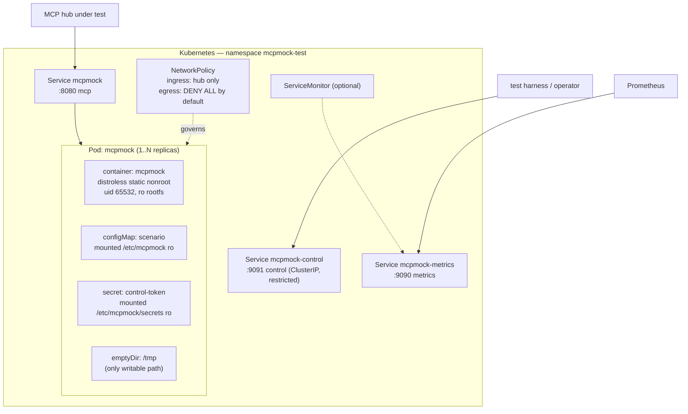

# Deployment and Operations

## 0. Authorised environment

**The only authorised deployment and test target is Kubernetes context `docker-desktop`,
namespace `mcpmock-test`.** No other cluster or namespace may be used. Every e2e test asserts the
context and namespace before acting and refuses otherwise.

Local tooling verified present: Go 1.27.1, helm 3.19.1, Docker Desktop 29.6.1, k6, govulncheck.
**Not installed:** trivy, cosign, syft, gofumpt, mockgen. `make tools` must install them, and the
CI jobs that need them use pinned actions rather than local binaries.

---

## 1. Runtime topology



Single deployable unit. Three ports, three Services, deliberately separate so that scraping
metrics does not imply access to the control plane or to the journal (`security.md §1`).

| Port | Name | Default | Exposure |
|---|---|---|---|
| 8080 | `mcp` | MCP endpoint(s), path-routed per instance | to the hub |
| 9091 | `control` | Control API | restricted; token required off-loopback |
| 9090 | `metrics` | `/metrics`, `/healthz`, `/readyz` | to Prometheus |

Replicas: **1 by default.** The journal is per-process and per-replica; two replicas mean a test's
evidence is split across pods and assertions become racy. Scaling above 1 is supported only for
`MOCK-508.2` rolling-restart testing and is documented with that caveat, loudly, in the chart's
`NOTES.txt`.

---

## 2. Container image

```dockerfile
# ---- build ----
FROM golang:1.27.1-alpine AS build
WORKDIR /src
COPY go.mod go.sum ./
RUN go mod download
COPY . .
ARG VERSION=dev
ARG COMMIT=none
ARG BUILD_TIME=unknown
RUN CGO_ENABLED=0 GOOS=${TARGETOS:-linux} GOARCH=${TARGETARCH:-amd64} \
    go build -trimpath \
      -ldflags="-s -w -X main.version=${VERSION} -X main.commit=${COMMIT} -X main.date=${BUILD_TIME}" \
      -o /out/mcpmock ./cmd/mcpmock

# ---- runtime ----
FROM gcr.io/distroless/static-debian12:nonroot
COPY --from=build /out/mcpmock /usr/local/bin/mcpmock
USER 65532:65532
ENV MCPMOCK_SAFE_MODE=1
EXPOSE 8080 9090 9091
ENTRYPOINT ["/usr/local/bin/mcpmock"]
CMD ["serve", "--config", "/etc/mcpmock/scenario.yaml"]
```

| Property | Value | Requirement |
|---|---|---|
| Base | `gcr.io/distroless/static-debian12:nonroot` | `MOCK-101` |
| Shell / package manager | none | `MOCK-101.3` |
| User | 65532 non-root | `MOCK-101.4` |
| Linkage | fully static, `CGO_ENABLED=0` | `MOCK-101.2` |
| Platforms | `linux/amd64`, `linux/arm64` | matches `ci.yml:598` |
| Size target | < 25 MiB (binary dominates) | — |
| `MCPMOCK_SAFE_MODE=1` | hostile corpus disabled by default in the image | ADR-018 §6 |
| SBOM | SPDX via `anchore/sbom-action` (`ci.yml:609`) | §10.2 |
| Signature | **Cosign — must be added, see §7** | §10.2 |

The build stage uses `golang:1.27.1-alpine` while `ci.yml:17` pins `GO_VERSION: '1.26.4'`.
**These disagree and must be reconciled** — GAP-002.

---

## 3. Configuration surface

Precedence, highest first: CLI flag → environment variable → scenario file → default.
Environment variables configure only **secrets and endpoints**, never behaviour — behaviour in an
env var defeats reproducibility (`MOCK-704`).

### 3.1 CLI

```
mcpmock serve    [--config PATH] [--seed N] [--transport stdio,http]
                 [--listen ADDR] [--control-listen ADDR] [--control-socket PATH]
                 [--metrics-listen ADDR] [--scenario-root DIR]
                 [--log-level debug|info|warn|error] [--safe-mode] [--no-validate]
mcpmock validate PATH [--strict] [--output text|json]
mcpmock ctl      <noun> <verb> [--url URL | --socket PATH] [--token-file PATH] ...
mcpmock gen      certs|endpoint|scenario ...
mcpmock corpus   list|dump --id ID
mcpmock version
```

Exit codes: `0` ok · `1` validation/runtime error · `2` I/O or usage error.

### 3.2 Environment

| Variable | Purpose | Default |
|---|---|---|
| `MCPMOCK_CONTROL_TOKEN` | control API bearer token | unset |
| `MCPMOCK_CONTROL_TOKEN_FILE` | file containing it (preferred in k8s) | unset |
| `MCPMOCK_SAFE_MODE` | ADR-018 third gate | `1` in the image, `0` otherwise |
| `OTEL_EXPORTER_OTLP_ENDPOINT` | enables tracing when set | unset |
| `OTEL_SERVICE_NAME` | span resource attribute | `mcpmock` |
| `GOMEMLIMIT` | set by the chart from the memory limit | — |
| `XDG_RUNTIME_DIR` | control socket location in stdio mode | `/tmp` |

**There is deliberately no `--control-token` flag with a value** — flag values are visible in
`ps`, in the pod spec and in shell history (`security.md §2.1`).

### 3.3 Validation of the configuration surface

`mcpmock validate` runs the same code path as `serve` (`MOCK-701`), so a config that validates
always starts. The chart runs `mcpmock validate` in an **init container** against the mounted
ConfigMap, so a bad scenario fails the rollout with a readable message instead of crash-looping.

---

## 4. Helm chart — values contract

`helm/mcpmock`. Values below are the contract; anything not listed is not supported.

```yaml
image:
  repository: ghcr.io/ORG/mcpmock      # GAP-001
  tag: ""                              # defaults to .Chart.AppVersion
  pullPolicy: IfNotPresent

replicaCount: 1                        # >1 splits the journal; see §1

scenario:
  # exactly one of:
  inline: {}                           # rendered into a ConfigMap
  configMapName: ""                    # reference an existing ConfigMap
  key: scenario.yaml
  validateOnStart: true                # init container running `mcpmock validate`

seed: 0                                # 0 = random; printed at startup (MOCK-704)
logLevel: info

mcp:
  port: 8080
  path: /mcp
  service: { type: ClusterIP, annotations: {} }
  tls:
    enabled: false
    secretName: ""                     # tls.crt / tls.key
    clientAuth: none                   # none|request|require-any|verify-if-given|require-and-verify
    clientCASecretName: ""
    minVersion: "1.2"

control:
  enabled: true
  port: 9091
  service: { type: ClusterIP }
  tokenSecretName: ""                  # REQUIRED when the service is reachable off-loopback
  tokenSecretKey: token
  networkPolicy:
    allowedNamespaces: []              # empty = same namespace only

metrics:
  enabled: true
  port: 9090
  serviceMonitor: { enabled: false, interval: 30s, labels: {} }

tracing:
  enabled: false
  endpoint: ""                         # OTLP/HTTP
  sampleRatio: 1.0

hostile:
  enabled: false                       # ADR-018; template FAILS unless networkPolicy.enabled

networkPolicy:
  enabled: true
  denyAllEgress: true                  # required when hostile.enabled
  ingressFrom: []                      # podSelector/namespaceSelector list

resources:
  requests: { cpu: 100m, memory: 128Mi }
  limits:   { cpu: "4",  memory: 1Gi }

profile: default                       # default | large-fleet | many-streams  (see §5)

podSecurityContext:
  runAsNonRoot: true
  runAsUser: 65532
  fsGroup: 65532
  seccompProfile: { type: RuntimeDefault }
securityContext:
  allowPrivilegeEscalation: false
  readOnlyRootFilesystem: true
  capabilities: { drop: ["ALL"] }

livenessProbe:  { httpGet: { path: /healthz, port: 9090 }, initialDelaySeconds: 1, periodSeconds: 10 }
readinessProbe: { httpGet: { path: /readyz,  port: 9090 }, initialDelaySeconds: 1, periodSeconds: 5 }

terminationGracePeriodSeconds: 30      # raise for MOCK-508.3 hangShutdown tests

nodeSelector: {}
tolerations: []
affinity: {}
podAnnotations: {}
extraEnv: []
```

### 4.1 Template-level guards

These are chart failures, not documentation:

1. `hostile.enabled: true` **and** `networkPolicy.enabled: false` ⇒ `fail` with a message naming
   ADR-018 (`MOCK-507.7`).
2. `control.service.type` is `LoadBalancer` or `NodePort` **and** `control.tokenSecretName` is
   empty ⇒ `fail`.
3. `mcp.tls.clientAuth` requires a certificate but `clientCASecretName` is empty ⇒ `fail`.
4. `replicaCount > 1` ⇒ a `NOTES.txt` warning about split journals.
5. Both `scenario.inline` and `scenario.configMapName` set, or neither ⇒ `fail`.

`helm lint` and `helm template` run in CI (`ci.yml:462`–`:474`); a `helm-unittest` suite covers the
five guards above.

---

## 5. Resource envelope

Stated honestly, including the number nobody likes (ADR-012's SSE memory).

| Profile | Workload | CPU req/lim | Mem req/lim | Notes |
|---|---|---|---|---|
| `default` | 1 instance, ≤ 100 tools, ≤ 100 streams | 100m / 1 | 128Mi / 256Mi | ordinary functional testing |
| `large-fleet` | 200 instances × 5000 virtual tools (`MOCK-904`) | 500m / 2 | 512Mi / 1Gi | catalogue is virtual (ADR-004), so tool count barely matters; instance count and journal budget do |
| `many-streams` | 20 000 concurrent SSE streams (`MOCK-903`) | 2 / 4 | **1.5Gi / 2Gi** | ≈ 25 KiB/stream × 20 000 ≈ 500 MiB user space + Go heap headroom + GC. **This is an estimate from ADR-012, to be replaced by measurement in Phase 6.** |
| `throughput` | 20 000 rps (`MOCK-901`) | 4 / 4 | 256Mi / 512Mi | CPU-bound, not memory-bound; journaling off |

Additional requirements for `many-streams`:
- `RLIMIT_NOFILE` ≥ 24 576. Containerd defaults are usually far above this; mcpmock checks at
  startup and logs a `WARN` if it is not (`MOCK-903.5`).
- `GOMEMLIMIT` set from the container memory limit by the chart, so Go's GC targets the cgroup
  rather than the host.
- Do **not** set a CPU limit below 2 for this profile; SSE flush work is spread across the write
  path and throttling produces misleading drop counts.

Journal memory is separate and explicit: `journal.maxBytesTotal` (default 256 MiB) is a
**fleet-wide budget** divided across instances (ADR-007). It must fit inside the memory limit
alongside the profile above; the chart's `NOTES.txt` prints the arithmetic.

---

## 6. Rollout, rollback, shutdown

| Concern | Design |
|---|---|
| Rollout | `RollingUpdate`, `maxUnavailable: 0`, `maxSurge: 1`. Readiness gates on `/readyz`, which requires every listener accepting **and** every `Snapshot` published. |
| Rollback | `helm rollback`. There is no persistent state, so rollback is unconditionally safe — the only loss is the journal, which is test evidence and should have been asserted before the rollout. |
| Graceful shutdown | SIGTERM ⇒ stop accepting, `/readyz` returns 503, close SSE streams with `resultType: "complete"`, drain in-flight up to `shutdown.drainTimeoutSeconds` (default 10 s), exit 0. |
| Deliberate bad shutdown (`MOCK-508.3`) | `shutdown.mode: hang` never closes streams; the pod is killed at `terminationGracePeriodSeconds`. Raise that value in the test's values file so the behaviour is observable. |
| Health under fault injection | `/healthz` **ignores** injected faults entirely (`observability.md §5`). Otherwise a `MOCK-508` test would be indistinguishable from a crash loop and Kubernetes would destroy the experiment. |
| PDB | Not provided. A single-replica test harness with a PDB blocks node drains for no benefit. |

---

## 7. CI pipeline changes — extending the existing workflow

`.github/workflows/ci.yml` exists (735 lines) and is templated from a different project. It is
**extended, not replaced**. Required edits:

### 7.1 Environment block (`ci.yml:16`–`:24`)

| Line | Current | Change to | Why |
|---|---|---|---|
| `:17` | `GO_VERSION: '1.26.4'` | `'1.27.1'` | toolchain is 1.27.1 — **GAP-002** |
| `:18` | `GOLANGCI_LINT_VERSION: 'v2.12.2'` | `'v2.13.2'` | stated target |
| `:20` | `DOCKER_IMAGE: ghcr.io/${{ github.repository }}` | unchanged | resolves once GAP-001 is settled |
| `:21` | `HELM_VERSION: 'v3.17.3'` | `'v3.19.1'` | matches local |
| `:22` | `HELM_CHART_PATH: 'helm/restapi-example'` | `'helm/mcpmock'` | |
| `:23` | `HELM_RELEASE_NAME: 'restapi-example'` | `'mcpmock'` | |
| `:24` | `HELM_NAMESPACE: 'restapi-example-test'` | `'mcpmock-test'` | authorised namespace |

Also `:450` and `:693` pin `azure/setup-helm` to `v3.14.0` inline, overriding `HELM_VERSION`;
change both to use the env var.

### 7.2 Build paths

| Line | Current | Change to |
|---|---|---|
| `:255` | `go build -o bin/server ./cmd/server` | `./cmd/mcpmock` |
| `:391` | artifact `bin/server` | `bin/mcpmock` |
| `:512`–`:519` | `./cmd/server`, `bin/server-*` | `./cmd/mcpmock`, `bin/mcpmock-*` |
| `:707` | `docker build -t restapi-example:helm-test` | `mcpmock:helm-test` |
| `:723`–`:725` | `--set image.repository=restapi-example` | `mcpmock` |
| `:735` | label `app.kubernetes.io/name=restapi-example` | `mcpmock` |

### 7.3 Integration job (`ci.yml:149`–`:231`)

**Remove** the Vault (`:156`), Keycloak DB (`:172`) and Keycloak (`:182`) service blocks and the
`INTEGRATION_*` env (`:214`–`:220`). mcpmock has no external dependencies — `MOCK-405` exists so
that auth tests need no IdP. This makes the job faster and removes a flaky third-party image.

Also reconsider `continue-on-error: true` (`:152`) and the `|| true` on the test command (`:222`,
`:281`): for this project, integration and e2e failures should **fail the build**, because they
cover `MOCK-106`, `MOCK-502` and `MOCK-508`, which no other level covers.

### 7.4 E2E job (`ci.yml:237`–`:297`)

Replace the `APP_*` env and the `/health` poll with mcpmock's flags and `/readyz` on `:9090`.

### 7.5 New jobs to add

| Job | Purpose | Requirement |
|---|---|---|
| `determinism` | `go test -tags=functional -run TestDeterminism -count=20 ./test/functional/...` | §0.1, PRIN-1 |
| `schema-check` | `make schema-check` — Go structs vs `scenario.schema.json` | ADR-008 |
| `deps-check` | approved dependency set; `assert`/`journalapi` stdlib-only; `test/mcpclient` isolation | ADR-013, ADR-017 |
| `globals-check` | no mutable package-level vars | ADR-007 |
| `secrets-check` | no PEM/private keys/fixture tokens in tree or image | `security.md §3` |
| `corpus-verify` | manifest hash check | ADR-018 |
| `startup-budget` | p95 < 200 ms over 50 runs, artifact | `MOCK-107` |
| `perf` (tag-only) | k6 suites, artifacts | `MOCK-901`…`904` |

### 7.6 **Cosign — a verified gap**

§10.2 requires "Container image with SBOM and **Cosign signature**". The existing pipeline
generates an SBOM (`ci.yml:609`–`:622`) but contains **no Cosign step anywhere**. This must be
added to `docker-build-push` (after `:607`):

```yaml
      - name: Install Cosign
        uses: sigstore/cosign-installer@<pinned-sha>   # pin like every other action here
      - name: Sign image (keyless, OIDC)
        env:
          COSIGN_EXPERIMENTAL: "1"
        run: |
          cosign sign --yes \
            "${{ env.DOCKER_IMAGE }}@${{ steps.build.outputs.digest }}"
      - name: Attach SBOM attestation
        run: |
          cosign attest --yes --predicate ./sbom.spdx.json --type spdxjson \
            "${{ env.DOCKER_IMAGE }}@${{ steps.build.outputs.digest }}"
```

This needs `permissions: id-token: write` on the job. **Cosign is not installed locally**, so the
signing path is CI-only and cannot be smoke-tested on the workstation — noted as an operational
constraint, not a blocker.

Trivy is already wired with a CRITICAL/HIGH `exit-code: 1` gate (`ci.yml:658`–`:665`); no change
needed beyond the image name.

### 7.7 Makefile targets required by CI

`ci.yml:385` calls `make build`. The Makefile must provide at minimum:

```
build test-unit test-functional test-integration test-e2e test-perf
lint fmt vuln tools
schema-check deps-check globals-check secrets-check corpus-verify determinism-check
docker helm-lint helm-template image-scan
```

---

## 8. Plain manifests

`deploy/manifests/` provides the Helm output for the `default` profile, hand-checked:
`namespace.yaml`, `configmap-scenario.yaml`, `secret-control-token.example.yaml` (with a
placeholder and a comment, never a real value), `deployment.yaml`, `service-mcp.yaml`,
`service-control.yaml`, `service-metrics.yaml`, `networkpolicy.yaml`.

They exist because `MOCK-101` requires them and because a reader who wants to know what the chart
actually produces should not have to run Helm. A CI check asserts they stay in sync with
`helm template --set profile=default`.

---

## 9. Operational runbook (short)

| Symptom | First check |
|---|---|
| Hub sees JSON parse errors on stdio | `mcpmock_stdout_leak_bytes_total` — ADR-011 leak |
| Test results not reproducible | Effective seed in the startup log; then the known-exception list (GAP-007, GAP-008) |
| Journal missing records | `mcpmock_journal_dropped_total` and the configured `overflow` policy |
| Streams silently stop | `mcpmock_sse_frames_dropped_total{reason="slow_consumer"}` — the consumer, not the mock |
| Pod OOMKilled at high stream counts | `many-streams` profile; §5 envelope |
| `helm install` fails with a `fail` message | One of the five §4.1 guards; the message names the reason |
| Hostile content appearing unexpectedly | `mcpmock_hostile_mode`, `X-Mcpmock-Hostile`, and the startup `WARN` — all three should have fired |
| Startup slower than 200 ms | `mcpmock_startup_duration_seconds{phase}` breaks it down |
