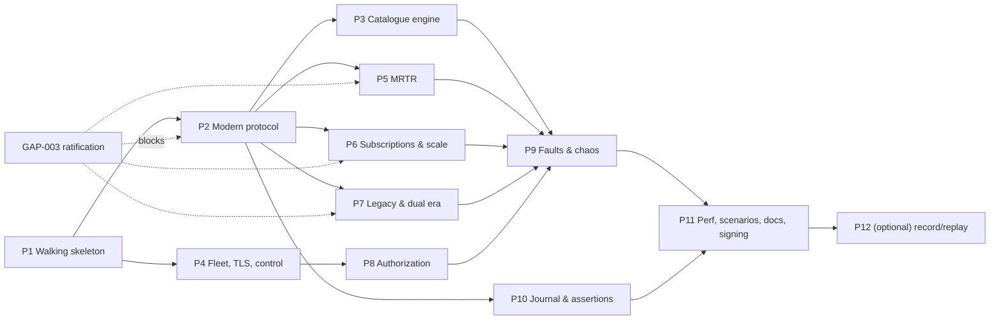

# Implementation Plan

## 0. Shape of the plan

Phases are **vertical slices**, not layers. Each phase ends with something demonstrable through
the public interfaces — never "the journal package is done".

Phase 1 is a **walking skeleton**: thin end-to-end, one instance, one transport pair, one method
family, deployed to Kubernetes and green in CI. Everything after it thickens a slice.

The requirement volume (≈120 MUSTs) exceeds one delivery cycle. Requirements are **not** narrowed;
they are sequenced, and undelivered ones are reported `NOT-IMPLEMENTED` honestly.

**Sizes** are relative, in engineer-weeks for one competent Go engineer, ±40%. They are estimates,
not commitments.

---

## Phase 1 — Walking skeleton  ·  size M (≈3 weeks)

**Goal: the earliest point at which every one of the requester's acceptance criteria is met
simultaneously — builds, lints, no vulns, tests pass, Helm chart deploys to local Kubernetes.**

Nothing after Phase 1 changes that; every later phase keeps it true.

### Slice

One instance. Both transports. Three methods. A real journal. A real control API. A real image and
chart on `docker-desktop`/`mcpmock-test`.

| Area | Delivered |
|---|---|
| Module | `go.mod` — `module github.com/vyrodovalexey/mcp-mock-server`, `go 1.27.0` — `Makefile` with every CI target, `Dockerfile`, `.gitignore` additions |
| CI | `ci.yml` adapted per `deployment.md §7.1`–`§7.4`; new `deps-check`, `globals-check`, `schema-check`, `secrets-check` jobs |
| Determinism | `internal/determinism` (seed tree, ChaCha8 DRNG, virtual clock), `internal/ordered`, canonical JSON. **ADR-002 and ADR-003 in full** — these cannot be retrofitted. |
| Config | `scenario` package, YAML/JSON load, `extends` composition, embedded JSON Schema, `mcpmock validate` |
| Engine | `Exchange` / `ResponseSink` (ADR-006), pipeline stages 1–9, handler registry |
| **Wire** | **`internal/wire` — Phase 1 subset only** (see the table below). Created here, not in Phase 2, because Phase 1 ships three methods and `_meta` validation, which are all wire surface, and ADR-019 forbids wire literals in handlers. **Corrected by AMEND-3.** |
| Transports | `stdio` (with the ADR-011 stdout hijack) and `streamable-http` (JSON shape only; SSE in Phase 2) |
| Methods | `server/discover`, `tools/list` (no pagination), `tools/call` (`echo`/`sleep`/`fail` — defined in `contracts/builtin-tools.md`) |
| Validation | `_meta` presence checks (`MOCK-203`), all three `validateMeta` modes (`contracts/builtin-tools.md §5`) |
| Catalogue | virtual generator + authored overlay (ADR-004), no drift, no scoping |
| Journal | sharded ring, overflow policies, JSON + NDJSON query, `Seq` ordering (ADR-005) |
| Public API | `mcpmock`, `journalapi`, `assert` (3 of 8 assertions: `AssertNoHeader`, `AssertHeaderNotValue`, `AssertRequestCount`), `StartTest` |
| Control API | `/v1` with instances, journal read/clear, seed, health; unix socket; `mcpmock ctl` |
| Observability | slog JSON on stderr, Prometheus registry + `/metrics`, `/healthz`, `/readyz`, startup record with effective seed |
| Test | `test/mcpclient` **written first** (ADR-017), determinism suite, first golden fixtures, e2e Helm install |
| Deploy | distroless image, `helm/mcpmock`, `deploy/manifests/`, NetworkPolicy |
| Perf | **early throughput smoke test** — a rough `tools/call` rps measurement to falsify ADR-012's estimate while the architecture is still cheap to change |

### `internal/wire` — the Phase 1 / Phase 2 split  (AMEND-3)

**Confirmed:** `@task-breakdown`'s resolution is correct. `TASK-010` (`internal/wire` Phase-1
subset) stands as written. The earlier text scheduling the whole of `internal/wire` in Phase 2 was
an error in this plan, not in the breakdown.

The package is **created** in Phase 1 with the minimum surface Phase 1's own handlers need, and is
**extended** — never rewritten — in Phase 2. ADR-019's containment rule ("no wire literals outside
`internal/wire` and `test/mcpclient`") applies from the first Phase 1 handler onward, enforced by
`make wire-literal-check`.

| Wire element | Annex clause | Phase | Why |
|---|---|---|---|
| Method-name constants: `server/discover`, `tools/list`, `tools/call` | §5, `[R MOCK-202]` | **1** | Phase 1 dispatches these three |
| `_meta` key constants `protocolVersion`, `clientCapabilities`; the `params._meta` location | 2.3, 2.4, 2.5 `[P-06]` | **1** | `MOCK-203` is Phase 1 |
| `-32602` + `error.data.missing` payload shape | 2.12 `[P-11]` | **1** | `MOCK-203.4` |
| `resultType` **table** (data, not a switch) — the three Phase 1 entries `discovery`, `toolList`, `toolResult` only | 4.2 `[P-21]` | **1** | `MOCK-209` partial |
| `_meta.serverInfo` shape | 4.4 `[P-22]` | **1** | on every Phase 1 result |
| `server/discover` result field set | §5 | **1** | `MOCK-201` partial |
| `ttlMs` / `cacheScope` result fields | 4.5, 4.6 `[P-23]` | **1** | emitted by discover and `tools/list` |
| `-32601` method-not-found | §6 | **1** | `switches.methods.*.enabled: false` |
| Wire-subset JSON Schema `wire-2026-07-28.schema.json` (`v0` draft) | new, AMEND-4 | **1** | makes `MOCK-201.4` self-check testable |
| Remaining six `resultType` values | 4.2 | 2 | those methods do not exist in Phase 1 |
| Mirrored headers, sentinel codec, `-32020` | §3 | 2 | `MOCK-204` is Phase 2 |
| `-32021`, `-32022` and their `data` payloads | §6 | 2 | `MOCK-205`/`206` are Phase 2 |
| Pagination `cursor` / `nextCursor` | 4.7, 4.8 | 2 | `tools/list` is unpaginated in Phase 1 |
| SSE framing, `event:`/`id:` fields | 1.6–1.8 | 2 | JSON shape only in Phase 1 |
| MRTR shapes | §7 | 5 | — |
| Subscription shapes | §8 | 6 | — |
| Legacy era, era detection | §9 | 7 | — |

**Consequence for `switches.selfCheck`.** `selfCheck` is now **in Phase 1 scope** for
`server/discover`, `tools/list` and `tools/call` results only, validated against the Phase 1
subset schema. This makes `MOCK-201.4` testable in Phase 1 — see AMEND-4.

### Requirements covered

Full: `MOCK-101`, `MOCK-102`, `MOCK-105`, `MOCK-107`, `MOCK-203`, `MOCK-601`, `MOCK-602`,
`MOCK-701`, `MOCK-703`, `MOCK-704`, plus PRIN-1…PRIN-5.
Partial: `MOCK-201` (fields, no `extensions` variation), `MOCK-202` (3 of 9 methods),
`MOCK-104` (subset of operations), `MOCK-221`/`222` (generation + overlay, no edge cases),
`MOCK-603` (3 of 8), `MOCK-702` (journal clear only), `MOCK-901` (measured, not gated).

### Blocked by
**Nothing.** ✅ GAP-001 (module path) resolved 2026-09-04 to
`github.com/vyrodovalexey/mcp-mock-server` (AMEND-1); ✅ GAP-002 (Go version) resolved to toolchain
Go 1.27.1 / `go.mod` `go 1.27.0` / golangci-lint v2.13.2. Phase 1 is unblocked and may start.

### Demo
`helm install` into `mcpmock-test`; a `curl` against `tools/call`; a hub-style Go test importing
`mcpmock` + `assert` from an external module and asserting on the journal; `/metrics` scraped;
same seed twice ⇒ byte-identical output.

---

## Phase 2 — Modern protocol completeness  ·  size L (≈4 weeks)

**🔴 Blocked by GAP-003 ratification.** Do not start until the wire annex is settled — this phase
*is* the annex made executable, and starting early means rewriting it.

| Area | Delivered |
|---|---|
| Wire | **Extends** the Phase 1 `internal/wire` subset to the full ratified annex — see the Phase 1 split table. The package already exists and the ADR-019 containment rule is already enforced; this phase adds table entries, it does not create the package. Ratification may *change* Phase 1 `[P-nn]` values, which is a table edit plus golden regeneration, not a rewrite (AMEND-3) |
| Headers | `MOCK-204` mirroring, sentinel codec, typed `Mcp-Param-*` comparison |
| Errors | `-32020` / `-32021` / `-32022` with their `data` payloads |
| Methods | remaining six of `MOCK-202`, per-method switches |
| Shapes | SSE sink, `X-Accel-Buffering: no`, seeded shape selection (`MOCK-208`) |
| Streams | `notifications/progress` (`MOCK-210`), `notifications/message` (`MOCK-211`), cancellation (`MOCK-212`) |
| Results | `resultType`, `_meta.serverInfo`, omission switches (`MOCK-209`) |
| Session hygiene | `405` on GET/DELETE, ignore session headers (`MOCK-207`) |
| Paging | opaque AEAD cursors, per-page `ttlMs`/`cacheScope` (`MOCK-231`, `MOCK-232`) |
| Scheduler | `internal/sched` timer wheel (needed by progress intervals) |
| Test | golden fixtures per requirement; `test/mcpclient` extended **before** each handler |

**Covers:** `MOCK-201` (full), `202`, `204`, `205`, `206`, `207`, `208`, `209`, `210`, `211`,
`212`, `231`, `232`.

---

## Phase 3 — Catalogue engine  ·  size M (≈3 weeks)

| Area | Delivered |
|---|---|
| Scale | 5000-tool catalogues, virtual, verified against the `MOCK-221.4` memory claim |
| Edge cases | name edge cases (`MOCK-223`), `x-mcp-header` invalid forms (`MOCK-224`), schema edge cases (`MOCK-225`) incl. the embedded loopback `$ref` host |
| Drift | `MOCK-227` patches by control API / after N calls / after N seconds; `MOCK-233` silent drift |
| Ordering | `MOCK-226` deterministic / shuffled / reversed / byName |
| Scoping | `MOCK-228` authorization-dependent catalogues with the bounded scope-index memo |
| Validation | `MOCK-606` `tools/call` argument validation with timeout and `schema_unusable` handling |

**🔴 Needs GAP-016** (external `$ref` posture) before `MOCK-225` external-ref work.
**Covers:** `MOCK-221`, `222`, `223`, `224`, `225`, `226`, `227`, `228`, `233`, `606`.

---

## Phase 4 — Fleet, listeners, TLS/mTLS, control completeness  ·  size M (≈3 weeks)

Independent of Phase 2; can run in parallel with it.

| Area | Delivered |
|---|---|
| Fleet | `kind: Fleet`, `generate:` for 200 instances, per-instance isolation, name collisions |
| Router | prefix trie with atomic swap; runtime add/remove instance |
| Listeners | `listener: own` escape hatch with its bound |
| TLS | full `MOCK-106`: five `clientAuth` modes, min version, cipher suites, ephemeral CA, SNI-based per-instance policy, client-cert evidence in the journal |
| Control | every remaining `Control` operation; CLI parity test; rate limiting; token auth; non-loopback refusal |
| Budgets | fleet-wide journal budget division |

**Covers:** `MOCK-103`, `MOCK-104` (full), `MOCK-106`, `MOCK-702` (full), `MOCK-703` (full),
`MOCK-904`.

---

## Phase 5 — MRTR  ·  size M (≈3 weeks)  ·  🔴 blocked by GAP-003

| Area | Delivered |
|---|---|
| AEAD | `requestState` per ADR-010: AES-256-GCM, HKDF, counter nonce, eight rejection reasons, replay LRU |
| Flow | `InputRequiredResult`, configurable rounds incl. never-completes, all three input types singly and combined |
| Re-asking | `MOCK-246` with `missing-only` / `all` |
| Capability gating | `MOCK-245` conformant refusal + named non-conformant override |
| Self-check | `MOCK-244` — reject our own neither-nor responses |
| Ids | `MOCK-247` recording, `retryIdsDistinct`, optional enforcement |
| Correlation | `MOCK-605` chain view over the control API and in `journalapi` |

**Needs GAP-021** (`crypto/hkdf` availability) verified as task one.
**Covers:** `MOCK-241`…`247`, `MOCK-605`.

---

## Phase 6 — Subscriptions and streaming scale  ·  size M (≈3 weeks)  ·  🔴 blocked by GAP-003, GAP-005

| Area | Delivered |
|---|---|
| Listen | `subscriptions/listen`, ack-first, `subscriptionId` on every message, filter honouring |
| Partial ack | `MOCK-252` subset acknowledgment and per-type refusal |
| Emission | on-demand / timer / catalogue-change, all four notification types |
| Closure | graceful (`resultType: complete`) and abrupt (RST via hijack + `SetLinger(0)`) |
| Keep-alive | timer-wheel-driven, configurable, disableable; drop-on-full with a metric |
| stdio mux | `MOCK-256` interleaving with the fuzz-ordered reassembly test |
| Non-conformant | `MOCK-257` two named modes |
| **Scale** | the `MOCK-903` 20 000-stream run, goroutine-budget assertion, real RSS measurement replacing ADR-012's estimate |

**Covers:** `MOCK-251`…`257`, `MOCK-903`.

---

## Phase 7 — Legacy and dual era  ·  size L (≈4 weeks)  ·  🔴 blocked by GAP-003

The largest single-phase protocol surface after Phase 2.

| Area | Delivered |
|---|---|
| Handshake | `initialize` / `notifications/initialized`, negotiated version |
| Sessions | `Mcp-Session-Id` issuance and validation, `DELETE` termination, TTL and call-count expiry, `inFlightOnInvalidate` |
| GET SSE | server→client stream, deterministic event ids, `Last-Event-ID` replay from a bounded buffer |
| Methods | `ping`, `logging/setLevel`, `resources/subscribe` / `unsubscribe` |
| Server-initiated | `MOCK-302` real requests on the stream with correlated responses (`Initiator`) |
| Dual era | `MOCK-303` with the total discrimination rule; strict single-era modes |
| Probes | `MOCK-304` all six behaviours |
| Errors | `MOCK-306` `-32002` |
| Versions | `2025-06-18`, `2025-03-26` differences per the legacy annex |
| Cross-check | optional third-party SDK integration test (ADR-017 §4) |

**Covers:** `MOCK-301`…`306`.

---

## Phase 8 — Authorization  ·  size M (≈3 weeks)

| Area | Delivered |
|---|---|
| Modes | `none`, `bearer-static` (constant-time), `oauth-resource-server` |
| RFC 9728 | protected-resource metadata, `WWW-Authenticate` challenges |
| Audience | `MOCK-403` validation with staged reasons — the token-passthrough detector |
| Scopes | `MOCK-404` per-primitive scopes, single `403` challenge with the full set |
| Embedded AS | `internal/jwtmini` + `internal/authsrv`: metadata, JWKS, `/token`, ES256/RS256, RFC 9207 `iss`, every named malformation |
| Lifecycle | `MOCK-406` expiry mid-session, scope escalation, credential recording |
| Evidence | `MOCK-407` hashed echo; the "no raw credential anywhere" scan test |

**Covers:** `MOCK-401`…`407`.

---

## Phase 9 — Fault and chaos injection  ·  size L (≈4 weeks)

The whole §5 vocabulary, on the engine built in Phase 1 and extended throughout.

| Area | Delivered |
|---|---|
| Engine | selector × trigger × action complete, matrix-tested; `determinism.strict` |
| Latency | fixed, distribution, percentile, slow first byte, slow SSE, stall |
| Transport | reset, half-close, truncation, accept refusal, TLS handshake failure |
| Protocol | all eleven named faults via `FrameRawBytes` |
| Size | oversized result/event (streamed, not buffered), many blocks, deep nesting |
| Error | every standard, MCP, retired and reserved-range code |
| Content | `isError`, schema violations, foreign URI schemes, hostile icon URLs |
| Corpus | ADR-018 in full: encoded blob, manifest, `corpus-verify`, three gates, delimiters, signalling, chart guard |
| Restart | stdio exit with journal flush, rolling restart e2e, `hangShutdown` |

**🔴 Needs GAP-009** (DNS) and 🔴 **GAP-015** (corpus ownership).
**Covers:** `MOCK-501`…`508`.

---

## Phase 10 — Journal and assertions completeness  ·  size S/M (≈2 weeks)

Can run in parallel with Phases 5–9.

| Area | Delivered |
|---|---|
| Assertions | the remaining five of the eight, plus `Check*` forms, plus the message-quality and secret-scan tests |
| Golden | `MOCK-604` redaction rules, unified diff, `schemaVersion` header, `MCPMOCK_UPDATE_GOLDEN` |
| Correlation | `MOCK-605` helpers in `assert` |
| Query | full filter set, `?follow=true`, `?consistent=true`, 100k-record query latency gate |
| Overflow | `MOCK-902` policies verified under load incl. block-timeout degradation |

**Covers:** `MOCK-603` (full), `MOCK-604`, `MOCK-902`.

---

## Phase 11 — Performance, scenario library, docs, signing  ·  size M (≈3 weeks)

| Area | Delivered |
|---|---|
| Perf | all four §9 targets measured under the GAP-006 conditions and gated in CI; results as artifacts |
| Scenarios | all ten `MOCK-705` scenarios on a shared `base.yaml`, each with a functional test |
| Docs | quick start, scenario reference, fault catalogue, dependency report, runbook |
| Supply chain | **Cosign signing + SBOM attestation added to CI** (`deployment.md §7.6`) — closing the §10.2 gap |
| Release | semver tagging, `CHANGELOG.md`, `v0.1.0` |
| Hub hooks | the structured-but-empty `HUB-nnn` mapping table and a documented harness shape (GAP-004) |

**Covers:** `MOCK-705`, `MOCK-901`…`904` (gated), DEL-1, DEL-2, DEL-3, DEL-4, DEL-6 (partial).

---

## Phase 12 — Optional: record/replay  ·  size L (≈4 weeks)

`MOCK-706`. Deferred per GAP-012. Builds on `test/mcpclient`, which already exists for
anti-circularity reasons and covers ~60% of the client work. Should not start before GAP-003 is
resolved — we would not know how to interpret a recording.

---

## Parallelism and the critical path

**Critical path:** P1 → P2 → P7 → P9 → P11 ≈ 18 weeks for one engineer.

**Parallelisable:**
- P4 with P2 (different subsystems, one shared touch point in the router).
- P10 with P5/P6/P8.
- P3 and P5 with each other once P2 lands.
- Documentation continuously.

With three engineers the path compresses to roughly 10–12 weeks, bounded by P2 → P7 → P9, which
are hard to split because each is one coherent protocol surface.

**The schedule risk is not engineering, it is GAP-003.** Every day the wire annex is unratified,
P2, P5, P6 and P7 — the bulk of the work — cannot start. P1, P4 and much of P10 are the only
GAP-003-independent work, totalling roughly 6–7 engineer-weeks. That is the size of the runway.

---

## Risk register

| ID | Risk | Prob | Impact | Mitigation | Owner |
|---|---|---|---|---|---|
| **RISK-01** | GAP-003 is never ratified; the wire format stays guessed | High | **Critical** — the mock validates the hub against a fiction | Annex with labelled `[P]` items; no wire literals in handlers; ratification is an explicit gate | Requester |
| **RISK-02** | `MOCK-903` 20 000 streams unreachable on stdlib `net/http` within the memory envelope | Medium | High | ADR-012's budget is an estimate; **early smoke test in Phase 1**, real measurement in Phase 6; fallback is to lower the target with evidence, not to rewrite the HTTP stack | Eng |
| **RISK-03** | `MOCK-901` 20 000 rps unreachable on 4 vCPU | Low–Med | High | Same early-falsification approach; hot path designed allocation-light from day one | Eng |
| **RISK-04** | Determinism leaks (map iteration, stray `time.Now()`) discovered late | Medium | High | ADR-003's `-count=20` cross-`GOMAXPROCS` suite from Phase 1; `determinism-check` AST scan | Eng |
| **RISK-05** | Scenario schema churns as phases land, breaking users' files | High | Medium | `v1alpha1` explicitly unstable; `additionalProperties: false` catches drift loudly; `schema-check` keeps Go and JSON aligned | Eng |
| **RISK-06** | Hostile corpus blocked on legal/security review | Medium | Medium (`MOCK-507` only) | GAP-015; start with a small in-house corpus; containment machinery is independent of content | Requester |
| **RISK-07** | Hub team cannot use `MOCK-107` because the module graph is too heavy | Low | Medium | ADR-001's four-package split; `assert`+`journalapi` are stdlib-only; escape hatch is a submodule at a path already chosen for it | Eng |
| **RISK-08** | Journal at 5000 rps with full bodies causes GC pressure that distorts the hub's own measurements | Medium | Medium | Bounded ring, byte budget, capture modes, `MOCK-902` gate measures RSS stability | Eng |
| **RISK-09** | The two state machines (MRTR, legacy session) accumulate subtle bugs | Medium | High | `stateDiagram-v2` models + exhaustive transition tables; formal methods held in reserve (`test-strategy.md §7`) | Eng |
| **RISK-10** | CI adaptation breaks the existing pipeline | Low | Medium | `deployment.md §7` lists every edit with a line number; changes land in Phase 1 where the blast radius is smallest | Eng |
| **RISK-11** | `internal/jwtmini` has a cryptographic defect | Low | High | Fixed algorithm set, no agility, RFC 7515 test vectors, `alg` confusion test, `gosec` with no exclusions, never promoted out of `internal/` | Eng |
| **RISK-12** | Cosign signing cannot be validated locally (not installed) | High | Low | CI-only path with pinned actions; verified on the first tag build | Eng |

---

## Earliest point all acceptance criteria are met

**End of Phase 1.** Concretely, at that point:

| Criterion | How it is met |
|---|---|
| Builds | `make build`; `CGO_ENABLED=0`, static, three platforms |
| Lints | `golangci-lint run` green against the **existing** `.golangci.yml`, no new exclusions |
| No vulns | `govulncheck ./...` clean over the six-module dependency set |
| Tests pass | unit + functional (`-race`) + integration + e2e, including the `-count=20` determinism suite |
| Helm chart deploys to local k8s | `helm install --wait` into `docker-desktop`/`mcpmock-test`, pod Ready, `/readyz` 200, `tools/call` answered, `/metrics` scraped |

Every subsequent phase must **keep** all five green; a phase that breaks one is not done.
