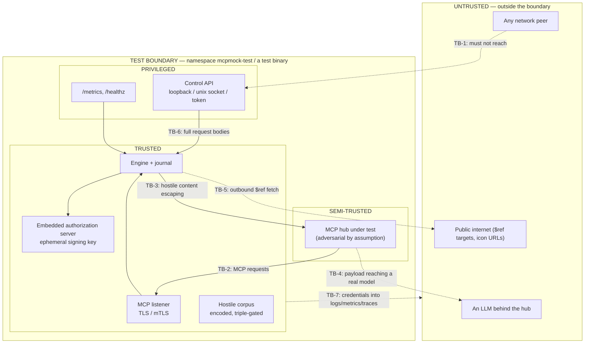

# Security

## 0. The awkward truth about this product

mcpmock is a tool whose *purpose* includes doing things a secure system must not do: forging
credentials, emitting prompt-injection payloads, serving deliberately malformed TLS, publishing
`javascript:` URLs, and recording every byte a client sends it — including its credentials.

So the security posture is not "make it safe". It is:

1. **Nothing dangerous happens by default.**
2. **Everything dangerous is named, gated, and loud when armed.**
3. **The dangerous capability never leaks outside the test boundary** — not into a shared cluster,
   not into a log aggregator, not into the repository, not into a production model endpoint.
4. **The one thing that must be unconditionally safe is the evidence**: the journal must never
   become the leak.

---

## 1. Trust boundaries



| Boundary | What crosses | Control |
|---|---|---|
| **TB-1** | Control API reachability | Loopback / unix socket by default; non-loopback bind **refused** without a token; constant-time token compare; optional mTLS. §4 |
| **TB-2** | MCP requests from a hub assumed adversarial | Bounded body size, bounded header count, bounded JSON depth, request timeouts, no reflection of input into HTTP headers. §8 |
| **TB-3** | Prompt-injection payloads leaving mcpmock | Three gates + delimiters + `X-Mcpmock-Hostile` + metric + journal tagging. ADR-018 |
| **TB-4** | Payload reaching a real model endpoint | Deny-all-egress NetworkPolicy **required** by the Helm chart in hostile mode; documentation. ADR-018 §6 |
| **TB-5** | Outbound `$ref` fetch (`MOCK-225`) | Loopback-only by default; public hosts need `allowExternalRefs` **and** an explicit allowlist; never in CI. §7 |
| **TB-6** | Journal contents (full request bodies) | Control API authentication; credentials hashed at capture; redaction on export. §5 |
| **TB-7** | Credentials into logs, metrics, traces | Structural: no field can hold a raw credential; `slog.LogValuer` redaction; no credential-derived metric label. §5 |

---

## 2. Authentication and authorization — of mcpmock itself

Two distinct planes, frequently confused:

| Plane | Who authenticates | Purpose |
|---|---|---|
| **MCP listener** | the hub, to mcpmock | This is **emulated** authorization (`MOCK-401`…`407`). Its job is to *test the hub*, not to protect mcpmock. Its decisions are evidence, not security. |
| **Control API** | an operator or test harness, to mcpmock | This is **real** security. It protects the journal and the mutation surface. |

Conflating them is the most likely design error here. The MCP listener's `401`s are test output.
The control API's `401`s are a control.

### 2.1 Control API (real)

| Aspect | Design |
|---|---|
| Default binding | `127.0.0.1` (HTTP mode) or a `0600` unix socket (stdio mode) |
| Non-loopback binding | **Refused at startup** unless a token is configured (`MOCK-104.5`) |
| Token source | `MCPMOCK_CONTROL_TOKEN` env or `--control-token-file`. **`--control-token` as a flag value is deliberately not implemented** — flag values are visible in `ps`, in container specs and in shell history. |
| Comparison | `crypto/subtle.ConstantTimeCompare` |
| Transport security | Optional TLS/mTLS reusing the `MOCK-106` plumbing |
| Rate limiting | 100 mutations/s (ADR-014), reads unlimited |
| CSRF / browser risk | The API requires a bearer token and rejects requests carrying `Origin` unless explicitly allowlisted; it is not a browser-facing API |
| Audit | Every mutation logged at `INFO` with the operation, instance, resulting `Snapshot.Gen`, and a token *fingerprint* (first 8 hex of HMAC), never the token |

### 2.2 Emulated authorization (test output)

`MOCK-401`…`407`, implemented per ADR-020. Everything about it is configurable including its own
correctness, because non-conformance is a feature. Its security-relevant properties are:

- Signing keys are **generated at runtime**, never committed, never baked into the image
  (`MOCK-405.6`). A CI check greps the repository and the built image for PEM private-key headers.
- `deterministicKeys: true` derives the key from `--seed` for golden-file stability. This is
  test-only, logs a `WARN` at startup, and is documented as producing a **publicly derivable**
  key. Anyone with the seed can mint a token. That is acceptable only inside the test boundary,
  and the warning says exactly that.
- Static bearer tokens are compared in constant time even though they are test tokens — because
  the code is a pattern people copy.
- Scenario validation **warns** if a `staticTokens` value looks like a real JWT (three
  base64url segments with a decodable header), on the assumption that someone pasted a live token
  into a config file. This has caught real incidents in other projects.

---

## 3. Secret lifecycle

| Secret | Source | Injection | Rotation | Never |
|---|---|---|---|---|
| Control API token | operator | `MCPMOCK_CONTROL_TOKEN` env, or a file (Kubernetes `Secret` mount) | restart, or `--control-token-file` re-read on `SIGHUP` | in a flag value, in the scenario file, in logs, in the image |
| AS signing key | `crypto/rand` at startup, or seed-derived in deterministic mode | in memory only | `POST /credentials:rotate` (`MOCK-702.5`) | on disk, in the repo, in the image, in logs |
| `requestState` AEAD key | HKDF from a per-process random IKM, or seed-derived | in memory only | on restart, or on `Snapshot` rotation | anywhere else |
| Journal credential-hash HMAC key | **`crypto/rand` per process, always** (AMEND-8). **Never seed-derived; no `deterministicKeys` escape hatch.** ADR-002 *Named exceptions to seed-determinism* | in memory only | per process | exported; seed-derived; reused across processes |
| TLS server key | operator-provided PEM path, or `certs.ephemeral` generated at startup | file mount or memory | restart | committed; `.gitignore` includes `*.pem`, `*.key` |
| Static test tokens | scenario file or `staticTokensFile` | file preferred | `credentials:rotate` | — these are **test fixtures**, not secrets, but the file-based form is the documented default so nobody develops the habit |

**Repository-level control:** a CI job (`make secrets-check`) scans the working tree and the built
image layers for PEM private-key headers, `BEGIN OPENSSH`, high-entropy strings matching common
token shapes, and the literal fixture tokens used in tests. Failing it blocks the build.
This addresses the stated constraint *"no secrets in source, logs, images or examples"*.

---

## 4. TLS and mTLS (`MOCK-106`)

| Aspect | Design |
|---|---|
| Library | `crypto/tls`. No third-party TLS. |
| Versions | `minVersion` configurable, default TLS 1.2; TLS 1.3 supported. |
| Client auth | All five `tls.ClientAuthType` values exposed by name. |
| Per-instance policy | `GetConfigForClient` keyed on SNI on the shared listener; `listener: own` for genuinely independent policies (ADR-007). |
| Certificate source | Operator PEM files, or an ephemeral in-process CA (`internal/certs`) generating P-256 ECDSA leaves at startup — microseconds, keeps the `MOCK-107` budget. |
| Client cert evidence | Subject, issuer, serial, SHA-256 fingerprint and `notAfter` recorded in the journal (`MOCK-106.3`). |
| Deliberate failures | `MOCK-502` TLS handshake faults: wrong cert, expired cert, unknown CA, alert mid-handshake. These require `listener: own` because they are connection-scoped. |
| Failure evidence | A handshake failure produces a journal record at `phase: connection` even though no HTTP request exists — otherwise the most interesting TLS test would leave no evidence. |
| What is **not** done | mcpmock never disables certificate verification on any outbound connection it makes (OTLP export, external `$ref`). "Insecure by configuration" is available only on the *inbound* emulation path. |

---

## 5. Credential handling in the journal — the highest-stakes control

`MOCK-601` requires recording the presented credential. `MOCK-407` requires it **hashed**. The
journal is also readable over the control API and exportable to files that end up in CI artifacts.

**Design: the raw value is unrepresentable.**

```
CredentialPart {
    Present, Scheme, HashAlg, Hash, Audience, Issuer, Subject, Scopes, ExpiresAt, KeyID, Decision
}
```

There is no `Raw` field, no `Value` field, and no `map[string]any` that could carry one. The
capture function takes the header value, computes the hash, extracts non-sensitive JWT claims,
and lets the raw bytes go out of scope. This is a structural control, not a policy.

| Control | Implementation |
|---|---|
| Hash | `HMAC-SHA256(perRunKey, rawValue)` truncated to 128 bits, hex. Keyed, so a captured journal is not a rainbow-table target for a real token accidentally sent. |
| Key lifetime | **Per process, from `crypto/rand`, in every mode** — including deterministic mode. There is deliberately **no** seed-derived variant and **no** `deterministicKeys`-style opt-in for this key. See *Why this key is the one exception*, below. |
| The `Authorization` header in `HTTPPart.Headers` | **Redacted at capture**: the value is replaced with `<redacted:sha256:xxxxxxxx>`. This is the one place where the wire-fidelity principle (`MOCK-601.2`) is deliberately broken, and it is broken in favour of not leaking. The header's *presence*, *name casing* and *position* are preserved, so `AssertNoHeader` and `AssertHeaderMatchesBody` still work. |
| Which headers are redacted | `Authorization`, `Proxy-Authorization`, `Cookie`, `Set-Cookie`, plus a configurable `journal.redactHeaders` list. |
| Bodies | Not redacted by default (a request body is test data). `journal.redactBodyPointers` accepts JSON Pointers for scenarios where the hub sends secrets in a body. |
| Logs, metrics, traces | No credential-derived value is ever a metric label, a span attribute or a log field except the hash. `authz.Credential` implements `slog.LogValuer` returning only the hash, so even a careless `logger.Info("cred", "c", cred)` is safe. |
| Assertion messages | Header values truncated to 8 characters. A dedicated test runs every assertion against a journal containing a sentinel secret and scans the resulting message. |

### Why this key is the one exception to seed-determinism  (AMEND-8, 2026-09-04)

Earlier revisions of this document and of ADR-002 disagreed. This section and ADR-002 *Named
exceptions to seed-determinism* are now the single normative statement; they say the same thing.

**The contradiction that was resolved.** This document offered a choice — "`crypto/rand` per run,
**or** seed-derived" — and never resolved it. ADR-002 resolved it silently, by listing `"credhash"`
among the seed-tree domains. The implementation followed ADR-002 and derived the key from the seed
in *every* mode. But the seed is **published by design** (`MOCK-704`: printed at startup, served at
`GET /v1/seed`, exposed as `mcpmock_effective_seed` on the metrics listener). A key derived from a
published value is a public key, so the hash was reversible by dictionary attack to anyone holding
a journal export and the CI log that contains the seed — which is everyone the export is shared
with. The keying was decorative.

**The ruling.** The credential-hash key is per-process `crypto/rand`, always. The `or` is removed
from both documents, and `"credhash"` is removed from ADR-002's domain list.

**Why no escape hatch, when the AS signing key has one.** §2.2's `deterministicKeys: true` exists
because the mock AS's *output* — a token — can be an **input** to a later assertion or golden. The
credential hash is never an input: it is evidence written into the journal and read back by
assertions. `MOCK-407`'s claim (*"the hub minted a distinct upstream credential"*) is an equality
comparison **between records within one run**, which a per-process random key preserves exactly.
Only cross-run stability is lost, and nothing requires it.

**Consequence for golden files.** `credential.hash` is a **volatile field**: golden comparison
normalises it out, alongside `wallTime`, `monoNs`, `durationNs`, `seq` and `peer`. A golden that
pins a literal credential hash is a defect in the golden, not a reason to weaken the key.

**Do not "fix" this back.** The seed-determinism principle (§0.1) is a convenience property; this
is a security property; where they conflict the security property wins. Anyone re-adding
`"credhash"` to the seed tree to make a golden stable is reintroducing the vulnerability.

---

## 6. `requestState` (`MOCK-243`) — see ADR-010

Summary of the security-relevant properties:

- AES-256-GCM, HKDF-SHA256-derived key, `prefix||counter` nonce (reuse-free by construction).
- Six distinguishable rejection classes, all journaled and metered.
- Bounded replay LRU; eviction is metered because it silently weakens the `replayed` check.
- The token protects nothing valuable — it is test-scoped state — but the construction is correct
  because engineers copy patterns from tools they trust.
- `pinStateKey: true` (deterministic mode) makes the key derivable from the seed; warned, and
  mixed with a per-process boot id so nonces stay unique across a restart.

---

## 7. SSRF surface (`MOCK-225`)

`MOCK-225` requires emitting schemas with network `$ref` "to a loopback address, to a public
host". If mcpmock *resolves* those refs (which it does, for `MOCK-606` argument validation), that
is an outbound fetch driven by configuration — a textbook SSRF primitive.

| Target | Default | Control |
|---|---|---|
| Loopback | **allowed** | Served by mcpmock's own embedded `$ref` host bound to loopback. Nothing leaves the machine. |
| Any other host | **refused** | Requires `hostile.allowExternalRefs: true` **and** the host in `hostile.externalRefAllowlist`. |
| In CI | **never enabled** | The CI scenario sweep excludes any scenario with `allowExternalRefs`. |
| `--safe-mode` | disables external refs entirely | Default in the container image. |
| Resolver | custom `jsonschema` loader (ADR-013) — we control every fetch | No implicit fetch; the library never reaches the network on its own. |
| Timeouts | 2 s per fetch, 5 s total, no redirects followed | |
| Response limits | 1 MiB, `application/json` or `application/schema+json` only | |

The `MOCK-506` `javascript:` / `file:` / cross-origin icon URLs are **inert**: mcpmock emits them
as data and never dereferences them. That is stated explicitly because "the mock fetched the
javascript: URL" would be an embarrassing and entirely avoidable finding.

---

## 8. STRIDE over the primary flows

| Flow | Threat | Category | Mitigation | Requirement |
|---|---|---|---|---|
| Hub → MCP listener | Oversized body exhausts memory | **D**oS | `MaxBytesReader` at `transport.maxBodyBytes` (default 8 MiB); bounded header count and size (`MaxHeaderBytes` 64 KiB) | `MOCK-102` |
| Hub → MCP listener | Deeply nested JSON exhausts stack | **D**oS | Depth-limited decode (default 256) before any handler sees it | `MOCK-504` (we emit deep JSON; we must not die on it) |
| Hub → MCP listener | Slowloris on 20 000 streams | **D**oS | `ReadHeaderTimeout` 10 s, `IdleTimeout` 120 s, per-frame write deadlines, bounded stream count per instance | `MOCK-903` |
| Hub → MCP listener | Reflected header injection: a hub-supplied value echoed into a response header, containing CR/LF | **T**ampering | **No hub-supplied value is ever written into a response header.** `MOCK-224`'s CR/LF annotations live in the JSON body only (`MOCK-224.4`). Go's `net/http` also rejects CR/LF in header values, and we do not bypass it. | `MOCK-224` |
| Hub → control API | Unauthorised journal read (full request bodies) | **I**nformation disclosure | §2.1; credentials already hashed at capture | `MOCK-104`, `MOCK-407` |
| Hub → control API | Unauthorised mutation to hide evidence | **T**ampering / **R**epudiation | Token auth; every mutation logged with resulting `Gen`; `Gen` on every record so a mid-test mutation is visible in the evidence | `MOCK-702` |
| mcpmock → hub | Prompt-injection payload escapes the test boundary | **E**levation (of the model's instructions) | ADR-018: three gates, delimiters, `X-Mcpmock-Hostile`, metric, NetworkPolicy requirement | `MOCK-507` |
| mcpmock → internet | SSRF via `$ref` | **I**nformation disclosure | §7 | `MOCK-225` |
| mcpmock → logs/CI artifacts | Credential leak | **I**nformation disclosure | §5 structural control + `make secrets-check` | `MOCK-407` |
| Embedded AS | Forged token accepted elsewhere | **S**poofing | Ephemeral per-process key; `aud` bound to the instance's canonical URI; documentation states these tokens are worthless outside the test | `MOCK-405` |
| Embedded AS | `alg: none` acceptance in *our* verifier | **S**poofing | `Verify` rejects `none` and enforces alg↔key-type agreement before verification, with a dedicated test (ADR-020) | `MOCK-405` |
| Journal ring | Evidence lost silently under load | **R**epudiation | `dropped` counter, `Dropped` marker on the next record, metric, explicit overflow policy | `MOCK-902` |
| stdio transport | Frame-stream corruption by a stray stdout write | **T**ampering | ADR-011 hijack + leak counter + CI assertion | `MOCK-105` |
| Container | Privilege escalation from a compromised process | **E**levation | distroless nonroot, `readOnlyRootFilesystem`, drop ALL caps, `seccompProfile: RuntimeDefault`, `allowPrivilegeEscalation: false` | `MOCK-101` |
| Supply chain | Compromised dependency | **T**ampering | Six screened runtime modules (ADR-013), `go.sum`, `govulncheck` (`ci.yml:71`), Trivy CRITICAL/HIGH gate (`ci.yml:665`), SBOM (`ci.yml:609`), **Cosign signing to be added** (§10.2 gap) | §10.2 |

---

## 9. Data classification

| Class | Data | Handling |
|---|---|---|
| **Sensitive** | Presented credentials, control API token, AS private key, AEAD keys, TLS private keys | Never persisted, never logged, never exported. Hashed or held in memory only. |
| **Confidential** | Journal bodies and headers (may contain the hub's internal data) | Behind control API auth; redacted on golden export; CI artifacts of journals are opt-in and retained 7 days. |
| **Hazardous** | Prompt-injection corpus | Encoded at rest, triple-gated, delimited, manifested, network-policy-fenced. ADR-018 |
| **Public** | Metrics, health, catalogue content, scenario files (once secrets are externalised) | No controls beyond ordinary access. |

**Protection in transit:** TLS on the MCP listener (`MOCK-106`), optional TLS on the control
listener, OTLP export over HTTPS when a remote endpoint is configured.
**Protection at rest:** there is no at-rest data. The only files mcpmock writes are an explicitly
requested journal export and an explicitly requested certificate bundle.

---

## 10. Audit requirements

Recorded at `INFO` on stderr, in the log schema of `observability.md §4`:

- Process start: version, effective seed, safe-mode state, hostile instances, listener addresses.
- Every control-API mutation: operation, instance, actor token fingerprint, resulting `Gen`.
- Every fault arming and firing (fault firing at `DEBUG` when high-volume, with a rate-limited
  `INFO` summary).
- Every authorization **denial** on the MCP listener (this is test output but is also the signal
  that a test is doing what it thinks).
- Hostile-mode arming, and every `withheld` placeholder emission.
- Journal drops, stdout leaks, OTLP export failures, replay-LRU evictions.

There is no separate audit log file. In a test harness, a second log stream is a second thing to
forget to collect.
