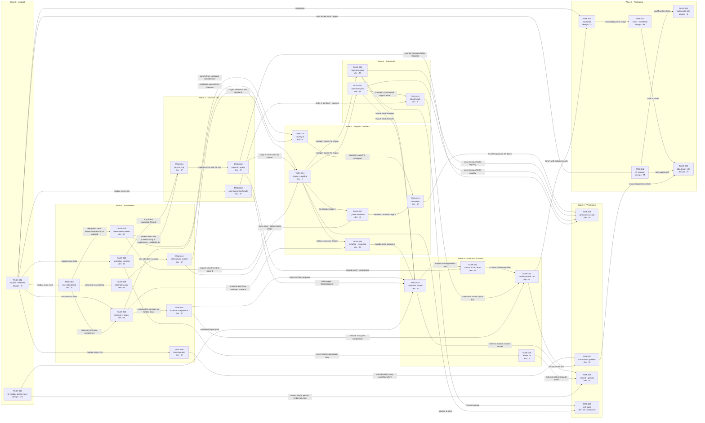

# Phase 1 Task Breakdown — Walking Skeleton

## Preconditions verified

| Precondition | Status | Evidence |
|---|---|---|
| Approved specification exists | **PASS** | `specification/implementation-plan.md` v0.1.0, Phase 1 boundary stated as a closed table |
| Requirements carry acceptance criteria | **PASS** | All 17 Phase 1 `MOCK-nnn` have numbered, levelled criteria tables in `requirements-spec.md` |
| Blocking open questions | **PARTIAL — resolved by orchestrator** | GAP-001 (module path) and GAP-002 (Go version) were the only Phase 1 blockers per `implementation-plan.md:92`. Both resolved in the delegation brief (see *Binding corrections* below). GAP-003 remains open but does **not** block Phase 1 — it is contained by ADR-019 and by the `wire-sensitive` flag on this breakdown |
| Repository state | **VERIFIED greenfield** | `git ls-files` returns exactly one tracked file (`README.md`). No `go.mod`, no Go source, no `Makefile`, no `Dockerfile`, no `helm/`. `.github/workflows/ci.yml`, `.golangci.yml`, `.gitignore` exist untracked |

### Binding corrections applied to the specification

These override the `specification/` documents where they conflict.

| # | Spec says | Correct value | Source |
|---|---|---|---|
| 1 | Module path `github.com/vyrodovalexey/mcpmock` (GAP-001, inferred from `ci.yml:183`) | **`github.com/vyrodovalexey/mcp-mock-server`** | `git remote -v`. The `ci.yml:183` inference was wrong — that line is a Keycloak image reference. `TASK-002` corrects the spec |
| 2 | `go.mod` targets `go 1.27.0`; `ci.yml` pins `GO_VERSION: '1.26.4'` | Toolchain **Go 1.27.1**; `go.mod` declares `go 1.27.0` (language version) — CI pin is stale and updated by `TASK-032` | Delegation brief |
| 3 | `ci.yml` pins `GOLANGCI_LINT_VERSION: 'v2.12.2'` | **`v2.13.2`** | Delegation brief |
| 4 | `ci.yml` is project-appropriate | It is **another project's template** (`HELM_CHART_PATH: helm/restapi-example`, Keycloak + Postgres services). Its 15-job structure is adopted; its content is replaced | Delegation brief; `architecture.md:36` |
| 5 | `internal/wire` is Phase 2 work (`implementation-plan.md:108`) | A **minimal Phase-1 subset of `internal/wire` is required in Phase 1** — see *Specification gaps* G-1 | ADR-019 + Phase 1 delivering three methods and `_meta` validation |

### Adopted gap resolutions (not re-litigated)

`MOCK-903` → 20 000 streams **per process**. `MOCK-502` DNS fault → `.invalid` generator.
`MOCK-706` → optional Phase 12. Hostile corpus → in-house, ~20 entries. Public-host `$ref`
schemas → emitted, never fetched. GAP-003 → Phase 1 proceeds under the authored annex as
`v0`/`v1alpha1` with **no conformance claim**.

---

## Scope

**In scope.** Decomposition of `implementation-plan.md` Phase 1 exactly as bounded there: module
and build plumbing, CI adaptation, the determinism kernel, scenario config and composition, the
engine and its nine-stage pipeline, both transports, three method handlers, `_meta` validation,
the virtual catalogue with authored overlay, the journal, the four-package public API, the control
API and CLI, observability, the independent test client, packaging (image, chart, manifests) and
the two front-loaded risk spikes.

**Out of scope.** Everything in Phases 2–12; recorded here only as *entry dependencies* where a
Phase 1 task deliberately leaves a seam. Specifically excluded from Phase 1 even where the same
requirement ID appears: SSE response sink and shape selection (`MOCK-208`), header mirroring and
`-32020/21/22` (`MOCK-204/205/206`), session hygiene `405` (`MOCK-207`), pagination and cursors
(`MOCK-231/232`), the remaining six methods of `MOCK-202`, MRTR, subscriptions, legacy era,
authorization beyond `none`, fault injection, TLS/mTLS, fleets, catalogue drift and scoping, the
remaining five assertions of `MOCK-603`, golden redaction (`MOCK-604`).

**Also out of scope for this document.** Test *case* design. Every task states an observable
acceptance criterion and folds its own testing into the estimate; it does not enumerate scenarios,
choose levels beyond what `requirements-spec.md` already assigns, or specify fixtures. Section 7
hands the risky and non-obvious verification surfaces to whoever owns test design.

**Agent routing.** Every task is exactly one of `development` (Go source and its unit tests) or
`devops` (Dockerfile, Makefile, Helm, manifests, CI, spec/doc housekeeping). No task mixes the two.

---

## 1. Task catalog

Effort key: `XS` < 2h · `S` ≈ half day · `M` ≈ 1–2 days · `L` ≈ 3–5 days. Estimates include the
task's own testing work. Nothing exceeds `L`.

`wire-sensitive: yes` means the task touches `2026-07-28` wire semantics that GAP-003 has not
ratified. Per ADR-019 and the delegation brief, such tasks carry a mandatory acceptance criterion
that wire constants are referenced from `internal/wire` and never appear as literals in handlers,
so ratification stays a one-package change.

### Wave 0 — Unblock

---

#### TASK-001 — Bootstrap the Go module, Makefile and ignore rules

| | |
|---|---|
| **Agent** | `devops` |
| **Satisfies** | `MOCK-101` (101.1, 101.7) |
| **Implements** | module root, build system |
| **Effort** | `S` |
| **Risk** | low — mechanical; the only trap is getting the module path wrong, which is corrected in advance |
| **Depends on** | — |
| **Blocks** | everything |
| **wire-sensitive** | no |
| **Skills** | Go toolchain, Make |

**Target file paths**
`go.mod`, `go.sum`, `Makefile`, `.gitignore` (extend), `tools.go` (build-tagged), directory
skeleton with a `doc.go` per package listed in `architecture.md §6`.

**Description.** Create the single Go module at path
`github.com/vyrodovalexey/mcp-mock-server`, declaring `go 1.27.0`. Add the approved runtime
dependency set from ADR-013 and nothing else: `sigs.k8s.io/yaml`,
`github.com/santhosh-tekuri/jsonschema/v6`, `github.com/prometheus/client_golang`,
`go.opentelemetry.io/otel` + `otel/sdk` + `otel/trace` +
`exporters/otlp/otlptrace/otlptracehttp`, `golang.org/x/sync`. Test-only:
`github.com/stretchr/testify`, `go.uber.org/goleak`. Create the `Makefile` with every target
`ci.yml` invokes or will invoke — `build`, `lint`, `test-unit`, `test-functional`,
`test-integration`, `test-e2e`, `docker-build`, `helm-lint`, plus the five policy targets
`deps-check`, `globals-check`, `schema-check`, `secrets-check`, `determinism-check`. Policy
targets may be stubs that exit 0 with a `NOT-IMPLEMENTED` notice at this task; they are filled in
by their owning tasks. Build flags per ADR-013: `CGO_ENABLED=0 -trimpath
-ldflags="-s -w -X main.version=… -X main.commit=… -X main.date=…"`. Create `doc.go` package
comments for every package directory so `revive`'s `package-comments` rule
(`.golangci.yml:148`) cannot fail later.

**Acceptance criteria**
1. `go build ./...` succeeds on an empty-but-well-formed tree; `go vet ./...` is clean.
2. `make build` produces `bin/mcpmock` for `linux/amd64`, `linux/arm64` and `darwin/arm64`
   (`101.1`), and on Linux the binary reports `statically linked` and `ldd` reports "not a
   dynamic executable" (`101.2`).
3. `go list -deps ./...` yields no module outside the ADR-013 approved set (`101.7`).
4. Every target named in `.github/workflows/ci.yml` after `TASK-032` exists in the `Makefile` and
   exits non-zero on failure rather than silently succeeding.
5. `golangci-lint run` with the **existing unmodified** `.golangci.yml` reports zero issues; no
   new exclusion is added to that file by this or any later task.

**Definition of done.** Module builds, `Makefile` complete, dependency set pinned in `go.sum`,
`.gitignore` covers `bin/`, coverage output and local Helm artifacts, lint green, a short note in
`README.md` recording the module path.

---

#### TASK-002 — Correct the module path throughout the specification set

| | |
|---|---|
| **Agent** | `devops` |
| **Satisfies** | `MOCK-101` (closes GAP-001) |
| **Implements** | specification consistency |
| **Effort** | `XS` |
| **Risk** | low — but leaving it undone guarantees a wrong import path in generated docs and in the hub's `go.mod` |
| **Depends on** | — |
| **Blocks** | `TASK-022`, `TASK-028` (both quote the import path in their published surface) |
| **wire-sensitive** | no |
| **Skills** | none beyond care |

**Target file paths**
`specification/gap-analysis.md` (GAP-001 entry), `specification/architecture.md:208–212`,
`specification/contracts/library-api.md`, `specification/deployment.md`, and any other occurrence
of `github.com/vyrodovalexey/mcpmock`.

**Description.** Replace every occurrence of the inferred module path
`github.com/vyrodovalexey/mcpmock` with the verified `github.com/vyrodovalexey/mcp-mock-server`.
Mark GAP-001 **RESOLVED** and record the evidence (`git remote -v`) and the reason the previous
inference was wrong (`ci.yml:183` is a Keycloak image tag, not a module path). Do not change any
other content.

**Acceptance criteria**
1. A repository-wide search for `vyrodovalexey/mcpmock` returns zero matches outside a changelog
   or historical note.
2. GAP-001 in `gap-analysis.md` is marked resolved with its evidence and no longer appears in any
   "blocks Phase 1" list.
3. `implementation-plan.md:92` no longer names GAP-001 as a Phase 1 blocker.

**Definition of done.** Spec edits applied, GAP-001 closed, no code touched.

*Routing note:* this is documentation housekeeping, not Go source, so it routes to `devops` under
the two-way split. It is deliberately kept separate from `TASK-001` so a spec edit never lands in
the same review as a build change.

---

### Wave 1 — Foundations

> **Justified exception to the vertical-slice rule.** `TASK-003`, `TASK-004` and `TASK-009` deliver
> no user-visible behaviour. ADR-002 states its reversibility is **HARD** — "changing the
> derivation changes every golden file and every recorded seed" — and `implementation-plan.md:68`
> says ADR-002 and ADR-003 must land "in full" in Phase 1 because they "cannot be retrofitted".
> Each is nonetheless independently reviewable and independently verifiable: their definition of
> done is a published set of golden derivation vectors, not "the package compiles". Every other
> task in this breakdown cuts through the stack.

---

#### TASK-003 — Implement `internal/ordered` deterministic collections

| | |
|---|---|
| **Agent** | `development` |
| **Satisfies** | `MOCK-704` (704.3, 704.4), PRIN-1, PRIN-2 |
| **Implements** | `internal/ordered` |
| **Effort** | `S` |
| **Risk** | low |
| **Depends on** | `TASK-001` — module must exist |
| **Blocks** | `TASK-004`, `TASK-006`, `TASK-009` |
| **wire-sensitive** | no |
| **Skills** | Go generics |

**Target file paths**
`internal/ordered/ordered.go`, `internal/ordered/slice.go`, `internal/ordered/map.go`,
`internal/ordered/doc.go`, `internal/ordered/*_test.go`.

**Description.** The base of the dependency graph — this package imports **nothing** from the
module (`architecture.md §6.1` rule 2). Provide an insertion-ordered map with deterministic
iteration, an `ordered.Slice[T]` used by the journal for headers in wire order including
duplicates (ADR-005), and sorted-key helpers so no output anywhere in the module depends on Go's
randomised map iteration.

**Acceptance criteria**
1. Iterating any `ordered.Map` twice, and across separate processes at `GOMAXPROCS=1` and
   `GOMAXPROCS=8`, yields the same key sequence.
2. `ordered.Slice[[2]string]` preserves both the original casing and duplicate entries of an
   input sequence — asserted against an input containing the same header name twice with
   different casing.
3. The package's import list is empty of module-internal packages; enforced by `make deps-check`.
4. Round-trip through JSON encoding preserves order.

**Definition of done.** Package implemented with doc comments on every exported symbol
(`revive`'s `exported` rule), unit tests written, lint green, `deps-check` rule for this package
added.

---

#### TASK-004 — Implement the determinism kernel: seed tree, DRNG, virtual clock

| | |
|---|---|
| **Agent** | `development` |
| **Satisfies** | `MOCK-704` (704.1, 704.3, 704.4), PRIN-1, PRIN-2 |
| **Implements** | `internal/determinism` |
| **Effort** | `M` |
| **Risk** | **high** — ADR-002 reversibility is HARD. A defect here is discovered only as flaky hub tests months later, and changing a domain string afterwards invalidates every golden file and every recorded seed |
| **Depends on** | `TASK-003` — `internal/determinism` builds on `internal/ordered` per `architecture.md §6.1` |
| **Blocks** | `TASK-011`, `TASK-014`, `TASK-016` |
| **wire-sensitive** | no |
| **Skills** | applied cryptography (HMAC/HKDF-style derivation, not design), `math/rand/v2` |

**Target file paths**
`internal/determinism/key.go`, `internal/determinism/domains.go`,
`internal/determinism/clock.go`, `internal/determinism/doc.go`,
`internal/determinism/testdata/vectors.json`, `internal/determinism/*_test.go`.

**Description.** Implement ADR-002 exactly: `Root(seed uint64) Key` as
`HMAC-SHA256(seed_be8, "mcpmock/v1/root")`; `Key.Derive(domain string, parts ...[]byte) Key` as
`HMAC-SHA256(k, domain || 0x00 || parts...)`; `Key.RNG() *rand.Rand` over
`rand.NewChaCha8`. Define every domain constant in `domains.go` as a stable string:
`instance`, `request`, `catalogue`, `cursor`, `requeststate`, `eventid`, `sessionid`,
`subscriptionid`, `jitter`, `shape`, `ordering`, `astoken`, `clock`. Phase 1 uses
only a subset; **all** are declared now so later phases append rather than insert.
**`credhash` is deliberately NOT in this list (AMEND-8).** The journal credential-hash key is
per-process `crypto/rand`, never seed-derived — see ADR-002 *Named exceptions to
seed-determinism* and `security.md §5`. Do not add it. Implement
`VirtualClock` deriving a `time.Time` from `requestKey.Derive("clock")` plus a scenario epoch.
RNG construction is lazy via `sync.OnceValue` per request so `MOCK-901`'s no-random-decision path
pays nothing.

**Acceptance criteria**
1. `Root`, `Derive` and `RNG` outputs match a committed golden vector file for a fixed seed and a
   fixed set of derivation paths; the vectors are byte-stable across `GOMAXPROCS=1` and
   `GOMAXPROCS=8` and across separate process invocations.
2. Two concurrent derivations from identical inputs produce identical keys and identical first
   256 bytes of RNG output; two derivations differing in any single input byte produce different
   keys.
3. `VirtualClock` returns the same instant for the same request key and epoch, and never consults
   `time.Now()` — asserted by the AST scan in `TASK-026`.
4. Constructing a `Key` performs no allocation on the hot path beyond the returned array;
   `RNG()` is not invoked unless a random decision is actually requested.
5. Every domain string in ADR-002 is present as an exported-or-documented constant; a test asserts
   the full set and its values, so a later accidental rename fails loudly.

**Definition of done.** Package implemented, golden vectors committed with a header explaining
that changing them is a breaking change requiring an `apiVersion` bump, unit tests written
including the concurrency and cross-`GOMAXPROCS` cases, doc comments on every exported symbol,
lint green.

---

#### TASK-005 — Define the public `journalapi` record, view and selector contract

| | |
|---|---|
| **Agent** | `development` |
| **Satisfies** | `MOCK-601` (field set), `MOCK-602` (query surface), `MOCK-603` (603.3, 603.4) |
| **Implements** | `journalapi` |
| **Effort** | `M` |
| **Risk** | medium — ADR-005 marks `journalapi.Record` reversibility **HARD**: it is a published contract that golden files and external hub test suites encode |
| **Depends on** | `TASK-001` |
| **Blocks** | `TASK-011`, `TASK-025` |
| **wire-sensitive** | no — `_meta` is carried as an opaque decoded tree, not as typed wire fields |
| **Skills** | Go API design, JSON serialisation |

**Target file paths**
`journalapi/record.go`, `journalapi/view.go`, `journalapi/selector.go`, `journalapi/ndjson.go`,
`journalapi/config.go`, `journalapi/doc.go`, `journalapi/*_test.go`.

**Description.** The serialisation boundary that external test suites depend on. Per
`architecture.md §6.1` rule 4 it imports **nothing** internal and nothing beyond the standard
library. Define `Record` with the full `MOCK-601.1` field set: `Seq`, `WallTime` (RFC 3339 nanos),
`MonoNs` (since instance start), `Transport`, `Headers` as an order- and duplicate-preserving
sequence, `Body`, decoded `Meta`, `CredentialHash`, `Peer`, `Response` (status, headers, body or
digest, ordered frame list, close reason), `Dropped` marker, `Instance`, `Method`, `Era`,
`Status`, `CorrelationID`, `TraceID`, `FaultRule`. Define `View` with
`Filter(Selector) View`, `Iter(func(Record) bool)`, `Len()`, `Snapshot() []Record`. Define
`Selector` with the `MOCK-602.4` filter set, AND-combinable. Define `Config` carrying the
capture mode (`full|truncate:N|digest|off`), `MaxRecords`, `MaxBytes`, overflow policy and
`BlockTimeout`. Provide NDJSON read and write so `MOCK-603.4` — assertions against a journal file
with no running server — is possible.

**Acceptance criteria**
1. `go list -deps ./journalapi` shows only standard library packages.
2. A `Record` round-trips through JSON and through NDJSON byte-identically, including header
   ordering, duplicate headers and original header casing.
3. `View.Filter` composes: applying two selectors in either order yields the same record set.
4. Reading an NDJSON file produces a `View` supporting the full `Selector` surface with no server
   present.
5. Every exported field and method carries a doc comment stating its stability posture; the
   package doc states that `Record` is a `v0` contract that may change until ADR-019 ratifies.

**Definition of done.** Package implemented, unit tests written, doc comments complete, package
listed in the `deps-check` stdlib-only allowlist, lint green.

---

#### TASK-006 — Implement the `scenario` types and the schema-validating loader

| | |
|---|---|
| **Agent** | `development` |
| **Satisfies** | `MOCK-701` (701.1, 701.2, 701.3, 701.4, 701.6, 701.7) |
| **Implements** | `scenario`, `internal/config` |
| **Effort** | `M` |
| **Risk** | medium — `additionalProperties: false` throughout means every Go struct field and every schema property must agree, and drift is silent until a user's file is rejected |
| **Depends on** | `TASK-001`; `TASK-003` — composed documents are compared as ordered JSON trees |
| **Blocks** | `TASK-007`, `TASK-015`, `TASK-016` |
| **wire-sensitive** | no |
| **Skills** | JSON Schema 2020-12, `sigs.k8s.io/yaml` |

**Target file paths**
`scenario/document.go`, `scenario/types.go`, `scenario/doc.go`,
`internal/config/load.go`, `internal/config/schema.go`,
`internal/config/schema/scenario.schema.json` (embedded copy),
`internal/config/*_test.go`.

**Description.** Public `scenario` package carrying the Phase 1 subset of the document types —
`apiVersion`, `kind`, `metadata`, `spec` with `transport`, `discover`, `switches`, `catalogue`
(generated + authored), `journal` — using `json:` tags only, because `sigs.k8s.io/yaml` converts
YAML to JSON so one schema validates both inputs (ADR-013). Fields typed `json.RawMessage` per
`MOCK-222.3`/`701.7`: `inputSchema`, `outputSchema`, `annotations`, `icons`. `internal/config`
embeds `scenario.schema.json` via `go:embed`, compiles it once through `sync.OnceValue` to stay
inside the 40 ms slice of the `MOCK-107` startup budget, validates, and reports errors with a
JSON Pointer plus source file and line. Cross-field semantic rules (`701.6`) are validated in the
same pass and reported in the same format — Phase 1 needs at minimum the ADR-005 rule forbidding
`bodies: full` together with size faults above `maxBytes/16`, declared now even though size
faults arrive in Phase 9.

**Acceptance criteria**
1. The same document supplied as YAML and as JSON produces identical composed JSON trees
   (`701.1`).
2. A document missing `apiVersion` or `kind`, or carrying an unrecognised `apiVersion`, is
   rejected with a message naming the field and the accepted values (`701.2`).
3. An unknown key at any level fails validation (`701.4`).
4. The embedded schema is byte-identical to `specification/contracts/scenario.schema.json`,
   asserted by SHA-256 comparison in a unit test (`701.3`) — this is the `schema-check` gate.
5. `json.RawMessage`-typed fields are neither validated nor normalised: an authored `inputSchema`
   is retained byte-for-byte including key order (`701.7`, feeds `222.3`/`222.4`).
6. Validation errors carry a JSON Pointer, the source file path and a line number.
7. Schema compilation happens at most once per process, asserted by a counter in a test build.

**Definition of done.** Both packages implemented, `scenario` verified to import nothing internal,
embedded-schema hash test in place, `make schema-check` implemented and wired, unit tests written,
lint green.

---

#### TASK-007 — Implement `extends` composition and the merge algebra

| | |
|---|---|
| **Agent** | `development` |
| **Satisfies** | `MOCK-703` (703.1, 703.2, 703.3, 703.4, 703.5, 703.7, 703.8) |
| **Implements** | `internal/config` (composition) |
| **Effort** | `M` |
| **Risk** | medium — merge semantics are easy to implement plausibly and wrongly; ADR-008's table is normative and every row needs to hold |
| **Depends on** | `TASK-006` — composition operates on loaded and typed documents, and validation must run *post*-composition per `703.8` |
| **Blocks** | `TASK-022`, `TASK-024` |
| **wire-sensitive** | no |
| **Skills** | tree-merge semantics, path sandboxing |

**Target file paths**
`internal/config/compose.go`, `internal/config/merge.go`, `internal/config/root.go`,
`internal/config/*_test.go`.

**Description.** Resolve `extends` depth-first, left-to-right, later-wins, over decoded JSON trees
(not over Go structs — merging structs loses the ability to distinguish absent from zero).
Implement ADR-008's merge table: scalars replace; objects merge; `null` deletes a key; lists of
objects merge by the `x-mcpmock-merge-key` declared in the schema; other lists replace; `$patch`
overrides both. Detect and report `extends` cycles with the full path. Reject any `extends` target
resolving outside `--scenario-root`. Validation runs **after** composition, so an intermediate
document may be incomplete.

**Acceptance criteria**
1. `extends` resolves depth-first and left-to-right with later winning, demonstrated on a
   three-level chain with a diamond (`703.1`).
2. A cycle is detected and reported with the chain of file paths rather than overflowing the
   stack (`703.1`).
3. Every row of ADR-008's merge table holds, exercised by a table-driven test with one case per
   row (`703.2`).
4. An explicit `null` in an overlay removes the key from the composed result rather than setting
   it to a zero value (`703.3`).
5. Object lists merge by their declared merge key; scalar and non-keyed lists replace wholesale;
   `$patch` takes precedence over both (`703.4`).
6. A schema test asserts that every object-typed list in `scenario.schema.json` declares either
   `x-mcpmock-merge-key` or `x-mcpmock-merge: replace`; the test fails if a future schema addition
   omits it (`703.5`).
7. An `extends` path resolving outside `--scenario-root`, including via `..` or a symlink, is
   rejected before any file read (`703.7`).
8. An intermediate document that would fail schema validation on its own composes successfully
   when the final result is valid (`703.8`).

**Definition of done.** Composition implemented, table-driven merge tests written, path-sandbox
test written including the symlink case, `703.5` schema-lint test wired into `make schema-check`,
lint green.

---

#### TASK-008 — Build the independent MCP test client (`test/mcpclient`)

| | |
|---|---|
| **Agent** | `development` |
| **Satisfies** | `MOCK-102` (verification vehicle for 102.1–102.4), ADR-017 |
| **Implements** | `test/mcpclient` |
| **Effort** | `M` |
| **Risk** | medium — its value is entirely in *not* sharing code with `internal/`; the failure mode is a well-meaning refactor that imports `internal/wire` and silently destroys the anti-circularity property |
| **Depends on** | `TASK-001` |
| **Blocks** | `TASK-027` |
| **wire-sensitive** | **yes** |
| **Skills** | HTTP and stdio client work, protocol reading from a written annex |

**Target file paths**
`test/mcpclient/client.go`, `test/mcpclient/http.go`, `test/mcpclient/stdio.go`,
`test/mcpclient/wire_constants.go`, `test/mcpclient/doc.go`, `test/mcpclient/*_test.go`.

**Description.** ADR-017 requires this to exist **before** the handlers it verifies — a mock
verified by a client that shares its encoder proves nothing. A minimal MCP client that speaks
newline-delimited JSON-RPC on stdio and `POST` over HTTP, builds requests with `params._meta`
carrying `protocolVersion` and `clientCapabilities`, and can deliberately omit those fields to
exercise `MOCK-203`. It holds its **own** copy of the wire constants transcribed from
`specification/contracts/wire-2026-07-28.md`, in a single file, with each constant annotated by
its annex clause number and its `[R]`/`[D]`/`[P-nn]` label. It also needs a raw-socket mode that
sends `x-mcp-header` twice with differing casing, required by `MOCK-601.2`.

**Acceptance criteria**
1. `go list -deps ./test/mcpclient` contains no package under `internal/` and no import of the
   root `mcpmock` package; enforced by `make deps-check`.
2. Wire constants live in exactly one file, each annotated with its annex clause and its
   `[P-nn]` label where proposed; a test asserts the constant set matches the annex table.
3. The client can issue a request with `params._meta` complete, with `protocolVersion` absent,
   with `clientCapabilities` absent, and with `_meta` absent entirely.
4. The client can send the same JSON-RPC payload over stdio and over HTTP and expose both
   response bodies as raw bytes for byte-for-byte comparison (`102.3`, `102.4`).
5. Raw-socket mode transmits duplicate headers with differing casing without Go's
   `http.Header` canonicalisation intervening.
6. The client makes no assumption about response *shape* beyond parsing the JSON-RPC envelope, so
   a Phase 2 SSE sink does not require rewriting it.

**Definition of done.** Client implemented, `deps-check` rule enforcing the isolation added, the
annex-constant parity test written, doc comment stating the anti-circularity rule and forbidding
imports from `internal/`, lint green (note `test/` is excluded from linting by
`.golangci.yml:61`, so this is a review obligation, stated explicitly in the package doc).

---

#### TASK-009 — Implement `internal/jsonrpc`: envelope, raw ids, canonical encoder

| | |
|---|---|
| **Agent** | `development` |
| **Satisfies** | `MOCK-203`, `MOCK-704` (canonical body hashing feeds ADR-002 derivation) |
| **Implements** | `internal/jsonrpc` |
| **Effort** | `M` |
| **Risk** | medium — the RFC 8785-style canonicaliser is load-bearing for determinism; a subtle difference in number or string escaping changes every request key |
| **Depends on** | `TASK-003` — ordered iteration is required for canonical key ordering |
| **Blocks** | `TASK-010` |
| **wire-sensitive** | no — JSON-RPC 2.0 itself is stable and is not part of GAP-003 |
| **Skills** | JSON canonicalisation, careful number handling |

**Target file paths**
`internal/jsonrpc/envelope.go`, `internal/jsonrpc/id.go`, `internal/jsonrpc/codes.go`,
`internal/jsonrpc/canonical.go`, `internal/jsonrpc/doc.go`, `internal/jsonrpc/*_test.go`.

**Description.** JSON-RPC 2.0 request, response, error and notification envelopes. Ids are
retained as **raw bytes as received** (ADR-002 derives the request key from
`canonicalJSONRPCID`), so a numeric id `1` and a string id `"1"` are distinguishable and are
echoed back exactly as sent. Standard error codes as constants. An RFC 8785-style canonical JSON
encoder used solely for `sha256(canonicalBody)` in the derivation path — not for response
emission, which must preserve authored key order per `MOCK-222.4`.

**Acceptance criteria**
1. A request id is echoed in the response byte-for-byte, preserving its JSON type; numeric,
   string, and `null` ids are all handled distinguishably.
2. The canonical encoder produces byte-identical output for two objects differing only in key
   order, and different output for objects differing in any value.
3. Canonical encoding of the same document is stable across processes and across
   `GOMAXPROCS` settings, asserted against a committed golden vector.
4. The canonical encoder is used **only** on the derivation path; response emission preserves
   input key order, asserted by a test that round-trips an authored object with non-alphabetical
   keys.
5. Malformed envelopes produce `-32700`/`-32600` with no panic, exercised against truncated and
   over-nested input.

**Definition of done.** Package implemented, golden canonicalisation vectors committed, unit
tests written including the panic-freedom cases, doc comments complete, lint green.

---

#### TASK-010 — Implement the Phase-1 subset of `internal/wire`

| | |
|---|---|
| **Agent** | `development` |
| **Satisfies** | `MOCK-201` (partial), `MOCK-202` (partial), `MOCK-203`, `MOCK-209` (partial: `resultType` table only) |
| **Implements** | `internal/wire` |
| **Effort** | `M` |
| **Risk** | **high** — GAP-003 is open. This package *is* the containment boundary for that risk; if wire literals escape into handlers, ratification becomes a month of rework (ADR-019) |
| **Depends on** | `TASK-009` — `internal/wire` sits above `internal/jsonrpc` per `architecture.md §6.1` |
| **Blocks** | `TASK-014`, `TASK-017`, `TASK-018` |
| **wire-sensitive** | **yes** |
| **Skills** | protocol modelling; disciplined transcription from a labelled annex |

**Target file paths**
`internal/wire/modern_2026_07_28.go`, `internal/wire/meta.go`, `internal/wire/resulttype.go`,
`internal/wire/errors.go`, `internal/wire/doc.go`, `internal/wire/*_test.go`.

**Description.** `implementation-plan.md:108` schedules `internal/wire` for Phase 2, but Phase 1
delivers three methods and `_meta` validation, all of which are wire surface — see
*Specification gaps* G-1. This task creates the **minimal** subset needed by Phase 1 and nothing
more, built so that Phase 2 extends rather than rewrites it. Contents: method-name constants
(`server/discover`, `tools/list`, `tools/call`); `_meta` key constants (`protocolVersion`,
`clientCapabilities`, and the `params._meta` location per annex clause 2.5 `[P-06]`); the
`resultType` value **table** (annex 4.2 `[P-21]`) as data, not a switch statement; the
`-32602` error `data.missing` payload shape (annex 2.12 `[P-11]`); the `server/discover` result
field set (annex §5). Every constant carries its annex clause and its `[R]`/`[D]`/`[P-nn]` label
in a doc comment. Legacy era, mirrored headers, `-32020/21/22`, MRTR and subscription shapes are
explicitly **not** in scope.

**Acceptance criteria**
1. No string literal naming a method, a `_meta` key, a `resultType` value or an MCP error code
   appears anywhere outside `internal/wire` and `test/mcpclient` — enforced by a
   `make wire-literal-check` grep-and-AST rule that fails the build on violation. *This is the
   ADR-019 containment criterion and is the reason this task exists in Phase 1.*
2. `resultType` values are looked up through a table keyed by method; adding a method is a table
   entry, not a code change.
3. Every exported constant's doc comment names its annex clause number and its label; a test
   asserts that every `[P-nn]`-labelled item in the annex tables covering Phase 1 surface has a
   corresponding constant, and vice versa.
4. The package doc states that this revision is **unratified**, that mcpmock emulates
   `requirements.md` plus the annex, and that **no conformance claim** is made.
5. Changing any `[P-nn]` constant requires edits in exactly one file — demonstrated by a test that
   asserts the package is the sole definition site.

**Definition of done.** Package implemented at the Phase 1 subset, `make wire-literal-check`
implemented and wired into the `Makefile` and into `TASK-033`, annex-parity test written, doc
comments carrying clause references, lint green.

---

### Wave 2 — Journal and observability

---

#### TASK-011 — Implement the sharded journal ring with total-order sequencing

| | |
|---|---|
| **Agent** | `development` |
| **Satisfies** | `MOCK-601` (601.3), `MOCK-602` (602.7), `MOCK-902` (partial: policies implemented, not gated) |
| **Implements** | `internal/journal` (storage) |
| **Effort** | `M` |
| **Risk** | **high** — a seqlock is straightforward to write and hard to write correctly; torn reads corrupt the evidence the product exists to provide. Also the only global contention point on the hot path |
| **Depends on** | `TASK-005` — stores `journalapi.Record`; `TASK-004` — shard hint and byte accounting must not introduce unseeded nondeterminism into anything observable |
| **Blocks** | `TASK-012` |
| **wire-sensitive** | no |
| **Skills** | lock-free concurrency, `sync/atomic`, Go memory model, race-detector-driven development |

**Target file paths**
`internal/journal/ring.go`, `internal/journal/shard.go`, `internal/journal/overflow.go`,
`internal/journal/doc.go`, `internal/journal/*_test.go`.

**Description.** ADR-005 storage exactly: `enabled atomic.Bool` fast path, global
`seq atomic.Uint64` giving a total order across shards, `dropped` and `bytes` counters, and
`S = next_pow2(GOMAXPROCS)` shards capped at 64, each with an `atomic.Uint64` cursor, a
preallocated power-of-two ring and a per-slot seqlock (`state atomic.Uint32`, even stable, odd
being written). Shard selection uses a `sync.Pool`-held per-goroutine-stable hint — **not**
`runtime_procPin`, which is unavailable outside the runtime. Readers copy under the seqlock and
retry on a changed or odd state. Record byte slices are owned by the record and never pooled
(ADR-005 is explicit that pooling here is a use-after-free class of bug in a tool whose purpose is
evidence). Both bounds enforced: `maxRecords` default 100 000 and `maxBytes` default 256 MiB,
whichever binds first. Three overflow policies: `drop-oldest` (default, increments
`mcpmock_journal_dropped_total`, leaves a `Dropped` marker so a reader can see the gap), `block`
(bounded by `blockTimeout`, default 100 ms, after which it degrades to drop-oldest and increments
a **distinct** counter — an unbounded block is a self-inflicted denial of service in the system
under test), and `error` (reject with `503` and a journalled reason).

**Acceptance criteria**
1. With journaling disabled the write path executes one atomic load and performs no allocation,
   asserted by an allocation-count benchmark.
2. Under concurrent writers and readers with `-race`, no reader ever observes a torn record: a
   record is either fully consistent or is retried or skipped and counted.
3. Records are returned in `Seq` order across all shards, and `Seq` values are unique and gapless
   for accepted writes (`602.7`).
4. `drop-oldest` overwrites the oldest slot, increments the dropped counter, and leaves a
   `Dropped` marker observable to a reader.
5. `block` waits at most `blockTimeout` and then degrades to drop-oldest, incrementing a counter
   distinct from the drop-oldest counter; the request is never held indefinitely.
6. `error` rejects with `503` and a journalled reason.
7. Whichever of `maxRecords` and `maxBytes` binds first triggers the policy; both are exercised
   independently.
8. `?consistent=true` reads take a snapshot under a brief write-disable so a hot writer cannot
   starve a reader.

**Definition of done.** Storage implemented, unit tests written including race-detector
concurrency tests and an allocation benchmark for the disabled path, doc comment stating the
seqlock protocol and the no-pooling rule with its rationale, lint green.

---

#### TASK-012 — Implement journal capture, query, filtering and NDJSON output

| | |
|---|---|
| **Agent** | `development` |
| **Satisfies** | `MOCK-601` (601.1, 601.2, 601.4, 601.5, 601.6), `MOCK-602` (602.1, 602.2, 602.4, 602.6, 602.7) |
| **Implements** | `internal/journal` (capture and query) |
| **Effort** | `M` |
| **Risk** | medium — `601.2` (header casing and duplicates) is defeated by any accidental use of `http.Header`, and the defect is invisible until a hub test that depends on it silently passes |
| **Depends on** | `TASK-011` — capture writes into the ring |
| **Blocks** | `TASK-014`, `TASK-023` |
| **wire-sensitive** | no |
| **Skills** | HTTP internals, hashing, streaming serialisation |

**Target file paths**
`internal/journal/capture.go`, `internal/journal/query.go`, `internal/journal/ndjson.go`,
`internal/journal/credhash.go`, `internal/journal/*_test.go`.

**Description.** Populate the full `MOCK-601.1` field set: wall time in RFC 3339 nanos, monotonic
nanoseconds since instance start, transport, **all** HTTP headers in wire order including
duplicates and original casing, full body, decoded `_meta` with unknown keys preserved, hashed
credential, peer address, and the produced response including status, response headers, body or
digest, the ordered frame list and the close reason. Capture modes `full | truncate:N | digest |
off`. Credentials are hashed with a keyed hash whose key is **per-process `crypto/rand`, never
seed-derived** (AMEND-8; ADR-002 *Named exceptions to seed-determinism*, `security.md §5`), and
never stored raw. The resulting `credential.hash` is a **volatile field**, normalised out of
golden comparison. Records must also exist for requests rejected before
dispatch — bad `_meta` in Phase 1; auth and header-mismatch rejections arrive later but the
rejection path must already write (`601.6`). Query implements the `MOCK-602.4` filter set
AND-combined, and emits either a paged JSON array or an NDJSON stream in `Seq` order.
`?follow=true` and the `602.5` 100k-record latency gate are **Phase 10**, not here.

**Acceptance criteria**
1. Every `MOCK-601.1` field is populated for a normal request; a test enumerates the field set and
   fails if any is zero-valued when it should not be.
2. A request sent over a raw socket with `x-mcp-header` twice in different casing is recorded with
   both occurrences, in wire order, with original casing preserved (`601.2`).
3. Each capture mode behaves as ADR-005 specifies: `truncate:N` retains the first N bytes plus a
   SHA-256 of the whole plus the original length; `digest` retains hash and length only; `off`
   retains neither (`601.3`, `601.4`).
4. The recorded response carries status code, response headers, body or digest, the ordered frame
   list and the close reason (`601.4`).
5. No raw credential appears anywhere in a record; a scan of the serialised journal for the
   fixture token value finds zero matches (`601.5`, feeds `105.5`).
6. A request rejected at the `_meta` validation stage still produces a complete record including
   the rejection reason and the emitted error response (`601.6`).
7. Every `MOCK-602.4` filter works individually and AND-combines; results are in `Seq` order.
8. NDJSON output is one record per line, parseable by `journalapi`'s reader, and byte-identical to
   the JSON array form modulo framing.
9. `DELETE` clears the journal and `mcpmock_journal_records` returns to zero (`602.6`).

**Definition of done.** Capture and query implemented, unit tests written including the
raw-socket duplicate-header case and the credential-scan case, doc comments complete, lint green.

---

#### TASK-013 — Implement observability: stderr slog, per-instance Prometheus, health endpoints

| | |
|---|---|
| **Agent** | `development` |
| **Satisfies** | `MOCK-105` (105.1, 105.2, 105.3, 105.5), `MOCK-107` (107.5 — no globals) |
| **Implements** | `internal/obs` |
| **Effort** | `M` |
| **Risk** | medium — Prometheus and OTel both want process-global registration, which ADR-007 forbids; getting this wrong breaks `MOCK-107.4` (two servers in one test binary) in a way that only shows up as a duplicate-registration panic |
| **Depends on** | `TASK-001` |
| **Blocks** | `TASK-021`, `TASK-022` |
| **wire-sensitive** | no |
| **Skills** | `log/slog`, `prometheus/client_golang`, OTel SDK |

**Target file paths**
`internal/obs/logger.go`, `internal/obs/metrics.go`, `internal/obs/server.go`,
`internal/obs/tracing.go`, `internal/obs/doc.go`, `internal/obs/*_test.go`.

**Description.** `obs.NewLogger(w io.Writer, level)` returning a `log/slog` JSON handler; there is
**no code path constructing a logger over stdout** (ADR-011 layer 3). `slog.SetDefault` is never
called. One logger per instance with a pre-bound `instance` attribute; request-level logs at
`DEBUG`, `INFO` reserved for lifecycle, config changes and — in later phases — fault arming and
auth denials. A `prometheus.Registry` per `Server`, never the default registerer, with metric
handles **pre-resolved at construction** so `WithLabelValues` never appears on the request path
(`architecture.md §7.2`). Phase 1 metric set: request counters, journal records and dropped
counters, `mcpmock_stdout_leak_bytes_total`, `mcpmock_effective_seed` gauge, plus the
`observability.md §2` metrics reachable by Phase 1 code. Observability listener serving
`/metrics`, `/healthz` and `/readyz` on its own address. OTel provider is **no-op by default**
for the startup budget; inbound `traceparent` is extracted and recorded even when export is off.

**Acceptance criteria**
1. `GET /metrics` returns Prometheus text exposition that `promtool check metrics` accepts
   (`105.1`).
2. Every metric declared in `observability.md §2` and reachable by Phase 1 code is present after a
   scenario run that exercises it, with the declared type and label set (`105.2`).
3. All log output is valid JSON, one object per line, on **stderr**; every line validates against
   the `observability.md §4` schema (`105.3`).
4. Two `Server`s constructed in one process each get an independent registry and neither panics on
   duplicate registration (feeds `107.4`).
5. No mutable package-level variable exists in `internal/obs` outside the `globals-check`
   allowlist (`107.5`); `slog.SetDefault` and `prometheus.MustRegister` on the default registerer
   appear nowhere in the module, asserted by an AST scan.
6. No log record contains a raw credential; asserted by scanning all output for fixture token
   values (`105.5`).
7. `/readyz` returns 200 only after all listeners are accepting; `/healthz` returns 200 once the
   process is up.
8. A metric handle is resolved once at construction; a benchmark asserts zero `WithLabelValues`
   calls on the request path.

**Definition of done.** Package implemented, `make globals-check` implemented and wired, unit
tests written including the two-registry case and the log-schema validation, doc comments
complete, lint green.


### Wave 3 — Engine, instance, catalogue, handlers

---

#### TASK-014 — Implement the engine: `Exchange`, `ResponseSink`, nine-stage pipeline, handler registry

| | |
|---|---|
| **Agent** | `development` |
| **Satisfies** | `MOCK-102` (transport neutrality), `MOCK-601` (pipeline stage 9 commits), PRIN-3 |
| **Implements** | `internal/engine` (`C-ENGINE`), `IF-Exchange`, `IF-ResponseSink` |
| **Effort** | `L` |
| **Risk** | **high** — ADR-006's transport abstraction and ADR-002's fixed draw order are both fixed here. Getting the stage boundaries wrong means every later phase inserts rather than appends, shifting all golden files |
| **Depends on** | `TASK-010` — stages reference wire constants; `TASK-012` — stage 9 commits to the journal; `TASK-004` — the request key is derived at stage 1 |
| **Blocks** | `TASK-015`, `TASK-017`, `TASK-019`, `TASK-020`, `TASK-029` |
| **wire-sensitive** | **yes** |
| **Skills** | Go interface design, `context` propagation, allocation-conscious hot-path work |

**Target file paths**
`internal/engine/exchange.go`, `internal/engine/sink.go`, `internal/engine/pipeline.go`,
`internal/engine/registry.go`, `internal/engine/emit.go`, `internal/engine/fault.go`,
`internal/engine/doc.go`, `internal/engine/*_test.go`.

**Description.** `Exchange` is the transport-neutral inbound representation (ADR-006): raw body,
headers in wire order, peer, transport tag, `context.Context`. `ResponseSink` is the
transport-neutral outbound: Phase 1 implements the buffered JSON sink only; the SSE sink is a
Phase 2 implementation of the same interface and the interface must accommodate it without
change. The nine stages of `architecture.md §5` exist as named, ordered stages even where Phase 1
implements them as pass-throughs: 1 decode, 2 era resolve (modern only in Phase 1), 3 authorize
(`none` only), 4 validate, 5 fault pre-hook (no-op), 6 dispatch, 7 fault post-hook (no-op),
8 encode and emit, 9 journal commit. Stage 1 captures the immutable `Snapshot` once, so every
stage reads the same configuration and a mid-request control mutation cannot produce a
half-old/half-new response (ADR-014). Each stage documents its RNG draw count (ADR-002 rule 2).
The wire error object is produced in **exactly one place**, `emit.go`, so Phase 9's `MOCK-505`
fault codes and genuine errors share one encoder. Handler registry maps method name to handler.
Per `architecture.md §7.1`: no `go func()` on the request path; per-request goroutine count is
zero extra.

**Acceptance criteria**
1. A handler receives no transport-specific type; the same handler serves an `Exchange` originating
   from stdio and from HTTP and produces identical response bytes (feeds `102.3`, `102.4`).
2. All nine stages execute in the documented order for every request, including pass-through
   stages; a test asserts the stage sequence via an instrumented pipeline.
3. The `Snapshot` captured at stage 1 is the only one read by stages 2–9: a control mutation
   applied concurrently mid-request cannot appear in that request's response, asserted by a test
   that mutates between stage 1 and stage 6.
4. Each stage's RNG draw count for a fixed request matches a committed per-stage expectation
   (ADR-002 rule 2); adding a draw to a stage fails the test unless appended at the end.
5. Every wire error object in the module is produced by `emit.go`; no other file constructs a
   JSON-RPC error response, asserted by an AST scan.
6. No wire literal appears in the engine; all method names and error codes come from
   `internal/wire` (ADR-019 containment).
7. Handling a request allocates no goroutine and no new `slog.Logger`, asserted by a benchmark and
   by `goleak`.
8. `context.Context` is threaded through every stage and every handler; `contextcheck`
   (`.golangci.yml:50`) is clean.

**Splitting note.** This was initially sized above `L` when it included instance lifecycle and the
`Snapshot` type. Those were split out into `TASK-015`, bringing this to `L`.

**Definition of done.** Engine implemented, unit tests written including the stage-order,
snapshot-isolation and draw-count tests, doc comments recording each stage's contract and draw
count, lint green.

---

#### TASK-015 — Implement `*Instance`, copy-on-write `Snapshot` and the atomic registry

| | |
|---|---|
| **Agent** | `development` |
| **Satisfies** | `MOCK-103` (partial: single-instance lifecycle; fleets are Phase 4), `MOCK-702` (partial: `Snapshot.Gen` mechanics and journal clear), PRIN-3 |
| **Implements** | `internal/instance` |
| **Effort** | `M` |
| **Risk** | medium — the lock-free read path is mandatory at 20 000 rps; the risk is a writer that mutates in place instead of copying, which is invisible until it races |
| **Depends on** | `TASK-014` — instances own an engine; `TASK-006` — snapshots are built from a validated scenario |
| **Blocks** | `TASK-022` |
| **wire-sensitive** | no |
| **Skills** | `sync/atomic` pointer discipline, copy-on-write |

**Target file paths**
`internal/instance/instance.go`, `internal/instance/snapshot.go`,
`internal/instance/registry.go`, `internal/instance/doc.go`, `internal/instance/*_test.go`.

**Description.** ADR-014 in full. `*Instance` owns a journal ring, a seed subtree derived as
`root.Derive("instance", name)`, an `atomic.Pointer[Snapshot]` and a per-instance `sync.Mutex`
serialising writers only. `Snapshot` is immutable and carries catalogue parameters, per-method
switches, `validateMeta` strictness, discover fields and journal configuration; every mutation
clones, edits the clone, increments `Gen`, and swaps the pointer. Per `architecture.md §7.1` an
instance owns **zero goroutines at rest** — this is the property that makes Phase 4's 200
instances cheap, and it must hold from Phase 1 or it will not be recoverable. Registry maps mount
path to `*Instance` behind an `atomic.Pointer[routeTable]` so instances can be added and removed
without restarting a listener. Phase 1 constructs one instance; the registry is built for N
because retrofitting it would touch every call site.

**Acceptance criteria**
1. The read path performs one atomic pointer load and takes no lock, asserted by a benchmark under
   concurrent readers and an occasional writer.
2. A mutation clones rather than edits: a reader holding a `*Snapshot` obtained before the
   mutation observes the pre-mutation values indefinitely.
3. `Snapshot.Gen` increments on every mutation and the change is journalled (`702.1` mechanics).
4. An instance at rest owns zero goroutines, asserted with `goleak` after construction and after a
   period of idleness.
5. Registry lookup is lock-free; adding and removing an instance does not disturb in-flight
   requests on other instances (`103.4` mechanics, exercised fully in Phase 4).
6. Each instance derives its own seed subtree; two instances with different names produce
   different derived keys from the same root seed (`103.5` partial).
7. Clearing an instance's journal empties it without disturbing in-flight requests (`702.7`).

**Definition of done.** Package implemented, unit tests written including the stale-snapshot and
`goleak` cases, doc comment stating the zero-goroutines-at-rest invariant and why it matters,
lint green.

---

#### TASK-016 — Implement the virtual catalogue generator and authored overlay

| | |
|---|---|
| **Agent** | `development` |
| **Satisfies** | `MOCK-221` (partial: 221.1, 221.3, 221.5; 221.2 pagination and 221.4 memory are Phases 2–3), `MOCK-222` (partial: 222.1, 222.2, 222.3, 222.4) |
| **Implements** | `internal/catalogue` |
| **Effort** | `M` |
| **Risk** | medium — ADR-004's "items are computed, not stored" claim is what keeps the startup budget; a generator that materialises a slice would pass every Phase 1 test and fail Phase 3's memory gate |
| **Depends on** | `TASK-004` — names derive from the `catalogue` seed domain; `TASK-006` — parameters come from the validated scenario |
| **Blocks** | `TASK-018` |
| **wire-sensitive** | no — item *shapes* are `json.RawMessage` and are never interpreted |
| **Skills** | deterministic generation, memory-conscious design |

**Target file paths**
`internal/catalogue/generate.go`, `internal/catalogue/overlay.go`,
`internal/catalogue/catalogue.go`, `internal/catalogue/doc.go`,
`internal/catalogue/testdata/names.golden`, `internal/catalogue/*_test.go`.

**Description.** ADR-004's virtual catalogue: `At(i)` computes item `i` on demand from
`instanceKey.Derive("catalogue", i)`; `IndexOf(name)` inverts it; `Len()` returns the configured
count. **Nothing is materialised** — a 5000-tool catalogue costs O(1) at construction. Authored
items from the scenario form an immutable overlay slice; an authored item whose name matches a
generated one **replaces** it. Authored `inputSchema`, `outputSchema`, `annotations` and `icons`
are `json.RawMessage` and are emitted verbatim, never validated and never normalised (ADR-008,
`MOCK-222.3`). Phase 1 excludes drift (`MOCK-227`), ordering modes (`MOCK-226`), authorization
scoping (`MOCK-228`) and name edge cases (`MOCK-223`).

**Acceptance criteria**
1. `catalogue.{tools,prompts,resources,resourceTemplates}.count` generate N, M, K items and
   `Len()` reports them (`221.1`).
2. At a fixed seed, item `i` has the same name across runs and across processes; golden-tested at
   `i ∈ {0, 1, 2499, 4999}` (`221.3`).
3. `IndexOf(At(i).Name) == i` for all `i` in `[0, count)`, exercised across the full range for a
   5000-item catalogue (`221.5`).
4. Constructing a 5000-item catalogue allocates no per-item storage, asserted by an allocation
   benchmark comparing a 0-item and a 5000-item construction.
5. Authored items support `name`, `title`, `description`, `icons`, `annotations`, `inputSchema`,
   `outputSchema`, each emitted verbatim (`222.1`).
6. An authored item whose name matches a generated one replaces it; both coexist otherwise
   (`222.2`).
7. `json.RawMessage` fields are emitted byte-for-byte including key order, asserted with an
   authored object whose keys are not in alphabetical order (`222.3`, `222.4`).

**Definition of done.** Package implemented, name golden file committed with a note that changing
it is a breaking change, unit tests written including the allocation benchmark and the
byte-for-byte emission case, doc comments complete, lint green.

---

#### TASK-017 — Implement `_meta` validation with configurable strictness

| | |
|---|---|
| **Agent** | `development` |
| **Satisfies** | `MOCK-203` (203.1–203.6) |
| **Implements** | `internal/engine` stage 4, `internal/modern` validation |
| **Effort** | `S` |
| **Risk** | medium — depends on annex clause 2.5 `[P-06]`, the location of `_meta`, which ADR-019 calls the **largest** ratification blast radius: it changes every request the hub builds |
| **Depends on** | `TASK-014` — it is a pipeline stage; `TASK-010` — key names and the `data.missing` payload come from `internal/wire` |
| **Blocks** | `TASK-018` |
| **wire-sensitive** | **yes** |
| **Skills** | protocol validation |

**Target file paths**
`internal/modern/meta.go`, `internal/modern/doc.go`, `internal/modern/*_test.go`,
wiring in `internal/engine/pipeline.go`.

**Description.** Stage 4 validation. Absent `_meta.protocolVersion`, absent
`_meta.clientCapabilities`, or absent `_meta` entirely each yield JSON-RPC `-32602` with HTTP
`400`. The error `data.missing` array names which fields were absent (annex 2.12 `[P-11]`).
Strictness is switchable via `switches.validateMeta: strict | lenient | off` so the hub's
behaviour against a lax server is testable. The decoded `_meta` is handed to the journal with all
keys preserved including unknown ones. `_meta` is read from `params._meta` per annex 2.5
`[P-06]`; that location is a single constant in `internal/wire`.

**Acceptance criteria**
1. A request with `_meta.protocolVersion` absent yields JSON-RPC `-32602` and HTTP `400`
   (`203.1`).
2. The same for `_meta.clientCapabilities` absent (`203.2`) and for `_meta` absent entirely
   (`203.3`).
3. The error `data.missing` array names exactly the absent fields, and names both when both are
   absent (`203.4`).
4. `validateMeta: lenient` accepts the request and records the deficiency; `off` performs no
   check; `strict` behaves as 1–3 (`203.5`).
5. The decoded `_meta` appears in the journal under `meta` with **all** keys preserved, including
   keys mcpmock does not recognise (`203.6`).
6. Rejected requests still produce a complete journal record (`601.6`).
7. The `_meta` location, key names and the `data.missing` payload shape are referenced from
   `internal/wire`; no literal appears in this file (ADR-019 containment).

**Definition of done.** Stage implemented and wired, unit tests written covering all three
strictness modes and all three absence cases, doc comment naming annex clauses 2.3, 2.4, 2.5 and
2.12 and their labels, lint green.

---

#### TASK-018 — Implement the three Phase-1 method handlers

| | |
|---|---|
| **Agent** | `development` |
| **Satisfies** | `MOCK-201` (partial: 201.1, 201.3 — no `extensions` variation), `MOCK-202` (partial: 3 of 9 methods, 202.2 enable/disable), `MOCK-221`/`MOCK-222` (served through `tools/list`) |
| **Implements** | `internal/modern` handlers |
| **Effort** | `M` |
| **Risk** | **high** — this is the largest concentration of unratified `[P-nn]` annex items in Phase 1: the `server/discover` result shape, the `resultType` value set and `_meta.serverInfo` are all proposed |
| **Depends on** | `TASK-016` — `tools/list` reads the catalogue; `TASK-017` — handlers run after stage 4 |
| **Blocks** | `TASK-019`, `TASK-020`, `TASK-026`, `TASK-027` |
| **wire-sensitive** | **yes** |
| **Skills** | protocol implementation, deterministic response construction |

**Target file paths**
`internal/modern/discover.go`, `internal/modern/tools_list.go`,
`internal/modern/tools_call.go`, `internal/modern/*_test.go`.

**Description.** Three handlers. `server/discover` returns `supportedVersions`, `capabilities`,
`instructions`, `serverInfo`, `ttlMs`, `cacheScope`, each independently configurable in
`spec.discover` and each with an independent omission switch producing an **absent key, not
`null`**. `capabilities.extensions` variation (`201.2`) and the `ttlMs` boundary values
(`201.5`) are **Phase 2**. `tools/list` returns the whole catalogue with no pagination — cursors
are `MOCK-231`, Phase 2. `tools/call` supports three built-in behaviours: `echo` (returns its
arguments), `sleep` (delays for a configured duration, `select`ing on `ctx.Done()` so
cancellation is observed rather than slept through) and `fail` (returns a configured error).
`switches.methods.<name>.enabled: false` makes a method return `-32601`. `resultType` and
`_meta.serverInfo` come from the `internal/wire` table. `hideFromCapabilities` (`202.3`) is
**Phase 2**.

**Acceptance criteria**
1. `server/discover` returns all six named fields, each independently configurable via
   `spec.discover` (`201.1`).
2. Omitting a discover field produces a result in which that key is **absent**, not present with
   a `null` value (`201.3`).
3. `tools/list` over a generated catalogue of 5000 returns exactly 5000 distinct names in one
   response (`221.2` minus pagination), and authored overlays appear per `TASK-016`.
4. `tools/call` with `echo` returns the supplied arguments verbatim; with `sleep` it delays and,
   if the client disconnects, records the cancellation with elapsed time rather than completing;
   with `fail` it returns the configured error.
5. `spec.switches.methods.<name>.enabled: false` causes that method to return `-32601` Method not
   found (`202.2`); the other two methods are unaffected.
6. Every result carries a `resultType` drawn from the `internal/wire` table and `_meta.serverInfo`
   (`209` partial).
7. No method name, `resultType` value or error code appears as a literal in these files (ADR-019
   containment) — `make wire-literal-check` passes.
8. Two identical requests at the same seed produce byte-identical response bodies.

**Definition of done.** Three handlers implemented and registered, unit tests written including
the cancellation case and the key-absent-not-null case, doc comments naming the annex clauses and
`[P-nn]` labels each handler depends on, lint green.

---

### Wave 4 — Transports

---

#### TASK-019 — Implement the `streamable-http` transport (JSON shape) and prefix router

| | |
|---|---|
| **Agent** | `development` |
| **Satisfies** | `MOCK-102` (102.2, and the HTTP half of 102.3, 102.4) |
| **Implements** | `internal/transport/httpx` |
| **Effort** | `M` |
| **Risk** | medium — ADR-012 chose stdlib `net/http` over a framework on the strength of an *estimated* memory envelope; `TASK-029` exists to falsify that estimate early |
| **Depends on** | `TASK-014` — transports drive the engine and must stay era-blind (`architecture.md §6.1` rule 3) |
| **Blocks** | `TASK-022`, `TASK-026`, `TASK-029` |
| **wire-sensitive** | no — the transport must not interpret wire content |
| **Skills** | `net/http` internals, allocation-conscious handler work |

**Target file paths**
`internal/transport/httpx/server.go`, `internal/transport/httpx/router.go`,
`internal/transport/httpx/jsonsink.go`, `internal/transport/httpx/doc.go`,
`internal/transport/httpx/*_test.go`.

**Description.** `POST` at a configurable per-instance mount path defaulting to `/mcp`, decoded
into an `Exchange` and driven through the engine. Prefix router over the registry's
`atomic.Pointer[routeTable]`. Buffered JSON `ResponseSink`. Per `architecture.md §7.1` a
non-streaming request spawns **zero** extra goroutines and is handled entirely on `net/http`'s
connection goroutine. Headers are captured in wire order with duplicates and original casing
before Go's canonicalisation can intervene — this is what `MOCK-601.2` depends on. Explicitly
**out of scope**: SSE sink and `X-Accel-Buffering` (`MOCK-208`, Phase 2), `405` on GET/DELETE and
session-header handling (`MOCK-207`, Phase 2), TLS (`MOCK-106`, Phase 4). The `ResponseSink`
interface must accept the Phase 2 SSE implementation without changing.

**Acceptance criteria**
1. `mcpmock serve --transport http --path /mcp` accepts `POST` at the configured path; the path is
   configurable per instance and defaults to `/mcp` (`102.2`).
2. Requests to an unmounted path return a well-formed error rather than a panic or a bare 404
   page.
3. Handling one request allocates zero goroutines, asserted by `goleak` and by a
   `runtime.NumGoroutine` delta assertion under load.
4. Headers reach the journal in wire order with duplicates and original casing preserved,
   asserted through a raw-socket client (feeds `601.2`).
5. The router resolves through an atomic snapshot; a concurrent instance add or remove does not
   drop an in-flight request.
6. The transport imports `internal/engine` but **not** `internal/modern`, `internal/legacy` or
   `internal/mrtr`; enforced by `make deps-check` (`architecture.md §6.1` rule 3).
7. The `ResponseSink` implementation is registered through the interface, and a compile-time
   assertion confirms the interface is satisfied.

**Definition of done.** Transport implemented, unit tests written including the goroutine-delta
and raw-socket header cases, `deps-check` rule for transport era-blindness added, doc comments
complete, lint green.

---

#### TASK-020 — Implement the `stdio` transport with a bounded worker pool

| | |
|---|---|
| **Agent** | `development` |
| **Satisfies** | `MOCK-102` (102.1, and the stdio half of 102.3, 102.4) |
| **Implements** | `internal/transport/stdio` |
| **Effort** | `M` |
| **Risk** | medium — `MOCK-256` interleaving arrives in Phase 6, but the two-goroutine plus bounded-pool structure must be right now or that phase becomes a rewrite |
| **Depends on** | `TASK-014` |
| **Blocks** | `TASK-021`, `TASK-022`, `TASK-026` |
| **wire-sensitive** | no |
| **Skills** | framing, bounded concurrency, `io.Reader`/`io.Writer` discipline |

**Target file paths**
`internal/transport/stdio/transport.go`, `internal/transport/stdio/frame.go`,
`internal/transport/stdio/pool.go`, `internal/transport/stdio/doc.go`,
`internal/transport/stdio/*_test.go`.

**Description.** Newline-delimited JSON-RPC framing. Exactly two goroutines per stdio transport
(`architecture.md §7.1`): one reader demultiplexing stdin, one writer serialising frames to the
output. Requests are handled on a **bounded worker pool**, not a goroutine per request, so Phase
6's `MOCK-256` interleaving stays bounded. Streams are supplied explicitly —
`WithStdio(in io.Reader, out io.Writer)`, never defaulting to `os.Stdin`/`os.Stdout` (ADR-011
layer 2), which is what makes the library form safe and the hijack in `cmd/` the only place
process globals are touched. A per-request `context.Context` is held in a request table for
Phase 2's cancellation; Phase 1 wires cancellation on stdin EOF only.

**Acceptance criteria**
1. The transport reads newline-delimited JSON-RPC on the supplied reader and writes frames on the
   supplied writer (`102.1`).
2. `WithStdio` has no default: constructing the transport without explicit streams is a
   compile-time impossibility or a returned error, never a silent fallback to `os.Stdout`
   (ADR-011 layer 2).
3. Exactly two goroutines exist per running stdio transport plus at most the configured pool
   size, asserted by a `goleak`-adjacent count; zero remain after shutdown.
4. Concurrent in-flight requests never exceed the configured pool bound.
5. Response bytes for a given JSON-RPC payload are byte-identical to those produced over HTTP at
   the same seed, for `tools/list` and `tools/call` (`102.3`, `102.4`).
6. stdin EOF cancels in-flight request contexts and shuts down cleanly without dropping already
   written frames.
7. Frames written to the output writer are the only bytes that writer receives — nothing else in
   the package writes to it.

**Definition of done.** Transport implemented, unit tests written including the goroutine-count,
pool-bound and cross-transport byte-equality cases, doc comment stating the two-goroutine budget
and the no-defaulting rule with its ADR-011 rationale, lint green.

---

#### TASK-021 — Implement the ADR-011 stdout hijack and leak drainer

| | |
|---|---|
| **Agent** | `development` |
| **Satisfies** | `MOCK-102` (102.1), `MOCK-105` (105.4) |
| **Implements** | `cmd/mcpmock` stdout hijack, `mcpmock_stdout_leak_bytes_total` |
| **Effort** | `S` |
| **Risk** | medium — must run **before any other initialisation** or a package that captured `os.Stdout` earlier escapes the hijack; ordering bugs here are silent |
| **Depends on** | `TASK-020` — the transport must accept an explicit writer; `TASK-013` — leaks are re-emitted as structured stderr records and counted |
| **Blocks** | `TASK-024` |
| **wire-sensitive** | no |
| **Skills** | `os.Pipe`, process initialisation ordering |

**Target file paths**
`cmd/mcpmock/hijack.go`, `cmd/mcpmock/main.go` (ordering), `cmd/mcpmock/*_test.go`.

**Description.** ADR-011 layer 1, and **only** in `cmd/` — the library must never do this. Before
any other initialisation in stdio mode: capture the real fd 1 as `protoOut`, replace `os.Stdout`
with the write end of an `os.Pipe`, and start one drainer goroutine that re-emits everything
arriving on the read end to **stderr** as structured records with `event: "stdout_leak"`, tagged
and attributed. Increment `mcpmock_stdout_leak_bytes_total`. The drainer is a tight `bufio`
loop with a bounded line length of 64 KiB; longer lines are truncated and counted. In HTTP-only
mode the hijack is **not** installed, but logging remains stderr-only so behaviour is uniform.

**Acceptance criteria**
1. In stdio mode, a `fmt.Println` executed anywhere after startup appears on **stderr** as a
   structured record with `event: "stdout_leak"` and does not appear in the protocol frame stream.
2. `mcpmock_stdout_leak_bytes_total` equals the number of leaked bytes and is zero after a clean
   scenario run (`105.4`).
3. The protocol frame stream on real fd 1 contains only JSON-RPC frames — asserted byte-for-byte
   against the expected frame sequence (`102.1`).
4. The hijack executes before any other package initialisation that could capture `os.Stdout`; a
   test asserts the ordering by installing a probe that captures `os.Stdout` in an `init()` and
   verifying it received the pipe, not fd 1.
5. A line longer than 64 KiB is truncated, counted and does not block the writer indefinitely.
6. In HTTP-only mode no hijack is installed and `os.Stdout` is unmodified; logs still go to
   stderr.
7. The hijack code exists only under `cmd/`; an AST scan asserts no assignment to `os.Stdout`
   anywhere else in the module.

**Definition of done.** Hijack implemented in `cmd/` only, unit tests written including the
init-ordering probe and the oversized-line case, metric registered, doc comment quoting ADR-011's
"structurally impossible" rationale, lint green.

---

### Wave 5 — Public API, control plane, CLI, assertions

---

#### TASK-022 — Implement the `mcpmock` public facade and `StartTest`

| | |
|---|---|
| **Agent** | `development` |
| **Satisfies** | `MOCK-107` (107.2, 107.3, 107.4, 107.5, 107.6, 107.7) |
| **Implements** | `mcpmock` (`IF-LibraryAPI`) |
| **Effort** | `M` |
| **Risk** | **high** — this is the published contract that lands in the hub's `go.mod`. ADR-001 marks it HARD to change, and RISK-07 is that the hub team cannot use it because the module graph is too heavy |
| **Depends on** | `TASK-015` (instances), `TASK-019` and `TASK-020` (listeners), `TASK-007` (`NewFromFile` composes), `TASK-013` (registerer and logger options), `TASK-002` (import path must be correct in the published doc) |
| **Blocks** | `TASK-023`, `TASK-028` |
| **wire-sensitive** | no |
| **Skills** | Go API design, options pattern, lifecycle management |

**Target file paths**
`mcpmock.go`, `options.go`, `control.go`, `starttest.go`, `doc.go`, `*_test.go`.

**Description.** Implement `contracts/library-api.md` §1–§3 to the Phase 1 subset. `New`,
`NewFromFile`, `NewFromScenario` perform **no I/O beyond reading the scenario**, bind no listener
and start no goroutine. `Start(ctx)` binds and returns once every listener is accepting.
`Shutdown(ctx)` and `Close()`. `StartTest(tb testing.TB, ...)` binds ephemeral loopback ports and
registers `Close` with `tb.Cleanup`. `Instances()`, `Instance(name)`, `ControlURL()`,
`ControlSocket()`, `Control()`, `Seed()`, `Registerer()`. `Instance.Name()`, `URL()`,
`Journal()`, `Generation()`. Phase 1 option subset: `WithSeed`, `WithScenarioRoot`,
`WithoutValidation`, `WithOverlay`, `WithAddr`, `WithListener`, `WithStdio`, `WithControlAddr`,
`WithControlSocket`, `WithControlToken`, `WithoutControl`, `WithObservabilityAddr`, `WithLogger`,
`WithRegisterer`, `WithJournal`, `WithoutJournal`. TLS, tracing, process-exit and safe-mode
options are later phases. Errors are wrapped sentinels inspectable with `errors.Is`. **No process
global is touched** (ADR-007).

**Acceptance criteria**
1. `package mcpmock` is importable from an **external** module at path
   `github.com/vyrodovalexey/mcp-mock-server` and satisfies `contracts/library-api.md` for the
   Phase 1 subset (`107.3`, verified by `TASK-028`).
2. `New` performs no listener bind and starts no goroutine; asserted by `goleak` and by a
   port-scan assertion after `New` without `Start`.
3. Two `Server`s run concurrently in one test binary under `t.Parallel()` sharing no state
   (`107.4`).
4. `StartTest` registers cleanup such that a test that never calls `Close` leaks nothing, verified
   with `goleak` (`107.7`).
5. In-process library start with no listener (`WithStdio` over pipes) completes in under 20 ms
   p95 (`107.2`).
6. `make globals-check` finds zero mutable package-level variables outside the allowlist
   (`107.5`).
7. No `init()` in the module performs I/O, compiles a schema, generates a key or allocates more
   than 4 KiB (`107.6`), asserted by an AST scan plus an allocation probe.
8. Every error returned is a wrapped sentinel matchable with `errors.Is`.
9. Every exported symbol carries a doc comment (`revive`'s `exported` rule) and the package doc
   states the `v0` stability posture and the ADR-019 non-conformance position.

**Definition of done.** Facade implemented to the Phase 1 subset, unit tests written including the
two-servers-parallel, goleak and startup-latency cases, `globals-check` and an `init()`-audit test
implemented, doc comments complete, lint green.

---

#### TASK-023 — Implement the `Control` interface and its HTTP + unix-socket front ends

| | |
|---|---|
| **Agent** | `development` |
| **Satisfies** | `MOCK-104` (partial: 104.1, 104.2, 104.4, 104.5, 104.6 — subset of operations), `MOCK-602` (602.1, 602.2, 602.4, 602.6), `MOCK-702` (partial: journal clear), `MOCK-704` (704.2 `GET /v1/seed`) |
| **Implements** | `mcpmock.Control`, `internal/control` |
| **Effort** | `M` |
| **Risk** | medium — ADR-015's one-interface-three-front-ends design means a route added without an interface method, or vice versa, silently breaks CLI parity |
| **Depends on** | `TASK-022` — `Server.Control()` returns the in-process implementation; `TASK-012` — journal read and clear |
| **Blocks** | `TASK-024` |
| **wire-sensitive** | no |
| **Skills** | HTTP API design, OpenAPI conformance, unix sockets |

**Target file paths**
`control.go` (interface), `internal/control/routes.go`, `internal/control/http.go`,
`internal/control/uds.go`, `internal/control/errors.go`, `internal/control/doc.go`,
`internal/control/*_test.go`.

**Description.** ADR-015: one `Control` interface, three front ends (in-process, HTTP, CLI), with
a **single route table** shared by all of them. Phase 1 operation subset: list instances, get
instance, read journal (paged JSON and NDJSON with the `MOCK-602.4` filters), clear journal, get
effective seed, health. `GET /v1/openapi.yaml` serves
`contracts/control-api.openapi.yaml`. Control listens on a port distinct from every MCP listener;
in stdio mode a unix-socket listener is created at the documented path with mode `0600` and the
path is printed on stderr at startup. Binding to a non-loopback address without a configured token
fails at startup with a non-zero exit and a clear message. Every 4xx/5xx response conforms to the
OpenAPI error object (`code`, `message`, `details`). Rate limiting (`702.9`), token auth and the
remaining operations are **Phase 4**; `?follow=true` is **Phase 10**.

**Acceptance criteria**
1. The control listener's port differs from every MCP listener's; `GET /v1/openapi.yaml` returns
   the contract document (`104.1`).
2. `TestControlSurfaceParity` walks the route table and the `Control` interface method set and
   asserts a bijection for the Phase 1 subset: every method has exactly one route and every route
   maps to exactly one method (`104.2`).
3. In stdio mode a unix socket exists at the documented path with mode `0600` and its path is
   printed on stderr at startup (`104.4`).
4. Binding control to a non-loopback address with no token configured exits non-zero at startup
   with a message naming the address and the missing token (`104.5`).
5. Every 4xx and 5xx response validates against the OpenAPI error schema (`104.6`).
6. `GET /v1/instances/{n}/journal` returns a paged JSON array in `Seq` order (`602.1`, `602.7`);
   `Accept: application/x-ndjson` or `?format=ndjson` returns newline-delimited records
   (`602.2`); every `MOCK-602.4` filter works individually and AND-combines.
7. `DELETE …/journal` clears it and `mcpmock_journal_records` returns to zero (`602.6`), without
   disturbing in-flight requests (`702.7`).
8. `GET /v1/seed` returns the effective root seed matching `Server.Seed()` and the
   `mcpmock_effective_seed` gauge (`704.2`).

**Definition of done.** Interface and both front ends implemented over one route table, parity
test written, unit tests written including the non-loopback refusal and the socket-mode case, doc
comments complete, lint green.

---

#### TASK-024 — Implement `cmd/mcpmock`: `serve`, `validate`, `ctl`

| | |
|---|---|
| **Agent** | `development` |
| **Satisfies** | `MOCK-104` (104.3 CLI mirror), `MOCK-701` (701.5 `validate` exit codes and `--output json`), `MOCK-704` (704.1, 704.2 effective-seed startup record) |
| **Implements** | `cmd/mcpmock` |
| **Effort** | `M` |
| **Risk** | medium — ADR-013 rejected cobra, so the subcommand dispatcher is ~60 lines we own; the risk is CLI/route drift, which `104.3` addresses by generating help from the route table |
| **Depends on** | `TASK-023` — `ctl` verbs are generated from the route table; `TASK-021` — `serve --transport stdio` installs the hijack first; `TASK-007` — `validate` runs post-composition |
| **Blocks** | `TASK-027`, `TASK-030` |
| **wire-sensitive** | no |
| **Skills** | stdlib `flag`, CLI ergonomics |

**Target file paths**
`cmd/mcpmock/main.go`, `cmd/mcpmock/serve.go`, `cmd/mcpmock/validate.go`,
`cmd/mcpmock/ctl.go`, `cmd/mcpmock/version.go`, `cmd/mcpmock/*_test.go`.

**Description.** Stdlib `flag` plus a small subcommand dispatcher (ADR-013 rejected cobra for its
init cost against the 200 ms budget). `serve` accepts `--transport stdio,http`, `--path`,
`--seed`, `--listen`, `--control-listen`, `--log-level`, `--scenario-root`, `--no-validate`.
`validate <file>` exits `0` on success, `1` on validation error, `2` on I/O error, and supports
`--output json` emitting a JSON Pointer plus source file and line. `ctl <verb>` has one verb per
`Control` method, with `--help` **generated from the same route table** so drift is impossible.
`--seed` sets the root seed; when absent a cryptographically random seed is generated. The
effective seed is printed on stderr at startup as a structured record
`{"msg":"effective seed","seed":<n>}` and exposed at `GET /v1/seed` and as
`mcpmock_effective_seed`. `gen` is not in Phase 1 (it belongs to `MOCK-106`, Phase 4).

**Acceptance criteria**
1. `mcpmock ctl <verb>` exists for every `Control` method in the Phase 1 subset, and
   `mcpmock ctl --help` is generated from the route table rather than hand-written (`104.3`).
2. `mcpmock validate <file>` exits `0`, `1` and `2` for success, validation error and I/O error
   respectively; `--output json` emits a JSON Pointer with source file and line (`701.5`).
3. `--seed <uint64>` sets the root seed; absent, a random seed is generated and two runs without
   `--seed` differ (`704.1`).
4. The effective seed is printed on stderr as a structured record at startup, and the same value
   is returned by `GET /v1/seed` and by `mcpmock_effective_seed` (`704.2`).
5. `serve --transport stdio,http` enables both and serves the same scenario on both (`102.3`).
6. In stdio mode the stdout hijack from `TASK-021` is installed before any other initialisation.
7. Unknown subcommands and unknown flags produce a usage message and a non-zero exit, never a
   panic.
8. Binary version, commit and build date are injected via `-ldflags` and reported by
   `mcpmock version`.

**Definition of done.** CLI implemented, unit tests written including exit-code and help-generation
cases, `make build` produces a working binary, doc comments complete, lint green.

---

#### TASK-025 — Implement three `assert` helpers in fatal and non-fatal forms

| | |
|---|---|
| **Agent** | `development` |
| **Satisfies** | `MOCK-603` (partial: 3 of 8 — 603.1 subset, 603.2, 603.3, 603.4, 603.5, 603.8) |
| **Implements** | `assert` |
| **Effort** | `S` |
| **Risk** | low — but `603.3`'s stdlib-only constraint is the whole point of ADR-001's four-package split and is easy to violate accidentally |
| **Depends on** | `TASK-005` — `assert` imports only `journalapi`, stdlib and `testing` |
| **Blocks** | `TASK-028` |
| **wire-sensitive** | no |
| **Skills** | Go test-helper ergonomics, failure-message design |

**Target file paths**
`assert/assert.go`, `assert/check.go`, `assert/render.go`, `assert/doc.go`,
`assert/testdata/*.ndjson`, `assert/*_test.go`.

**Description.** The three Phase 1 assertions named in `implementation-plan.md:76`:
`AssertNoHeader`, `AssertHeaderNotValue`, `AssertRequestCount`. Each in both a fatal form
(`Assert*`, calling `t.Fatalf` after `t.Helper()`) and a non-fatal form (`Check*`, returning an
`error`). Signatures per `contracts/assertions-api.md`. Failure messages carry a **compact**
rendering of the offending record — method, `Seq` and the relevant field — never a full JSON dump.
The remaining five assertions, the `MOCK-604` golden machinery and `MOCK-605` correlation helpers
are **Phase 10**.

**Acceptance criteria**
1. `go list -deps ./assert` shows only `journalapi`, standard library packages and `testing`
   (`603.3`), enforced by `make deps-check`.
2. All three assertions work against a journal loaded from an NDJSON **file** with no server
   running (`603.4`), exercised against committed testdata.
3. Each assertion has a positive case that passes on a conforming journal and a negative case that
   fails with a message naming the offending record's `Seq`, method and field (`603.2`).
4. Both `Assert*` and `Check*` forms exist for all three; `Assert*` calls `t.Helper()` so the
   reported line is the caller's (`603.5`).
5. Failure messages render the offending record compactly — a bounded number of fields, not a full
   JSON dump (`603.8`); asserted by a length bound and a content check on the message.
6. Signatures match `contracts/assertions-api.md` exactly for these three; a compile-time
   assertion pins them.

**Definition of done.** Package implemented, NDJSON testdata committed, positive and negative
tests written for all six functions, `deps-check` stdlib-only rule added, doc comments complete
including a package doc stating that five further assertions arrive in Phase 10, lint green.

---

### Wave 6 — Verification suites and risk falsification

---

#### TASK-026 — Build the determinism suite and the `determinism-check` AST scan

| | |
|---|---|
| **Agent** | `development` |
| **Satisfies** | `MOCK-704` (704.3, 704.4), PRIN-1, PRIN-2 |
| **Implements** | `test/functional` determinism suite, `make determinism-check` |
| **Effort** | `M` |
| **Risk** | **high** — RISK-04. Determinism leaks found late are the most expensive class of defect in this product, because they surface as flaky tests in the *system under test* and get blamed on the hub |
| **Depends on** | `TASK-018` (handlers produce the bytes), `TASK-019` and `TASK-020` (both transports), `TASK-012` (journals are compared after redaction) |
| **Blocks** | — |
| **wire-sensitive** | no |
| **Skills** | Go AST analysis, test harness design |

**Target file paths**
`test/functional/determinism_test.go`, `hack/determinism-check/main.go`,
`Makefile` (`determinism-check` target).

**Description.** The suite `implementation-plan.md:337` and RISK-04 require **from Phase 1**. Two
runs in the same process, and two runs at `GOMAXPROCS=1` and `GOMAXPROCS=8`, must produce
byte-identical response bodies for an identical request sequence, and identical journals after
redacting `wallTime`, `monoTime`, `peer` and `durationNs`. Runs with `-count=20`. Separately,
`make determinism-check` is an AST scan over `internal/` — excluding `obs/`, `journal/` and
`certs/`, which legitimately use wall time — rejecting `time.Now()`, `crypto/rand` and global
`math/rand` functions on any path that can produce a response body, plus map iteration whose order
reaches output. Per GAP-008 the guarantee is over **response bytes, not wall-clock timing**; the
suite must state that scope explicitly so a later latency-fault phase does not appear to violate
it.

**Acceptance criteria**
1. For every scenario under `scenarios/` present in Phase 1, two in-process runs produce
   byte-identical response bodies for an identical request sequence (`704.3`, PRIN-1).
2. The same holds across `GOMAXPROCS=1` and `GOMAXPROCS=8` and across two separate process
   invocations at the same seed.
3. Journals from two runs are identical after redaction of `wallTime`, `monoTime`, `peer` and
   `durationNs`.
4. The suite passes at `-count=20` — that is, twenty consecutive repetitions with no failure.
5. Byte-equality holds across transports: the same payload over stdio and over HTTP yields
   identical response bodies (`102.4`).
6. `make determinism-check` reports zero findings on the Phase 1 tree, and **fails** when a
   deliberately introduced `time.Now()` is added to a response path — the negative case is part of
   the task, so the gate is proven to work rather than merely proven to be silent (`704.4`).
7. The suite documents its scope as response bytes, not timing, citing GAP-008.

**Definition of done.** Suite implemented under `-tags=functional`, AST scanner implemented and
wired to `make determinism-check`, the scanner's own negative test written, results reproducible
locally, doc comment explaining the redaction list and why each field is redacted.

---

#### TASK-027 — Build the Phase 1 functional suite and golden fixtures through the independent client

| | |
|---|---|
| **Agent** | `development` |
| **Satisfies** | `MOCK-102` (102.1–102.4), `MOCK-105` (105.3, 105.4, 105.5), `MOCK-203` (all), `MOCK-201`/`MOCK-202` (Phase 1 subset), `MOCK-601`, `MOCK-602` |
| **Implements** | `test/functional`, `test/integration`, golden fixtures |
| **Effort** | `M` |
| **Risk** | medium — golden fixtures encode the unratified `[P-nn]` annex items; they must be named by `MOCK-nnn` so a ratification diff shows exactly which requirements changed meaning (ADR-019) |
| **Depends on** | `TASK-008` (the independent client is the only permitted verification vehicle), `TASK-024` (the binary under test) |
| **Blocks** | `TASK-034` |
| **wire-sensitive** | **yes** |
| **Skills** | test harness design; disciplined golden-file management |

**Target file paths**
`test/functional/*_test.go`, `test/integration/*_test.go`,
`test/functional/testdata/golden/MOCK-*/*.json`, `scenarios/happy-path.yaml`.

**Description.** Exercise every Phase 1 requirement through `test/mcpclient`, never through
`internal/` code — ADR-017's anti-circularity rule. Cover: both transports and their byte-equality
(`102.1`–`102.4`); `_meta` rejection in all three absence cases and all three strictness modes
(`MOCK-203`); the three handlers' happy paths and the `-32601` disable switch; journal
completeness including the raw-socket duplicate-header case (`601.2`) and the pre-dispatch
rejection record (`601.6`); journal query, filters, NDJSON and clear (`MOCK-602`); log schema
validation (`105.3`), the stdout-leak assertion (`105.4`) and the credential scan (`105.5`);
`/metrics` presence and `promtool` acceptance (`105.1`, `105.2`). Golden fixtures are directoried
by `MOCK-nnn`. Build tags must match the existing `ci.yml`: `-tags=functional ./test/functional/...`
(`ci.yml:126`) and `-tags=integration ./test/integration/...` (`ci.yml:222`). Provide
`scenarios/happy-path.yaml` as the Phase 1 scenario; the other nine of `MOCK-705` are Phase 11.

**Acceptance criteria**
1. Every Phase 1 requirement listed above has at least one functional test that drives the server
   only through `test/mcpclient` or through HTTP/stdio directly — no test imports `internal/`.
2. Golden fixtures live under a directory named for the `MOCK-nnn` they serve; a test enumerates
   the fixture directories and fails if a Phase 1 requirement has none.
3. `TestNoStdoutLeak` asserts `mcpmock_stdout_leak_bytes_total == 0` after a full scenario run
   (`105.4`).
4. `TestLogSchema` validates every emitted log line against the `observability.md §4` schema
   (`105.3`).
5. A scan of all process output and of the serialised journal for fixture credential values finds
   zero matches (`105.5`).
6. `promtool check metrics` accepts the `/metrics` output after a scenario run (`105.1`).
7. `scenarios/happy-path.yaml` validates, starts, and is exercised by at least one functional test
   (`705.2` for the one scenario Phase 1 delivers).
8. `make test-functional` and `make test-integration` run with the build tags `ci.yml` already
   fixes, and both are green with `-race`.

**Definition of done.** Suites implemented under the correct build tags, golden fixtures committed
with a README stating that they encode unratified `[P-nn]` items and how to regenerate them, all
suites green with `-race`, Makefile targets wired.

---

#### TASK-028 — Prove external-module embeddability and the no-globals property

| | |
|---|---|
| **Agent** | `development` |
| **Satisfies** | `MOCK-107` (107.3, 107.4, 107.5, 107.6, 107.7), `MOCK-603` (603.3, 603.4 in situ) |
| **Implements** | `test/e2e/embed/`, `make globals-check` |
| **Effort** | `M` |
| **Risk** | medium — RISK-07: the hub team cannot use `MOCK-107` if the module graph is too heavy. This task is where that becomes measurable rather than asserted |
| **Depends on** | `TASK-022` (the facade), `TASK-025` (the assertions), `TASK-002` (the import path must be correct) |
| **Blocks** | — |
| **wire-sensitive** | no |
| **Skills** | Go modules, `goleak`, AST analysis |

**Target file paths**
`test/e2e/embed/go.mod`, `test/e2e/embed/embed_test.go`, `hack/globals-check/main.go`,
`Makefile` (`globals-check` target), `docs/dependencies.md`.

**Description.** A **separate Go module** under `test/e2e/embed/` that requires
`github.com/vyrodovalexey/mcp-mock-server` via a `replace` directive, imports `mcpmock` and
`assert`, calls `StartTest`, drives a request and asserts on the journal — the hub-style usage
`implementation-plan.md:95` names in the demo. It also records the transitive module graph of an
`assert` + `journalapi`-only import, which per ADR-001 §6.2 must pull **no** server code, no
Prometheus and no OTel. `make globals-check` is an AST scan for mutable package-level variables
outside an explicit allowlist, plus an `init()` audit per `107.6`.

**Acceptance criteria**
1. The embed module builds and its test passes with `go test ./...` run from
   `test/e2e/embed/`, importing `mcpmock` and `assert` from outside the main module (`107.3`).
2. A second embed target importing only `journalapi` and `assert` has a transitive module graph
   containing **no** internal server package, no `prometheus/client_golang` and no `otel` module;
   the graph is recorded as an artifact (ADR-001 §6.2, RISK-07).
3. `TestTwoServersParallel` runs two `Server`s under `t.Parallel()` with no shared state and no
   duplicate-registration panic (`107.4`).
4. A test that starts a server via `StartTest` and never closes it leaks no goroutine, verified
   with `goleak` (`107.7`).
5. `make globals-check` reports zero mutable package-level variables outside the allowlist
   (`107.5`), and **fails** when a deliberately introduced global is added — the negative case is
   part of the task.
6. No `init()` in the module performs I/O, compiles a schema, generates a key or allocates more
   than 4 KiB (`107.6`).
7. `docs/dependencies.md` is generated by `make deps-report` and lists every runtime module with
   its version.
8. The embed module runs under `-tags=e2e ./test/e2e/...` per `ci.yml:281`.

**Definition of done.** Embed module implemented, globals scanner implemented with its own
negative test, dependency report generated, `goleak` assertions in place, Makefile targets wired.

---

#### TASK-029 — Falsify the ADR-012 throughput and stream-density estimates (time-boxed spike)

| | |
|---|---|
| **Agent** | `development` |
| **Satisfies** | `MOCK-901` (measured, not gated), `MOCK-903` (measured, not gated) |
| **Implements** | `test/perf/` probes |
| **Effort** | `M` — **time-boxed to 2 days.** If the measurement is not obtained in that window, stop and report the partial result rather than continuing |
| **Risk** | **high** — RISK-02 and RISK-03. ADR-012's ~25 KiB/stream × 20 000 ≈ 1.5 GiB envelope is an **estimate, not a measurement**. If it is wrong, the architecture is cheapest to change now |
| **Depends on** | `TASK-019` (an HTTP listener to load), `TASK-014` (a pipeline to drive) |
| **Blocks** | — (its *output* gates the Phase 6 plan, not a Phase 1 task) |
| **wire-sensitive** | no |
| **Skills** | Go benchmarking, `pprof`, RSS and goroutine measurement |

**Target file paths**
`test/perf/throughput_test.go`, `test/perf/streams_test.go`, `test/perf/README.md`,
`docs/perf-phase1-baseline.md`.

**Description.** Two probes, both explicitly **measurements, not gates** — Phase 11 gates them.

*Probe A, throughput.* A rough `tools/call` requests-per-second measurement with journaling off,
against the real pipeline, to falsify or support `MOCK-901`'s 20 000 rps target early
(`implementation-plan.md:81`).

*Probe B, stream density.* The `MOCK-903` 20 000-concurrent-stream memory and goroutine
measurement. **Important scoping decision:** the SSE response sink is Phase 2 work and this task
must not pull it forward. Probe B therefore uses a **stripped harness** — a bare `net/http`
handler that holds 20 000 connections open with the same per-connection state footprint the design
implies — to measure the *transport-layer* envelope only. It measures what `net/http` costs,
which is the part of ADR-012's estimate most likely to be wrong. The product's real SSE sink is
measured in Phase 6.

**Decision the spike must produce.** A written answer to: *does stdlib `net/http` hold 20 000
concurrent streams within the ADR-012 memory envelope on the reference hardware?* One of —
(a) **confirmed**, proceed with ADR-012 unchanged; (b) **refuted, target lowered**, with the
measured figure and a recommendation to renegotiate `MOCK-903` with evidence; (c) **refuted,
design change needed**, with the specific ADR-012 assumption that failed. Per RISK-02 the intended
fallback is to lower the target with evidence, **not** to rewrite the HTTP stack.

**Acceptance criteria**
1. A `tools/call` rps figure is measured with journaling off, with the hardware, `GOMAXPROCS` and
   methodology recorded alongside it.
2. Resident set size and goroutine count are measured at 20 000 concurrent held connections, and
   the per-connection cost is reported in KiB.
3. The measured per-stream cost is compared against ADR-012's ~25 KiB estimate and the delta is
   stated numerically.
4. `docs/perf-phase1-baseline.md` records one of the three named decision outcomes with its
   evidence, and is referenced from RISK-02 in `implementation-plan.md`.
5. The probes are excluded from the default `make test-unit` run and do not gate CI in Phase 1 —
   they produce artifacts, not failures.
6. Probe B does not introduce an SSE sink into `internal/`; a review criterion, stated in the
   harness's doc comment.
7. If the time box expires, the partial measurement and what remains unknown are recorded rather
   than the task silently continuing.

**Definition of done.** Both probes implemented under `test/perf/`, measurements recorded,
`docs/perf-phase1-baseline.md` written with an explicit decision, RISK-02 and RISK-03 updated with
the finding, time box respected.

---

### Wave 7 — Packaging, CI and deployment

---

#### TASK-030 — Author the distroless multi-stage Dockerfile

| | |
|---|---|
| **Agent** | `devops` |
| **Satisfies** | `MOCK-101` (101.3, 101.4) |
| **Implements** | container image |
| **Effort** | `S` |
| **Risk** | low — but it owns user acceptance criterion (c), zero vulnerabilities under Trivy, and distroless is the main lever on that |
| **Depends on** | `TASK-001` (`make build`), `TASK-024` (there must be a binary with subcommands) |
| **Blocks** | `TASK-031` |
| **wire-sensitive** | no |
| **Skills** | Docker multi-stage builds, distroless images |

**Target file paths**
`Dockerfile`, `.dockerignore`.

**Description.** Multi-stage: a Go builder stage producing a `CGO_ENABLED=0 -trimpath` static
binary with the ADR-013 ldflags, and a final stage `FROM gcr.io/distroless/static-debian12:nonroot`
containing only the binary. No shell, no package manager, no scenario files baked in — scenarios
arrive via an optional `emptyDir` or ConfigMap mount.

**Acceptance criteria**
1. The image is built `FROM gcr.io/distroless/static-debian12:nonroot`, and
   `docker run --rm --entrypoint sh ` fails because no shell is present (`101.3`).
2. The container runs as UID 65532 (`101.4`).
3. The image contains exactly one binary and no scenario file, package manager or shell —
   asserted by an image-layer inspection step.
4. The binary in the image reports `statically linked` and is not a dynamic executable
   (`101.2`).
5. Trivy at `CRITICAL,HIGH` with `exit-code: 1` reports zero findings against the built image —
   **user acceptance criterion (c), image half**.
6. `.dockerignore` excludes `bin/`, `.git/`, `specification/` and test artifacts so the build
   context stays small and no source leaks into the image.

**Definition of done.** Dockerfile authored, image builds locally, distroless and UID assertions
verified, Trivy scan clean, `make docker-build` target wired.

---

#### TASK-031 — Author the `helm/mcpmock` chart, raw manifests and NetworkPolicy

| | |
|---|---|
| **Agent** | `devops` |
| **Satisfies** | `MOCK-101` (101.4, 101.5, 101.6, 101.8) |
| **Implements** | `helm/mcpmock`, `deploy/manifests/` |
| **Effort** | `M` |
| **Risk** | medium — `101.8`'s deny-all-egress NetworkPolicy is the operational proof of "no runtime dependencies"; if the pod needs egress for any reason the claim fails visibly, which is the point |
| **Depends on** | `TASK-030` — the chart deploys the image |
| **Blocks** | `TASK-034` |
| **wire-sensitive** | no |
| **Skills** | Helm, Kubernetes security contexts, NetworkPolicy |

**Target file paths**
`helm/mcpmock/Chart.yaml`, `helm/mcpmock/values.yaml`,
`helm/mcpmock/templates/{deployment,service,configmap,networkpolicy,serviceaccount,_helpers}.yaml`,
`helm/mcpmock/templates/tests/`, `deploy/manifests/*.yaml`.

**Description.** A chart deploying one mcpmock pod with the scenario supplied as a ConfigMap
mounted read-only, `readOnlyRootFilesystem: true`, all capabilities dropped, `runAsNonRoot` with
UID 65532, and an optional `emptyDir` as the only writable volume. Services for the MCP listener,
the control listener and the observability listener. Readiness probe on `/readyz`, liveness on
`/healthz`. A **deny-all-egress** NetworkPolicy, which is how `101.8` verifies the
no-runtime-dependencies claim operationally. `deploy/manifests/` provides the equivalent as raw
YAML for `kubectl apply` without Helm (`101.6`).

**Acceptance criteria**
1. `helm lint helm/mcpmock` passes and `helm template` renders valid manifests for the default
   values and for a values file overriding image tag, replica count and scenario (`101.5`,
   template half).
2. The rendered pod spec sets `runAsUser: 65532`, `runAsNonRoot: true`,
   `readOnlyRootFilesystem: true`, drops all capabilities and disallows privilege escalation
   (`101.4`).
3. The only writable mount is the optional `emptyDir`; the scenario ConfigMap is mounted
   read-only (`101.4`).
4. A deny-all-egress NetworkPolicy is rendered and applied by default (`101.8`).
5. `kubectl apply -f deploy/manifests/` produces an equivalent deployment without Helm and reaches
   `Ready` (`101.6`).
6. Chart values are documented in `values.yaml` comments, and `helm/mcpmock/README.md` lists every
   value with its default.
7. Probe paths and ports match what `TASK-013` actually serves — asserted by `TASK-034`, not
   assumed here.

**Definition of done.** Chart and manifests authored, `helm lint` and `helm template` green,
`make helm-lint` target wired, values documented.

---

#### TASK-032 — Retarget the CI workflow to this project and refresh the toolchain pins

| | |
|---|---|
| **Agent** | `devops` |
| **Satisfies** | `MOCK-101` (101.1, 101.2, 101.7); owns user acceptance criteria (a), (b), (c) and (d) as CI gates |
| **Implements** | `.github/workflows/ci.yml` |
| **Effort** | `M` |
| **Risk** | medium — RISK-10: CI adaptation breaks the existing pipeline. Mitigated by landing it in Phase 1 where the blast radius is smallest |
| **Depends on** | `TASK-001` — every job invokes a `Makefile` target |
| **Blocks** | `TASK-033`, `TASK-034` |
| **wire-sensitive** | no |
| **Skills** | GitHub Actions, Go CI, Helm CI |

**Target file paths**
`.github/workflows/ci.yml`.

**Description.** The existing workflow is another project's template. **Adopt its 15-job structure
unchanged** — `lint`, `govulncheck`, `unit-tests`, `functional-tests`, `integration-tests`,
`e2e-tests`, `sonarcloud`, `build`, `docker-build-pr`, `helm-validate`, `build-release`,
`docker-build-push`, `trivy-scan`, `helm-deploy` — and replace the project-specific content.
Required edits: `GO_VERSION` `1.26.4` → **`1.27.1`**; `GOLANGCI_LINT_VERSION` `v2.12.2` →
**`v2.13.2`**; `HELM_CHART_PATH` `helm/restapi-example` → `helm/mcpmock`; `HELM_RELEASE_NAME`
`restapi-example` → `mcpmock`; `HELM_NAMESPACE` `restapi-example-test` → `mcpmock-test`; remove
the Keycloak and Postgres service containers at `ci.yml:156`–`:202` and any Vault references, none
of which this project uses (`MOCK-101`: no runtime dependencies — provisioning them in CI would
contradict the requirement under test); `./cmd/server` → `./cmd/mcpmock`. **Preserve** the build
tags already fixed by the workflow: `-tags=functional ./test/functional/...` (`:126`),
`-tags=integration ./test/integration/...` (`:222`), `-tags=e2e ./test/e2e/...` (`:281`), and the
`make build` invocation at `:385`. Keep pinned action SHAs. Do not add a single exclusion to
`.golangci.yml`.

**Acceptance criteria**
1. All 15 jobs are retained by name and each runs a target that exists in the `Makefile`.
2. `GO_VERSION` is `1.27.1` and `GOLANGCI_LINT_VERSION` is `v2.13.2`.
3. No Keycloak, Postgres or Vault service container remains; a search for those names in the
   workflow returns zero matches.
4. All chart, release and namespace env vars reference `mcpmock` / `mcpmock-test`.
5. The `lint` job runs `golangci-lint` against the **unmodified** `.golangci.yml` and is green —
   **user acceptance criterion (b)**.
6. The `govulncheck` job runs `govulncheck ./...` over the six-module ADR-013 dependency set and
   reports zero vulnerabilities — **user acceptance criterion (c), source half**.
7. The `build` job produces binaries for all three target platforms and is green — **user
   acceptance criterion (a)**.
8. The four test jobs run with the pre-existing build tags and are green with `-race` where the
   template already specifies it — **user acceptance criterion (d)**.
9. Every third-party action remains pinned by commit SHA.

**Definition of done.** Workflow retargeted, a full run green on a pull request, no
`.golangci.yml` exclusion added, the edits cross-checked against `deployment.md §7.1`–`§7.4`.

---

#### TASK-033 — Add the five policy-gate CI jobs

| | |
|---|---|
| **Agent** | `devops` |
| **Satisfies** | `MOCK-101` (101.7), `MOCK-107` (107.5), `MOCK-701` (701.3), `MOCK-704` (704.4), ADR-019 containment |
| **Implements** | `.github/workflows/ci.yml` new jobs |
| **Effort** | `S` |
| **Risk** | low — but these are the gates that keep the architecture's invariants true after Phase 1; without them each degrades silently |
| **Depends on** | `TASK-032` (the workflow to extend); the scanners themselves are delivered by `TASK-004`/`TASK-006`/`TASK-010`/`TASK-026`/`TASK-028` |
| **Blocks** | — |
| **wire-sensitive** | no |
| **Skills** | GitHub Actions |

**Target file paths**
`.github/workflows/ci.yml`.

**Description.** Add the jobs `implementation-plan.md:67` requires — `deps-check`,
`globals-check`, `schema-check`, `secrets-check` — plus `determinism-check` and
`wire-literal-check`, each invoking the `Makefile` target its owning task implemented. They run in
the same parallel group as `lint` and `govulncheck`. This task wires and gates only; it does not
implement the scanners.

**Acceptance criteria**
1. Six jobs exist — `deps-check`, `globals-check`, `schema-check`, `secrets-check`,
   `determinism-check`, `wire-literal-check` — each invoking its `Makefile` target.
2. Each job fails the workflow on a non-zero exit, verified by a deliberate temporary violation
   during development for at least `deps-check`, `globals-check` and `wire-literal-check`.
3. `deps-check` fails on any module outside the ADR-013 approved set, and on any violation of the
   five `architecture.md §6.1` import rules (`101.7`).
4. `schema-check` fails if the embedded schema diverges from
   `specification/contracts/scenario.schema.json` (`701.3`).
5. `secrets-check` fails if any fixture credential value appears in committed output, logs or
   golden files.
6. `wire-literal-check` fails if a method name, `_meta` key, `resultType` value or MCP error code
   appears outside `internal/wire` and `test/mcpclient` (ADR-019 containment).
7. The jobs run in parallel with `lint` and add no more than a minute to wall-clock CI time.

**Definition of done.** Six jobs added and green, each proven to fail on a deliberate violation,
runtime impact measured.

---

#### TASK-034 — Deploy the chart to local Kubernetes and verify the running pod end to end

| | |
|---|---|
| **Agent** | `devops` |
| **Satisfies** | `MOCK-101` (101.5, 101.6, 101.8); **owns user acceptance criterion (e)** |
| **Implements** | `test/e2e` Helm deployment verification |
| **Effort** | `M` |
| **Risk** | **high** — this is the single criterion `helm template` cannot satisfy. It is also the first time the image, the chart, the probes and the listeners meet, and probe-path or port mismatches surface only here |
| **Depends on** | `TASK-031` (the chart), `TASK-032` (the `helm-deploy` job), `TASK-027` (the request assertions it reuses) |
| **Blocks** | — |
| **wire-sensitive** | no |
| **Skills** | Kubernetes operations, Helm, `kubectl`, e2e scripting |

**Target file paths**
`test/e2e/helm_deploy_test.go`, `hack/e2e/deploy.sh`, `.github/workflows/ci.yml`
(`helm-deploy` job).

**Description.** An **actual deploy**, not a render. `helm install --wait` into the
`docker-desktop` context, namespace `mcpmock-test`. Wait for pod `Ready`, then verify from
outside the pod: `/readyz` returns 200, a `tools/call` request is answered correctly, `/metrics`
is scrapeable, and the deny-all-egress NetworkPolicy is in force. Then repeat the equivalent with
`kubectl apply -f deploy/manifests/` for `101.6`. Runs under `-tags=e2e ./test/e2e/...` per
`ci.yml:281`. Teardown must be reliable so a failed run does not poison the next.

**Acceptance criteria**
1. `helm install --wait` into `docker-desktop` / `mcpmock-test` completes and the pod reaches
   `Ready` (`101.5`) — **user acceptance criterion (e)**.
2. `GET /readyz` against the deployed service returns 200.
3. A `tools/call` request against the deployed service returns the expected result, verified with
   the same assertions `TASK-027` uses.
4. `GET /metrics` returns scrapeable Prometheus exposition from the deployed pod.
5. The deny-all-egress NetworkPolicy is present and in force; the pod serves correctly with no
   other pod, service or external endpoint reachable (`101.8`).
6. `kubectl apply -f deploy/manifests/` reaches `Ready` and serves equivalently without Helm
   (`101.6`).
7. `helm uninstall` and namespace teardown leave no residue; a second consecutive run succeeds.
8. The `helm-deploy` CI job performs the same sequence, so the criterion is enforced continuously
   and not only demonstrated once.

**Definition of done.** e2e deployment test implemented and green against local Kubernetes,
`helm-deploy` job wired and green, teardown verified idempotent, the run recorded as evidence for
user acceptance criterion (e).

---

## 2. Dependency graph

Edges are labelled with the **reason** for the dependency, not merely its existence.



---

## 3. Delivery waves and parallelism

Durations use `XS`=0.25d, `S`=0.5d, `M`=1.5d, `L`=4d. **Width** is the number of tasks that can
run simultaneously in that wave.

| Wave | Tasks | Agents | Width | Earliest start | Wave duration |
|---|---|---|---|---|---|
| **0 · Unblock** | `TASK-001`, `TASK-002` | 2 × devops | **2 parallel** | day 0 | 0.5 d |
| **1 · Foundations** | `TASK-003`, `TASK-005`, `TASK-006`, `TASK-008`, then `TASK-004`, `TASK-007`, `TASK-009` → `TASK-010` | development | **4 parallel** at entry, narrowing to 2 | day 0.5 | 3.5 d |
| **2 · Journal + obs** | `TASK-011` → `TASK-012`; `TASK-013` | development | **2 parallel** (`013` is independent of the journal chain and can start at day 0.5) | day 2.5 | 3.0 d |
| **3 · Engine + handlers** | `TASK-014` → {`TASK-015`, `TASK-017`}; `TASK-016`; `TASK-017` → `TASK-018` | development | **3 parallel** after `014` | day 5.5 | 3.0 d |
| **4 · Transports** | `TASK-019`, `TASK-020` parallel; then `TASK-021` | development | **2 parallel** | day 7.0 | 2.0 d |
| **5 · Public API + control** | `TASK-022` → `TASK-023` → `TASK-024`; `TASK-025` fully parallel from day 2.5 | development | **2 parallel** | day 8.5 | 4.5 d |
| **6 · Verification** | `TASK-026`, `TASK-027`, `TASK-028`, `TASK-029` | development | **4 parallel** — `029` can start at day 8.5, well before the others | day 8.5–14.5 | 1.5 d each |
| **7 · Packaging** | `TASK-032` from day 0.5; `TASK-030` → `TASK-031` → `TASK-034`; `TASK-033` after `032` | devops | **2 parallel**, and the whole devops track runs alongside development | day 0.5 | 5.0 d |

### Parallelism to exploit

**Two tracks run start to finish.** The `devops` track (`TASK-032`, `TASK-033`) begins at day 0.5,
immediately after `TASK-001`, and is idle waiting only for `TASK-024` before `TASK-030`. Assigning
a devops engineer from day 0.5 removes CI adaptation from the critical path entirely.

**Genuinely independent, startable early:**
- `TASK-002` — no dependencies at all, day 0.
- `TASK-005`, `TASK-006`, `TASK-008` — all three depend only on `TASK-001`. `TASK-008` in
  particular is long-lead and ADR-017 requires it **before** the handlers it verifies, so start it
  first among these.
- `TASK-013` — depends only on `TASK-001` but is scheduled in Wave 2 for narrative clarity; it can
  begin at day 0.5.
- `TASK-025` — depends only on `TASK-005`, so it can begin around day 2.5 and sit idle until
  `TASK-028` needs it.
- `TASK-032` — depends only on `TASK-001`.
- `TASK-029` — depends only on `TASK-019` and `TASK-014`, so it can begin at day 8.5, six days
  before the rest of Wave 6. **Start it the moment `TASK-019` merges**: its whole purpose is to
  falsify an architectural estimate while the architecture is still cheap to change, and running it
  last would defeat that.

**Narrow points, where parallel width drops to one:**
- `TASK-014` (`L`) is the widest single blocker: `TASK-015`, `TASK-017`, `TASK-019`, `TASK-020`
  and `TASK-029` all wait on it. Consider staffing it first among the engine work.
- `TASK-022` → `TASK-023` → `TASK-024` is a hard three-link serial chain, 4.5 days with no
  internal parallelism, because each genuinely needs the previous one's surface.

### Earliest demonstrable milestone

**Day ≈ 8.5, at the completion of `TASK-020`.** At that point a request enters over HTTP *or*
stdio, traverses all nine pipeline stages, is validated for `_meta`, is dispatched to a real
handler reading a real catalogue, returns a deterministic response, and lands in a queryable
journal — the full vertical thread, minus only the public facade, the control plane and the
packaging. It can be demonstrated with `curl` and with a piped JSON-RPC line.

**Second milestone, day ≈ 13:** `TASK-024` completes and `mcpmock serve` is a real binary with a
control API and a CLI — the demo in `implementation-plan.md:95` minus Kubernetes.

**Full Phase 1 acceptance, day ≈ 16.5:** `TASK-034` completes and all five user criteria are
simultaneously true.

---

## 4. Critical path

```
TASK-001 → TASK-003 → TASK-004 → TASK-011 → TASK-012 → TASK-014 → TASK-015
        → TASK-022 → TASK-023 → TASK-024 → TASK-030 → TASK-031 → TASK-034
```

| Step | Task | Effort | Cumulative |
|---|---|---|---|
| 1 | `TASK-001` bootstrap module | `S` 0.5 d | 0.5 |
| 2 | `TASK-003` `internal/ordered` | `S` 0.5 d | 1.0 |
| 3 | `TASK-004` determinism kernel | `M` 1.5 d | 2.5 |
| 4 | `TASK-011` journal ring | `M` 1.5 d | 4.0 |
| 5 | `TASK-012` capture + query | `M` 1.5 d | 5.5 |
| 6 | `TASK-014` engine + pipeline | `L` 1.5 d\* | 7.0 |
| 7 | `TASK-015` instance + snapshot | `M` 1.5 d | 8.5 |
| 8 | `TASK-022` public facade | `M` 1.5 d | 10.0 |
| 9 | `TASK-023` control plane | `M` 1.5 d | 11.5 |
| 10 | `TASK-024` CLI | `M` 1.5 d | 13.0 |
| 11 | `TASK-030` Dockerfile | `S` 0.5 d | 13.5 |
| 12 | `TASK-031` Helm chart | `M` 1.5 d | 15.0 |
| 13 | `TASK-034` k8s deploy e2e | `M` 1.5 d | **16.5 d** |

\* `TASK-014` is sized `L` (3–5 days) but sits on a path where its predecessors gate it; the 1.5 d
figure above is its *marginal* contribution when the parallel branch through `TASK-010`
(`TASK-001`→`003`→`009`→`010`, also 5.5 d) arrives at the same moment. Taking `TASK-014` at its
full `L` of 4 days makes the path **19.0 d**.

**Total critical path: ≈ 16.5 engineer-days, or ≈ 19 days at the pessimistic `L` reading — about
3.3 to 3.8 weeks for one engineer.** This corroborates `implementation-plan.md`'s independent
estimate of "size M (≈3 weeks)" for Phase 1, which is a useful cross-check: two estimates derived
by different routes agree within their stated error bars.

**Where parallelism helps.** With **two engineers, one development and one devops**, the devops
track (`TASK-032`, `TASK-033`, and later `030`/`031`/`034`) leaves the development critical path,
which then terminates at `TASK-024` → handoff → `TASK-030`. That saves roughly 2 days, giving
**≈ 14.5 d**. With **three engineers** the second development engineer absorbs `TASK-005`,
`TASK-006`, `TASK-007`, `TASK-008`, `TASK-013`, `TASK-016`, `TASK-025` and the Wave 6 suites, but
the `022`→`023`→`024` chain and the `004`→`011`→`012`→`014`→`015` chain are irreducibly serial.
**Floor is ≈ 12 days;** below that the graph, not the headcount, is binding.

**Longest chain if `TASK-029` refutes ADR-012.** The spike is deliberately off the critical path,
but outcome (c) — a required design change — would insert rework into `TASK-019` and invalidate the
Wave 4–7 estimates. This is the strongest argument for starting `TASK-029` at day 8.5 rather than
in Wave 6 order.

---

## 5. Traceability matrix

### 5.1 Requirement → component/interface → task

| `MOCK-nnn` | Coverage | Components / interfaces | Tasks |
|---|---|---|---|
| **MOCK-101** Binary, image, chart, manifests | **Full** | build system, `Dockerfile`, `helm/mcpmock`, `deploy/manifests` | `TASK-001`, `TASK-030`, `TASK-031`, `TASK-032`, `TASK-033`, `TASK-034` |
| **MOCK-102** Both transports | **Full** | `internal/transport/stdio`, `internal/transport/httpx`, `internal/engine` | `TASK-014`, `TASK-019`, `TASK-020`, `TASK-021`, `TASK-008`, `TASK-027` |
| **MOCK-104** Control API + CLI | **Partial** (subset of operations; rate limiting, token auth, remaining ops → P4) | `mcpmock.Control`, `internal/control`, `cmd/mcpmock` | `TASK-023`, `TASK-024` |
| **MOCK-105** `/metrics` + JSON logs on stderr | **Full** | `internal/obs`, `cmd/mcpmock` hijack | `TASK-013`, `TASK-021`, `TASK-027` |
| **MOCK-107** Startup < 200 ms, library use | **Full** | `mcpmock`, `journalapi`, `assert`, `scenario` | `TASK-022`, `TASK-028`, `TASK-013` |
| **MOCK-201** `server/discover` | **Partial** (201.1, 201.3; no `extensions` variation 201.2, no `ttlMs` edge cases 201.5, no self-check 201.4) | `internal/modern`, `internal/wire` | `TASK-010`, `TASK-018` |
| **MOCK-202** Method set + enable/disable | **Partial** (3 of 9 methods; 202.2 yes, 202.3 `hideFromCapabilities` → P2) | `internal/modern`, `internal/engine` registry | `TASK-014`, `TASK-018` |
| **MOCK-203** `_meta` validation | **Full** (203.1–203.6) | `internal/modern`, `internal/wire`, `internal/engine` stage 4 | `TASK-010`, `TASK-017`, `TASK-027` |
| **MOCK-221** Catalogue generation | **Partial** (221.1, 221.3, 221.5; 221.2 pagination → P2, 221.4 memory gate → P3) | `internal/catalogue`, `internal/determinism` | `TASK-004`, `TASK-016` |
| **MOCK-222** Authored primitives | **Partial** (222.1–222.4; edge cases → P3) | `internal/catalogue`, `scenario` | `TASK-006`, `TASK-016` |
| **MOCK-601** Full request journal | **Full** (601.1–601.6) | `internal/journal`, `journalapi` | `TASK-005`, `TASK-011`, `TASK-012` |
| **MOCK-602** Journal over control API | **Full** for Phase 1 scope (602.1, 602.2, 602.4, 602.6, 602.7; 602.3 `follow` → P10, 602.5 latency gate → P10) | `internal/journal` query, `internal/control` | `TASK-012`, `TASK-023` |
| **MOCK-603** Assertion helpers | **Partial** (3 of 8: `AssertNoHeader`, `AssertHeaderNotValue`, `AssertRequestCount`; 603.3–603.5, 603.8 fully) | `assert`, `journalapi` | `TASK-005`, `TASK-025`, `TASK-028` |
| **MOCK-701** Declarative file + `--validate` | **Full** (701.1–701.7) | `scenario`, `internal/config`, `cmd/mcpmock` | `TASK-006`, `TASK-024`, `TASK-033` |
| **MOCK-702** Runtime mutation | **Partial** (journal clear 702.7 and `Snapshot.Gen` mechanics 702.1 only) | `internal/instance`, `internal/control` | `TASK-015`, `TASK-023` |
| **MOCK-703** Scenario composition | **Full** (703.1–703.5, 703.7, 703.8; 703.6 fleet generate → P4) | `internal/config` | `TASK-007` |
| **MOCK-704** `--seed` everywhere | **Full** (704.1–704.4) | `internal/determinism`, `cmd/mcpmock`, `internal/obs` | `TASK-004`, `TASK-024`, `TASK-026` |
| **PRIN-1** Byte-identical at same seed | Full | cross-cutting | `TASK-004`, `TASK-026` |
| **PRIN-2** All nondeterminism seeded | Full | `make determinism-check` | `TASK-026` |
| **PRIN-3** Runtime mutability | Partial | `internal/instance` snapshot | `TASK-015`, `TASK-023` |
| **PRIN-4** Journal completeness | Full | `internal/journal` | `TASK-012`, `TASK-027` |
| **PRIN-5** Non-conformance is nameable | Partial (defaults-only path proven; named faults → P9) | `scenario`, `internal/config` | `TASK-006`, `TASK-027` |
| **MOCK-901** Throughput | **Measured, not gated** | `test/perf` | `TASK-029` |
| **MOCK-903** Stream density | **Measured, not gated** (orchestrator-mandated early falsification) | `test/perf` | `TASK-029` |

### 5.2 Reverse check — every task traces to a requirement

| Task | Primary requirement | Unmapped? |
|---|---|---|
| `TASK-001` | `MOCK-101` (101.1, 101.7) | no |
| `TASK-002` | `MOCK-101` via GAP-001 closure | no |
| `TASK-003` | `MOCK-704` / PRIN-1 | no |
| `TASK-004` | `MOCK-704` | no |
| `TASK-005` | `MOCK-601`, `MOCK-603` | no |
| `TASK-006` | `MOCK-701` | no |
| `TASK-007` | `MOCK-703` | no |
| `TASK-008` | `MOCK-102` (verification vehicle, ADR-017) | no |
| `TASK-009` | `MOCK-203`, `MOCK-704` | no |
| `TASK-010` | `MOCK-201`, `MOCK-202`, `MOCK-203` | no |
| `TASK-011` | `MOCK-601`, `MOCK-602` | no |
| `TASK-012` | `MOCK-601`, `MOCK-602` | no |
| `TASK-013` | `MOCK-105`, `MOCK-107` | no |
| `TASK-014` | `MOCK-102`, `MOCK-601` | no |
| `TASK-015` | `MOCK-103` (partial), `MOCK-702` | no |
| `TASK-016` | `MOCK-221`, `MOCK-222` | no |
| `TASK-017` | `MOCK-203` | no |
| `TASK-018` | `MOCK-201`, `MOCK-202` | no |
| `TASK-019` | `MOCK-102` | no |
| `TASK-020` | `MOCK-102` | no |
| `TASK-021` | `MOCK-102`, `MOCK-105` | no |
| `TASK-022` | `MOCK-107` | no |
| `TASK-023` | `MOCK-104`, `MOCK-602`, `MOCK-704` | no |
| `TASK-024` | `MOCK-104`, `MOCK-701`, `MOCK-704` | no |
| `TASK-025` | `MOCK-603` | no |
| `TASK-026` | `MOCK-704`, PRIN-1, PRIN-2 | no |
| `TASK-027` | `MOCK-102`, `MOCK-105`, `MOCK-203`, `MOCK-601` | no |
| `TASK-028` | `MOCK-107`, `MOCK-603` | no |
| `TASK-029` | `MOCK-901`, `MOCK-903` | no |
| `TASK-030` | `MOCK-101` | no |
| `TASK-031` | `MOCK-101` | no |
| `TASK-032` | `MOCK-101` | no |
| `TASK-033` | `MOCK-101`, `MOCK-107`, `MOCK-701`, `MOCK-704` | no |
| `TASK-034` | `MOCK-101` | no |

**Result: no requirement unmapped, no task without a requirement.** All 17 Phase 1 `MOCK-nnn`
plus PRIN-1…PRIN-5 are covered; `MOCK-901` and `MOCK-903` are covered as measurements per the
orchestrator's front-loading instruction.

---

## 6. Acceptance-criteria ownership

The user's five criteria and the task that makes each true. Every task's own definition of done
carries the lint and test obligations, but exactly one task **owns** each criterion — the one
whose completion is the evidence.

| # | Criterion | **Owning task** | Supporting tasks | Evidence |
|---|---|---|---|---|
| **(a)** | The project builds | **`TASK-001`** | `TASK-024` (there is a binary to build), `TASK-030` (image), `TASK-032` (CI `build` job) | `make build` produces static binaries for `linux/amd64`, `linux/arm64`, `darwin/arm64`; `file` reports `statically linked`; CI `build` job green (`101.1`, `101.2`) |
| **(b)** | Zero lint errors under golangci-lint **v2.13.2** with the **existing** `.golangci.yml` | **`TASK-032`** (owns the gate and the version pin) | every `development` task — each carries "lint green, no new exclusion" in its definition of done | CI `lint` job green with `GOLANGCI_LINT_VERSION: v2.13.2` against an unmodified `.golangci.yml`; a diff of `.golangci.yml` against its pre-Phase-1 state is empty |
| **(c)** | Zero vulnerabilities (`govulncheck` + Trivy on the image) | **`TASK-032`** (govulncheck job, source half) and **`TASK-030`** (distroless image, Trivy half) | `TASK-001` (ADR-013 six-module set is what govulncheck scans), `TASK-033` (`deps-check` prevents unapproved additions) | `govulncheck ./...` clean over the six approved modules; Trivy at `CRITICAL,HIGH` with `exit-code: 1` reports zero findings on the built image |
| **(d)** | All tests pass | **`TASK-032`** (owns the four CI test jobs) | **substantively** `TASK-026` (`-count=20` determinism suite), `TASK-027` (functional + integration + goldens), `TASK-028` (e2e embed), plus every task's own unit tests | `unit-tests`, `functional-tests`, `integration-tests` and `e2e-tests` jobs all green with `-race`, including the `-count=20` cross-`GOMAXPROCS` determinism suite |
| **(e)** | Helm chart verified by an **actual deploy to local Kubernetes** | **`TASK-034`** — sole owner | `TASK-030` (image), `TASK-031` (chart), `TASK-032` (`helm-deploy` job), `TASK-027` (the assertions reused against the deployed pod) | `helm install --wait` into context `docker-desktop`, namespace `mcpmock-test`; pod `Ready`; `/readyz` 200; `tools/call` answered; `/metrics` scraped; deny-all-egress NetworkPolicy in force. **`helm template` alone does not satisfy this and is not accepted as evidence** |

---

## 7. Handoff notes for test design

Not test cases — flags for whoever owns test design, naming what is risky or non-obvious to verify.
Failure modes introduced, contracts changed, concurrency and ordering assumptions relied upon.

| Task | What makes it hard to verify |
|---|---|
| `TASK-004` | The failure mode is *silent correctness drift*: a derivation that is stable within one run but differs across processes passes every naive test. Verification must span processes and `GOMAXPROCS` values, not just repeat in-process. Golden vectors are the contract; a test that regenerates them proves nothing |
| `TASK-005` | `journalapi.Record` is a **published contract** with HARD reversibility. Changing a field name silently breaks external hub suites that compiled against it. Consider a serialised-shape golden, not just a round-trip test |
| `TASK-006` / `TASK-007` | Merge semantics have an enormous input space and ADR-008's table is the oracle. The dangerous cases are *absent* vs *null* vs *zero* — three states that Go structs collapse into two. Path sandboxing (`703.7`) must be tested against symlinks and `..`, not only against absolute paths |
| `TASK-008` | Its value is entirely negative — that it shares no code. A test asserting the client *works* misses the point; the assertion that matters is the import-graph one. Also: it encodes unratified `[P-nn]` items, so its constants and the handlers' constants can be wrong **in the same way** and still agree |
| `TASK-009` | Canonical JSON has notorious edge cases: number formatting (`1.0` vs `1`), Unicode escaping, lone surrogates, and very large integers beyond `2^53`. Each changes the request key and therefore every downstream random decision |
| `TASK-010` | Every constant here is a GAP-003 hypothesis. Tests can prove *consistency* with the annex but cannot prove *correctness* against a protocol nobody has. Test design should make that distinction visible in test names so a ratification diff is legible |
| `TASK-011` | **The highest-risk verification surface in Phase 1.** A seqlock's failure mode is a torn read under a narrow race window that `-race` may not surface without sustained contention. Needs long-running concurrent read/write stress, not a short unit test. The `block`→degrade path has a timing dependency that makes it flaky if tested naively. Shard count varies with `GOMAXPROCS`, so behaviour differs across CI runners |
| `TASK-012` | `601.2` — header casing and duplicates — **cannot be verified through Go's `http.Client`**, which canonicalises. It requires a raw socket. This is the single most likely criterion to be tested incorrectly and pass. Also: the credential-scan test must scan the *serialised* journal, not the in-memory struct, or a hash that stringifies to the raw value would slip through |
| `TASK-013` | Prometheus and OTel both have process-global affordances; the two-servers-in-one-binary case is what catches accidental use, and it only fails on the *second* registration, so a single-server test suite never sees it |
| `TASK-014` | The stage-order and draw-count assertions are the guard against ADR-002 rule 2 being violated by a later phase. They need to fail loudly on *insertion* while permitting *appending* — a subtle assertion to write. Snapshot isolation needs a test that mutates between two specific stages, which requires an instrumentation hook the production path must not carry |
| `TASK-015` | Copy-on-write violations are invisible until a reader holds a snapshot across a mutation. The test must hold the pointer deliberately. `goleak` at rest is easy to get wrong: a `sync.Pool` or a lazily-started timer can look like a leak or hide one |
| `TASK-016` | `IndexOf(At(i).Name) == i` over 5000 items is cheap; the trap is that a generator that *materialises* passes it identically to one that computes. The allocation benchmark, not the correctness test, is what verifies ADR-004's actual claim. Byte-for-byte `json.RawMessage` emission needs an authored object with deliberately non-alphabetical keys — Go's default marshalling would sort them and pass a weaker test |
| `TASK-017` | `lenient` mode is under-specified in the requirement: `203.5` names the mode but does not say what "lenient" records or returns. See gap G-3. Test design should not invent it |
| `TASK-018` | `sleep` + client disconnect is a timing-sensitive test with a real flake risk. The `key absent, not null` criterion (`201.3`) is easy to assert wrongly — `encoding/json` will emit `null` for a nil pointer and the difference is one character |
| `TASK-019` / `TASK-020` | Cross-transport byte equality (`102.4`) is the interesting assertion and it must compare **raw bytes**, not decoded structures, or it proves nothing about encoding. The goroutine-delta assertion is inherently noisy under a shared CI runner |
| `TASK-021` | Init-ordering is the hazard and it is nearly untestable from a normal test binary, because the test framework itself has already initialised. Likely needs a subprocess test. The oversized-line path can deadlock rather than fail, so it needs a timeout, not just an assertion |
| `TASK-022` | `107.6` (no `init()` allocates > 4 KiB) is an AST plus runtime property that is awkward to assert; a subprocess measuring heap after init is probably needed. `StartTest` cleanup verification requires deliberately *not* closing, which fights most test hygiene lint |
| `TASK-023` | `104.2` surface parity is a reflection-based test over an interface and a route table — it fails confusingly when a method is added without a route, so its failure message needs to name the offender. The non-loopback refusal (`104.5`) is a startup-failure test, so it needs a subprocess |
| `TASK-024` | Exit codes `0`/`1`/`2` require subprocess execution. Help-text generation from the route table is the anti-drift mechanism, so the test must assert *generation*, not the resulting string |
| `TASK-025` | Negative cases matter more than positive ones here: an assertion that never fails is worse than useless. Message-quality criteria (`603.8`, compact rendering) are subjective and need a concrete bound |
| `TASK-026` | The `determinism-check` scanner must itself be tested with a deliberate violation, or a scanner that silently matches nothing will pass forever. `-count=20` is a 20× runtime multiplier — consider where it runs |
| `TASK-027` | Golden fixtures encode unratified `[P-nn]` items; regeneration must be deliberate and reviewable, never automatic on failure. `105.5`'s credential scan must cover *all* output streams including the journal and the goldens |
| `TASK-028` | A separate module with a `replace` directive behaves differently in CI than locally. The transitive-graph assertion for the `assert`-only import is the RISK-07 evidence and is easy to write in a way that accidentally pulls the server package |
| `TASK-029` | This is a **measurement**, not a test. It must not gate CI in Phase 1 and must not be flaky-failed into being ignored. Its output is a written decision; test design's role is to ensure the methodology is recorded well enough to be repeated in Phase 6 |
| `TASK-030` / `TASK-031` | Chart correctness that `helm template` can prove is a small subset of chart correctness. Probe paths, port numbers and the NetworkPolicy are only really verified by `TASK-034` |
| `TASK-034` | Requires a live `docker-desktop` cluster, so it is environment-dependent and will not run on an arbitrary CI runner without a cluster step. Teardown idempotency matters: a failed run leaving a namespace behind makes the next run fail for the wrong reason |

---

## 8. Risks and blockers

| ID | Risk | Prob | Impact | Mitigation | Owning task |
|---|---|---|---|---|---|
| **RISK-P1-01** | GAP-003 unratified: Phase 1's three handlers, `_meta` location and `resultType` table encode `[P-nn]` guesses. If ratification differs, Phase 1's golden fixtures and `test/mcpclient` constants all change | **High** | Medium *for Phase 1* (Critical for P2/P5/P6/P7) | ADR-019 containment enforced mechanically by `make wire-literal-check` (`TASK-010`, `TASK-033`); goldens named by `MOCK-nnn` so the diff is enumerable; `v0`/`v1alpha1` with **no conformance claim** | `TASK-010`, `TASK-033` |
| **RISK-P1-02** | `MOCK-903` 20 000 streams unreachable within ADR-012's ~1.5 GiB envelope. The architect rates this an **estimate, not a measurement** | Medium | High | `TASK-029` front-loaded to day ≈ 8.5, time-boxed to 2 days, with three named decision outcomes. Fallback is to lower the target with evidence, **not** to rewrite the HTTP stack | `TASK-029` |
| **RISK-P1-03** | `MOCK-901` 20 000 rps unreachable on 4 vCPU | Low–Med | High | Same early falsification; hot path designed allocation-light from `TASK-011` and `TASK-014` onward, with allocation benchmarks in their definitions of done | `TASK-029` |
| **RISK-P1-04** | Determinism leaks discovered late — RISK-04. The worst class of defect here because it surfaces as flakiness in the *hub* and gets misattributed | Medium | High | `-count=20` cross-`GOMAXPROCS` suite **from Phase 1** (`TASK-026`); `determinism-check` AST scan gated in CI (`TASK-033`); the scanner has its own negative test | `TASK-026`, `TASK-033` |
| **RISK-P1-05** | Seqlock defect in the journal produces torn records under load, corrupting the evidence the product exists to provide | Medium | **High** | Sustained concurrent stress under `-race` in `TASK-011`'s definition of done; `?consistent=true` snapshot path as the escape hatch | `TASK-011` |
| **RISK-P1-06** | CI adaptation breaks the pipeline — RISK-10 | Low | Medium | `deployment.md §7` enumerates every edit with a line number; lands in Phase 1 where blast radius is smallest; job structure preserved wholesale | `TASK-032` |
| **RISK-P1-07** | Hub team cannot use `MOCK-107` because the module graph is too heavy — RISK-07 | Low | Medium | ADR-001's four-package split; `TASK-028` **measures** the `assert`+`journalapi` transitive graph and records it as an artifact rather than asserting it in prose | `TASK-028` |
| **RISK-P1-08** | `TASK-014` is the widest blocker in the graph (five dependents) and is the only `L`. Slippage there compresses nothing and delays everything | Medium | Medium | Staff it first among engine work; its scope was already reduced by splitting `TASK-015` out | `TASK-014` |
| **RISK-P1-09** | `TASK-034` requires a live `docker-desktop` cluster. If the CI runner has none, criterion (e) is demonstrated once locally rather than gated continuously | Medium | Medium | `TASK-032`'s `helm-deploy` job must be confirmed to have a cluster step; if not, this is a blocker to escalate before Phase 1 closes | `TASK-032`, `TASK-034` |
| **RISK-P1-10** | Scenario schema churn as later phases land — RISK-05 | High | Low *in Phase 1* | `v1alpha1` declared explicitly unstable; `additionalProperties: false` makes drift loud; `schema-check` keeps Go and JSON aligned | `TASK-006`, `TASK-033` |

### Blocked work

No Phase 1 task is blocked. GAP-001 and GAP-002 — the only blockers `implementation-plan.md:92`
names — are resolved by the delegation brief and closed by `TASK-002`.

**Pending, not blocking:** GAP-003 ratification. It blocks Phases 2, 5, 6 and 7 entirely. **Who
must resolve it: the requester**, by either supplying the real `2026-07-28` specification or
confirming the `[P-nn]` shapes as the definition mcpmock will emulate. Every day it stays open is
a day the bulk of the remaining work cannot start; Phase 1, Phase 4 and much of Phase 10 are the
only GAP-003-independent work, roughly 6–7 engineer-weeks of runway.

---

## 9. Assumptions

Everything below was supplied by this breakdown and is **not** stated in the specification.

1. **Effort-to-duration mapping.** `XS`=0.25 d, `S`=0.5 d, `M`=1.5 d, `L`=4 d. The specification
   gives sizes in engineer-weeks per phase, not per task.
2. **`TASK-014` sizing.** Sized `L` after splitting instance lifecycle into `TASK-015`. If the
   nine-stage pipeline plus the registry plus both sink interfaces genuinely exceed `L` on
   contact, it must be split again along the stage 1–5 / stage 6–9 boundary rather than allowed to
   run over.
3. **`internal/wire` in Phase 1.** `implementation-plan.md` schedules it for Phase 2. Assumed a
   minimal Phase-1 subset is required, because Phase 1 delivers three methods and `_meta`
   validation and ADR-019 forbids wire literals in handlers. See gap G-1.
4. **`tools/call` behaviours.** `implementation-plan.md:73` names "echo/sleep/fail" without
   defining them. Assumed: `echo` returns its arguments; `sleep` delays for a configured duration
   and observes cancellation; `fail` returns a configured error. See gap G-2.
5. **`TASK-029` Probe B scoping.** The SSE sink is Phase 2. Assumed the `MOCK-903` smoke test uses
   a stripped `net/http` connection-holding harness under `test/perf/`, measuring the transport
   envelope only, rather than pulling the Phase 2 sink forward.
6. **Phase 1 scenario library.** `MOCK-705` requires ten scenarios in Phase 11. Assumed Phase 1
   delivers exactly one, `scenarios/happy-path.yaml`, sufficient for the determinism suite's
   "every scenario in `scenarios/`" criterion to be meaningful.
7. **Control API operation subset.** `implementation-plan.md:77` names "instances, journal
   read/clear, seed, health". Assumed this is the complete Phase 1 route set and that
   `TestControlSurfaceParity` asserts a bijection over that subset, not over the full
   `control-api.openapi.yaml`.
8. **`TASK-002` agent routing.** A specification documentation edit is neither Go source nor
   packaging. Routed `devops` because the split is two-way and it is not `development` work.
9. **`Makefile` stub targets.** Assumed it is acceptable for `TASK-001` to create the five policy
   targets as exit-0 stubs, filled in by their owning tasks, rather than blocking `TASK-001` on
   scanners that do not yet have code to scan.
10. **Wave 6 suites as separate tasks.** Assumed the determinism suite, the functional suite and
    the embed proof are separately reviewable deliverables rather than being folded into the tasks
    they verify. Folding them in would have pushed several tasks above `L`.
11. **`goleak` and `testify` as test-only dependencies.** ADR-013 admits `testify`; `goleak` is
    required by `107.7` but is not in the approved list. Assumed admissible as test-only. **Confirm
    before `TASK-001`** — it is a one-line ADR-013 amendment if agreed, and a blocker if not.

---

## 10. Specification gaps found

Gaps discovered while decomposing. Each needed interpretation, and each should be routed before
implementation starts rather than resolved during it.

| ID | Gap | Where | Impact | Suggested route |
|---|---|---|---|---|
| **G-1** | `internal/wire` is scheduled for Phase 2 (`implementation-plan.md:108`) but Phase 1 delivers `server/discover`, `tools/list`, `tools/call` and `_meta` validation — all wire surface. ADR-019 requires wire constants to live in one package. The plan is internally inconsistent | `implementation-plan.md:71`–`:73` vs `:108` | Would have caused wire literals in Phase 1 handlers, defeating ADR-019's containment and turning ratification into rework | **Architect.** Confirm the minimal Phase-1 `internal/wire` subset in `TASK-010` and amend the plan |
| **G-2** | `tools/call` "echo/sleep/fail" is named but never defined — no argument shape, no configuration surface, no error shape for `fail`, no duration units for `sleep` | `implementation-plan.md:73` | An implementer must invent three behaviours. Different inventions are all defensible and all produce different golden fixtures | **Requester or architect.** Needs a short definition in the scenario schema before `TASK-018` |
| **G-3** | `switches.validateMeta: lenient` is named in `203.5` but its behaviour is unspecified: does it accept and record, accept and warn, or accept silently? Does it still journal the deficiency? | `requirements-spec.md` `203.5` | `TASK-017` cannot write an acceptance criterion for `lenient` beyond "does not reject". Test design would have to invent it | **Requester.** One sentence resolves it |
| **G-4** | `MOCK-201.4` requires the discover result to validate against "the annex schema when `switches.selfCheck` is on", but `switches.selfCheck` is not defined anywhere in Phase 1 scope, and `wire-2026-07-28.schema.json` — the annex *schema* file, as opposed to the prose — does not exist in `specification/contracts/` | `requirements-spec.md` `201.4`; ADR-019 names the file | `201.4` is untestable in Phase 1 and was excluded from `TASK-018`. If it is meant to be Phase 1, the schema file is a missing deliverable | **Architect.** Either confirm `201.4` is Phase 2 (current assumption) or schedule the annex schema file |
| **G-5** | The `MOCK-107` startup budget (`architecture.md §9`) allocates < 60 ms to constructing 200 instances and < 40 ms to schema validation, but Phase 1 constructs **one** instance. There is no stated Phase 1 startup target other than `107.2`'s 20 ms library figure | `architecture.md §9`, `requirements-spec.md` `107.1` | `107.1`'s p95 < 200 ms for the 200-instance reference scenario is **not testable in Phase 1** because fleets are Phase 4. Only `107.2` is | **Architect.** Confirm `107.1` is deferred to Phase 4 and that Phase 1 owns only `107.2` |
| **G-6** | ADR-013's approved dependency set omits `goleak`, which `107.7` explicitly requires ("verified with `goleak`") | ADR-013 vs `requirements-spec.md` `107.7` | `make deps-check` as specified would **fail** on a dependency the requirements mandate | **Architect.** One-line ADR-013 amendment adding `go.uber.org/goleak` as test-only |
| **G-7** | `MOCK-602.4` lists filters including `correlationId`, `chain`, `era` and `faultRule`, none of which have a source in Phase 1 — correlation is `MOCK-605` (P5), era is P7, faults are P9 | `requirements-spec.md` `602.4` | `TASK-012` and `TASK-023` implement filters that cannot be meaningfully exercised in Phase 1 | **Architect.** Confirm the filters are implemented-but-inert in Phase 1, which is the current assumption, so the query surface does not change later |
| **G-8** | `deployment.md §7` is cited by `architecture.md:39` as listing "every edit with a line number" for the CI adaptation, but the delegation brief instructed that `deployment.md` not be read. `TASK-032`'s edit list was therefore reconstructed from `ci.yml` directly and from the brief | `deployment.md §7.1`–`§7.4` | `TASK-032` may miss an edit that `deployment.md §7` specifies | **Whoever implements `TASK-032`** must read `deployment.md §7` first and reconcile it against `TASK-032`'s criteria. Flagged rather than guessed |
| **G-9** | The `observability.md §2` metric catalogue and the `§4` log schema are referenced by `MOCK-105.2` and `105.3` as the oracle, but `observability.md` was excluded from this run's reading | `requirements-spec.md` `105.2`, `105.3` | `TASK-013`'s metric list is stated as "the `observability.md §2` metrics reachable by Phase 1 code" rather than enumerated | **Whoever implements `TASK-013`** must enumerate from `observability.md §2` and confirm which are Phase-1-reachable |
| **G-10** | `MOCK-104.4` requires the unix socket at "the documented path", but no path is documented in the material reviewed | `requirements-spec.md` `104.4` | `TASK-023` cannot assert a specific path | **Architect.** Needs a concrete default, e.g. under `$XDG_RUNTIME_DIR`, with the fallback behaviour stated |
| **G-11** | `MOCK-101.5` requires `helm install --wait` to reach `Ready` on `docker-desktop`, but no `values.yaml` contract, resource requests or image-pull policy for a locally built image is specified. A locally built image needs `imagePullPolicy: Never` or a local registry | `requirements-spec.md` `101.5` | `TASK-034` will fail on image pull unless this is decided | **DevOps.** Decide the local-image strategy before `TASK-031` |

---

## 11. Phase 2–12 entry dependencies left by Phase 1

Recorded so later phases know what seam Phase 1 deliberately left, and so a reviewer can check
that Phase 1 did not foreclose them.

| Later phase | Seam left by Phase 1 | Task that owns the seam |
|---|---|---|
| P2 wire | `internal/wire` exists with the Phase 1 subset and a table-driven `resultType`; extending is additive | `TASK-010` |
| P2 SSE | `ResponseSink` is an interface with only a buffered JSON implementation; the SSE sink is a second implementation, not an interface change | `TASK-014`, `TASK-019` |
| P2 methods | The handler registry is a map; six more methods are six registrations | `TASK-014`, `TASK-018` |
| P2 scheduler | No timer wheel in Phase 1; `internal/sched` is a new package with no Phase 1 call sites to change | — |
| P3 catalogue | Generator is virtual with `At`/`IndexOf`/`Len`; drift, ordering and scoping layer over it | `TASK-016` |
| P4 fleet | The registry is built for N instances and swaps atomically, though Phase 1 constructs one | `TASK-015` |
| P4 control | One route table, one interface; remaining operations are additions to both | `TASK-023` |
| P5 MRTR | `requeststate` seed domain is declared in Phase 1 so no derivation constant changes later | `TASK-004` |
| P6 subscriptions | Per-request `context` table exists in the stdio transport; the bounded worker pool bounds `MOCK-256` interleaving | `TASK-020` |
| P9 faults | Pipeline stages 5 and 7 exist as named no-ops; arming faults is filling them, not re-ordering | `TASK-014` |
| P9 errors | Every wire error is produced in `emit.go` alone, so fault codes and genuine errors share one encoder | `TASK-014` |
| P10 journal | `Selector` carries the full filter set; `follow` and the latency gate are additions | `TASK-005`, `TASK-012` |
| P10 assertions | `assert` is stdlib-only with both `Assert*` and `Check*` forms established | `TASK-025` |
| P11 supply chain | CI has the 15-job structure; Cosign and SBOM attestation are new jobs | `TASK-032` |

